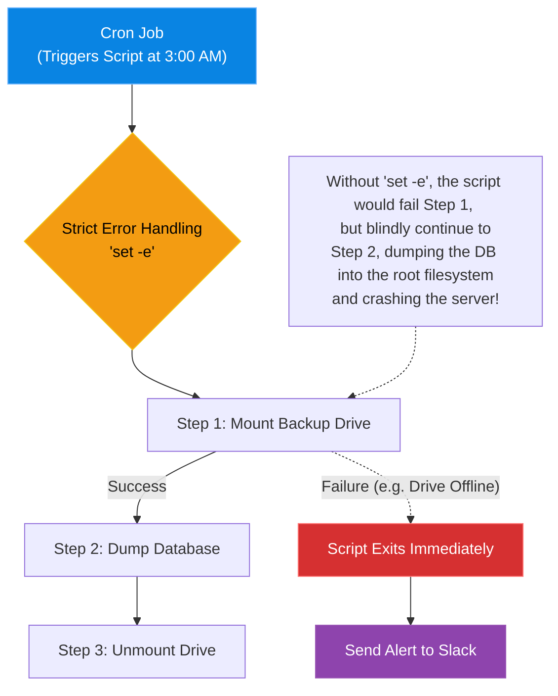

# Chapter 6 — Advanced Bash Scripting

* **Difficulty:** Advanced
* **Estimated Time:** 1.5 Hours
* **Hands-on Labs:** 1
* **Interview Questions:** 3

## Learning Objectives

By the end of this chapter, you will be able to:
* Use `set -e` and `set -o pipefail` for strict error handling.
* Write robust Bash functions with local variables.
* Master advanced text processing using `awk` and `sed`.
* Build interactive menus and accept command-line arguments using `getopts`.

## Visual Architecture: The Scripting Mindset

In Volume 2, you learned basic Bash commands to navigate the filesystem and read files. That is **Interactive Bash**. You type a command, hit enter, and wait for the result.
**Advanced Bash Scripting** is about removing the human from the equation. A senior engineer writes scripts that run unattended at 3:00 AM. If an interactive command fails, a human sees the error on the screen. If an unattended script fails, it must intelligently catch the error, log it, and exit gracefully *before* it accidentally deletes the production database.



## Theory & Concepts

### 1. Strict Error Handling (`set -e`)
By default, Bash is incredibly forgiving. If line 2 of a 100-line script throws a fatal error, Bash will just print the error and cheerfully continue executing line 3. This is disastrous for automation.
* `set -e`: Tells Bash to exit the script *immediately* if any command returns a non-zero exit status (an error).
* `set -u`: Tells Bash to exit if the script tries to use an undefined variable (preventing catastrophic bugs like `rm -rf /$UNDEFINED_VAR`).
* `set -o pipefail`: If you run `command_A | command_B`, Bash only cares if `command_B` succeeds. `pipefail` forces the script to fail if *any* command in the pipeline fails.
Always start your production scripts with: `set -euo pipefail`

### 2. Mastering `awk` and `sed`
* **`sed` (Stream Editor):** Used for finding and replacing text on the fly. Example: `sed -i 's/old_text/new_text/g' config.txt` will replace every instance of `old_text` with `new_text` inside the file.
* **`awk`:** A powerful data extraction tool. If you have a log file separated by spaces, and you only want to print the 5th column (the IP address), you use `awk '{print $5}' access.log`.

### 3. Command Line Arguments (`getopts`)
A senior script does not hardcode values. It accepts parameters.
Instead of writing a script that specifically backs up the `/var/www` directory, you write a script that accepts a flag: `./backup.sh -d /var/www`. You parse these flags safely using the built-in `getopts` function.

## Scenario-Based Troubleshooting

### Scenario A: The Silent Catastrophe
**The Incident:** A junior admin writes a nightly backup script:
```bash
#!/bin/bash
cd /mnt/backup_drive
rm -rf old_backups/*
cp -r /var/lib/mysql /mnt/backup_drive/new_backups/
```
The script runs as root via Cron. One night, the `/mnt/backup_drive` network share fails to mount. The next morning, the primary server is completely dead. 

**The Investigation & Fix:**
1. The Senior Engineer investigates the outage. The server's primary hard drive is completely full. 
2. **The Analysis:** The engineer looks at the script. Because the network drive failed to mount, the `cd /mnt/backup_drive` command failed. 
3. Because the junior admin did not use `set -e`, Bash simply printed "No such file or directory" to the invisible Cron log, and then immediately executed the next line: `rm -rf old_backups/*`. (Since the `cd` failed, it ran this in the root directory!).
4. Next, it ran the `cp` command. Because it was not mounted to the network, it just copied the massive database into the local `/mnt` folder, filling up the primary hard drive to 100% and crashing the OS.
5. **The Resolution:** The engineer cleans up the mess and rewrites the script to be robust:

```bash
#!/bin/bash
set -euo pipefail # Strict Mode!

BACKUP_DIR="/mnt/backup_drive"

# Explicitly check if the directory is mounted before doing ANYTHING
if ! mountpoint -q "$BACKUP_DIR"; then
    echo "ERROR: Backup drive is not mounted. Exiting." >&2
    exit 1
fi

cd "$BACKUP_DIR"
# ... rest of script
```

> [!CAUTION]  
> **Best Practice: Variable Quoting**  
> Always, always, always put double quotes around your variables! If you write `rm -rf $DIR/files`, and `$DIR` contains a space (e.g., `DIR="My Folder"`), Bash expands it to `rm -rf My Folder/files`. It will attempt to delete a directory called `My`, and then a directory called `Folder/files`! By writing `rm -rf "$DIR/files"`, Bash treats it as a single, safe string.

## Hands-on Lab

> [!TIP]
> **Practice Assignment Available**
> Proceed to the [Chapter 6 Practice Guide](../practice-files/V5-C06-practice.md) to practice writing a robust script using `getopts` and `awk`!

## Interview Questions

### Question 1: What does `set -euo pipefail` do at the top of a Bash script, and why is it considered a mandatory best practice for automation?
* **Target Answer**: "It enables 'Strict Mode' for Bash. `set -e` forces the script to exit immediately if any command returns an error. `set -u` forces the script to exit if an uninitialized variable is used. `set -o pipefail` ensures that if any command in a pipeline fails (e.g., `false | true`), the entire pipeline fails. This prevents a script from blindly continuing execution after a critical failure, which could otherwise lead to catastrophic data loss."

### Question 2: Explain the difference between `awk` and `sed`.
* **Target Answer**: "`sed` is a Stream Editor primarily used for text substitution (Find and Replace) using Regular Expressions. `awk` is a full data extraction and reporting language. `awk` excels at processing structured, columnar data (like CSVs or space-delimited log files) where you need to extract specific fields (columns), perform mathematical calculations on them, or filter rows based on logical conditions."

### Question 3: Why should you always double-quote your variables in a Bash script (e.g., `"$VAR"` instead of `$VAR`)?
* **Target Answer**: "Double-quoting variables prevents 'Word Splitting' and 'Globbing'. If a variable contains spaces and is not quoted, Bash will split the variable into multiple separate arguments passed to the command. For destructive commands like `rm`, this can cause the script to delete unintended files or directories. Quoting ensures the variable is treated as a single, literal string argument regardless of its contents."

## Chapter Summary

Bash is a powerful, dangerous language. As a Senior Engineer, you do not just write scripts that work when everything goes right; you write scripts that fail safely when everything goes wrong.

## Completion Checklist

- [ ] I understand the danger of default Bash execution.
- [ ] I can explain the `set -euo pipefail` strict mode.
- [ ] I know why unquoted variables are dangerous.

---

## Navigation

⬅ Previous:
[Chapter 5 – Infrastructure Cost Optimization](V5-C05-cost-optimization.md)

🏠 Volume Contents:
[Table of Contents](../TOC.md)

➡ Next:
[Chapter 7 – Python for Systems Administrators](V5-C07-python-sysadmin.md)
