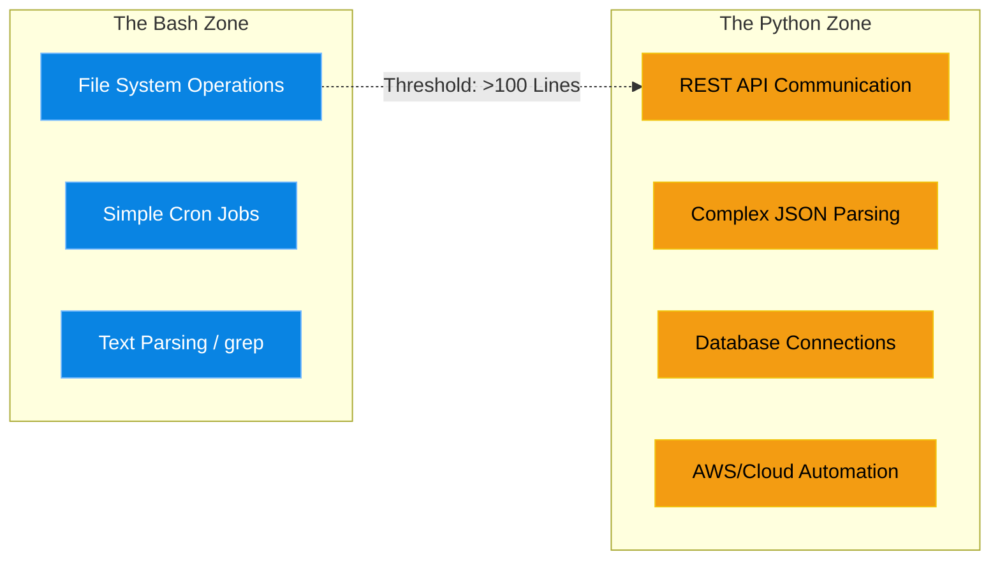

# Chapter 7 — Python for Systems Administrators

* **Difficulty:** Intermediate
* **Estimated Time:** 1.5 Hours
* **Hands-on Labs:** 1
* **Interview Questions:** 3

## Learning Objectives

By the end of this chapter, you will be able to:
* Determine when a task requires Python instead of Bash.
* Use the `os` and `sys` modules to interact with the Linux environment.
* Use the `subprocess` module to execute Linux commands from within Python.
* Handle structured data (JSON) natively in Python.

## Visual Architecture: The Scripting Threshold

Bash is the undisputed king of local file manipulation. If you need to find all `.log` files created in the last 7 days and zip them, you write a 3-line Bash script. 
However, Bash has severe limitations. It is terrible at complex math, it has no native concept of JSON dictionaries, and error-handling complex API responses requires massive amounts of fragile `grep` and `awk` pipelines. 
When a Bash script exceeds 100 lines, or when it needs to talk to a REST API, a Senior Engineer immediately switches to **Python**.



## Theory & Concepts

### 1. The `os` and `sys` Modules
Python does not natively know it is running on Linux. To interact with the operating system, you import standard modules.
* `os.environ.get("HOME")`: Reads Linux Environment Variables.
* `os.path.exists("/etc/passwd")`: Checks if a file exists on the Linux filesystem.
* `sys.argv`: Reads command-line arguments passed to the script (e.g., `python script.py -f file.txt`).

### 2. The `subprocess` Module
Sometimes, you just need to run a Linux command (like `ping` or `ls`) from within Python. You do not use `os.system()`, you use `subprocess.run()`. It safely executes the command and allows you to capture the `stdout` (the output text) and the `returncode` (to check for success or failure).

### 3. Native JSON Parsing
In Bash, parsing JSON requires downloading a third-party tool like `jq`. In Python, JSON is a native concept. 
By importing the `json` module, you can convert a raw JSON string into a Python Dictionary. This allows you to instantly extract data using keys (e.g., `data["user"]["email"]`), completely eliminating the need for complex regular expressions.

## Scenario-Based Troubleshooting

### Scenario A: The Fragile API Script
**The Incident:** A company uses a Bash script to query a third-party HR system API every night to sync user accounts. The script looks like this:
```bash
RESPONSE=$(curl -s https://api.hr.com/users)
EMAILS=$(echo $RESPONSE | grep -o '"email":"[^"]*' | grep -o '[^"]*$')
```
For six months, it works perfectly. Then, the HR vendor releases a minor update. They added a space after the colon in their JSON response (`"email": "xxx"` instead of `"email":"xxx"`). 
The Bash `grep` pipeline instantly breaks. The script fails silently, and no new employee accounts are created for a week.

**The Investigation & Fix:**
1. The Senior Engineer investigates the broken script. They realize the junior admin attempted to parse JSON using `grep` (text string matching). This is incredibly fragile. JSON is an object, not just a string of text.
2. **The Resolution:** The engineer immediately scraps the Bash script and rewrites it in Python.

```python
import json
import urllib.request

# 1. Fetch the data
response = urllib.request.urlopen("https://api.hr.com/users")
data_string = response.read().decode('utf-8')

# 2. Parse the JSON (The magic step!)
users_dict = json.loads(data_string)

# 3. Extract the emails robustly
for user in users_dict["employees"]:
    print(user["email"])
```
3. Because Python converts the JSON into a real dictionary object, it does not care if the vendor adds spaces, changes the indentation, or adds new random fields. As long as the `email` key exists, the Python script will never break.

> [!CAUTION]  
> **Best Practice: Virtual Environments**  
> If you need to install a third-party Python library like `requests`, DO NOT run `sudo pip install requests`. Doing this installs the library globally into the Linux OS's system Python. This can overwrite core libraries and physically break OS components like `yum` or `apt`! Always use a Python Virtual Environment (`python3 -m venv myenv`) to sandbox your script's dependencies safely away from the operating system.

## Hands-on Lab

> [!TIP]
> **Practice Assignment Available**
> Proceed to the [Chapter 7 Practice Guide](../practice-files/V5-C07-practice.md) to practice writing a Python script that uses `subprocess` to check server disk space!

## Interview Questions

### Question 1: When should a Systems Administrator choose to write a script in Python instead of Bash?
* **Target Answer**: "Bash is ideal for rapid, local filesystem manipulation and stringing together standard Linux binaries (like `find`, `tar`, and `grep`). A SysAdmin should pivot to Python when the script exceeds roughly 100 lines, requires complex data structures (like multi-dimensional arrays or dictionaries), involves interacting with REST APIs, requires native JSON parsing, or requires robust exception handling (Try/Catch blocks) that Bash cannot provide."

### Question 2: Why is it dangerous to parse JSON data using `grep` or `awk` in a Bash script?
* **Target Answer**: "`grep` and `awk` are text-processing tools; they do not understand the structural schema of JSON. If an API provider changes the spacing, line breaks, or the ordering of the keys in their JSON response, a `grep` regex will immediately break, even if the data itself is perfectly valid. Python natively parses JSON into dictionaries, making it completely immune to whitespace or ordering changes."

### Question 3: How does the `subprocess` module allow Python to interact with native Linux commands safely?
* **Target Answer**: "The `subprocess` module (specifically `subprocess.run`) allows a Python script to spawn a new process, execute a standard Linux binary (like `df -h` or `ping`), and capture its standard output (`stdout`) and exit status (`returncode`). It is safer than older methods like `os.system` because it prevents shell injection vulnerabilities by passing command arguments as a list rather than a raw, exploitable string."

## Chapter Summary

As an engineer's responsibilities shift from managing individual servers to managing fleets of cloud infrastructure via APIs, Python becomes mandatory. Bash is a hammer; Python is a surgical scalpel.

## Completion Checklist

- [ ] I can articulate when to switch from Bash to Python.
- [ ] I understand how Python parses JSON natively.
- [ ] I know why I should use `subprocess.run()` instead of `os.system()`.

---

## Navigation

⬅ Previous:
[Chapter 6 – Advanced Bash Scripting](V5-C06-advanced-bash.md)

🏠 Volume Contents:
[Table of Contents](../TOC.md)

➡ Next:
[Chapter 8 – Building Custom ChatOps Bots](V5-C08-chatops-bots.md)
