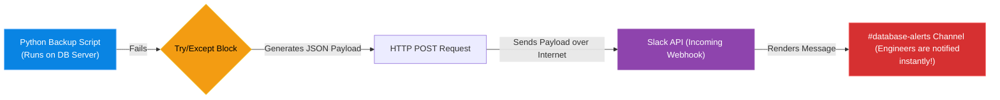

# Chapter 8 — Building Custom ChatOps Bots

* **Difficulty:** Intermediate
* **Estimated Time:** 1.5 Hours
* **Hands-on Labs:** 1
* **Interview Questions:** 3

## Learning Objectives

By the end of this chapter, you will be able to:
* Define ChatOps and its benefits.
* Use the Python `requests` library to send an HTTP POST request.
* Create a Webhook integration in Slack or Discord.
* Format a JSON payload to send dynamic alerts to a chat room.

## Visual Architecture: Bringing Infrastructure to the Humans

Ten years ago, when a server crashed, the monitoring system would send an email. Engineers receive 500 emails a day; they ignore them, and the outage is missed.
**ChatOps** is the practice of integrating your infrastructure automation directly into the chat platforms where the engineers already live (Slack, MS Teams, Discord). Instead of logging into AWS to check a deployment, the deployment script sends a message to the `#deployments` Slack channel: `"✅ Production Deployment v2.4 Successful."`



## Theory & Concepts

### 1. The Incoming Webhook
You cannot just magically send text to Slack. You must log into the Slack Workspace Administration panel and create an **Incoming Webhook**. 
A Webhook is simply a unique, secret URL (e.g., `https://hooks.slack.com/services/T000/B000/XXXX`). It acts as a listener. Anyone who sends a properly formatted HTTP POST request to that secret URL can post a message into the designated Slack channel.

### 2. The Python `requests` Library
Python has a built-in `urllib` module, but it is notoriously difficult to use for complex HTTP requests. The industry standard is a third-party library called `requests` (installed via `pip install requests`). It makes interacting with REST APIs incredibly simple.
`requests.post(url, json=my_dictionary)` will automatically serialize your Python dictionary into a JSON string, add the correct HTTP headers, and send it to the Webhook.

### 3. Payload Formatting
Slack APIs expect the JSON payload to have a specific schema. If you send `{"message": "Hello"}`, Slack will reject it. You must read the API documentation. For a basic Slack webhook, the payload must look like `{"text": "Hello"}`. 

## Scenario-Based Troubleshooting

### Scenario A: The Broken Webhook
**The Incident:** A junior engineer writes a Python script to monitor a critical system. If the system fails, it should post an alert to Slack. The system fails at 2:00 AM. The script runs, but no message appears in Slack. The outage is missed until 8:00 AM.

**The Investigation & Fix:**
1. The Senior Engineer investigates the script. The junior engineer's code looks like this:
```python
import requests
webhook_url = "https://hooks.slack.com/services/secret-url"
alert_text = "CRITICAL: The system is down!"

# Send the alert
requests.post(webhook_url, data=alert_text)
```
2. **The Observation:** The engineer runs the script manually and adds `print(response.text)`. The Slack API returns an HTTP 400 Bad Request with the error `invalid_payload`.
3. **The Analysis:** The junior engineer made two critical mistakes. First, they sent raw text (`data=alert_text`) instead of a JSON object. The Slack API expects JSON. Second, they did not check the HTTP status code of the response. The `requests.post()` failed, but the Python script didn't care; it just exited silently.
4. **The Resolution:** The engineer rewrites the code to format the JSON correctly and add robust error handling:

```python
import requests
import sys

webhook_url = "https://hooks.slack.com/services/secret-url"
payload = {
    "text": "CRITICAL: The system is down!"
}

# Use the json parameter to automatically format headers and serialization
response = requests.post(webhook_url, json=payload)

# Check if the API accepted our message!
if response.status_code != 200:
    print(f"Failed to send Slack alert. API replied: {response.text}")
    sys.exit(1)
```

> [!CAUTION]  
> **Best Practice: Secret Management**  
> A Webhook URL is a password! If you hardcode `https://hooks.slack.com/...` into your Python script, and you commit that script to a public GitHub repository, a bot will scrape that URL in 30 seconds. A malicious actor can then use your Webhook URL to spam your company's Slack channel with phishing links. Always store Webhook URLs as local Environment Variables (`os.environ.get("SLACK_WEBHOOK")`) or in a secure Vault.

## Hands-on Lab

> [!TIP]
> **Practice Assignment Available**
> Proceed to the [Chapter 8 Practice Guide](../practice-files/V5-C08-practice.md) to conceptually build a Python script that sends a formatted Slack message!

## Interview Questions

### Question 1: What is ChatOps, and how does it improve Incident Response times?
* **Target Answer**: "ChatOps is the integration of development and operational tools directly into collaboration platforms like Slack or MS Teams. It improves Incident Response by pushing real-time alerts into channels where engineers are actively looking, rather than burying them in an email inbox. Furthermore, it creates shared visibility—when a script posts an alert to a channel, every engineer sees it simultaneously, preventing duplicate work and fostering immediate collaboration."

### Question 2: Why is the Python `requests` library preferred over the built-in `urllib` for interacting with REST APIs?
* **Target Answer**: "While `urllib` is built-in, it requires significant boilerplate code to handle simple tasks like setting HTTP headers, encoding data, or managing sessions. The `requests` library abstracts this complexity. For example, passing a Python dictionary to the `json=` parameter in `requests.post()` automatically serializes the data to JSON and sets the `Content-Type: application/json` header in a single line of readable code."

### Question 3: Why must you check the `status_code` of an HTTP response in your Python scripts?
* **Target Answer**: "Sending an HTTP request over the network is inherently unreliable. The destination server might be offline, the API key might be expired, or the JSON payload might be incorrectly formatted. If you do not explicitly check if `response.status_code == 200` (or use `response.raise_for_status()`), the Python script will assume the network call succeeded and continue executing, resulting in silent failures where alerts are never actually delivered."

## Chapter Summary

By learning to communicate with REST APIs, your automation is no longer confined to the local server. You can write scripts that reach out across the internet to interact with Slack, Jira, PagerDuty, or any other modern SaaS platform.

## Completion Checklist

- [ ] I can define ChatOps.
- [ ] I understand what an Incoming Webhook is.
- [ ] I know how to send a JSON payload using Python `requests`.

---

## Navigation

⬅ Previous:
[Chapter 7 – Python for Systems Administrators](V5-C07-python-sysadmin.md)

🏠 Volume Contents:
[Table of Contents](../TOC.md)

➡ Next:
[Chapter 9 – Automating Cloud with Boto3](V5-C09-boto3-automation.md)
