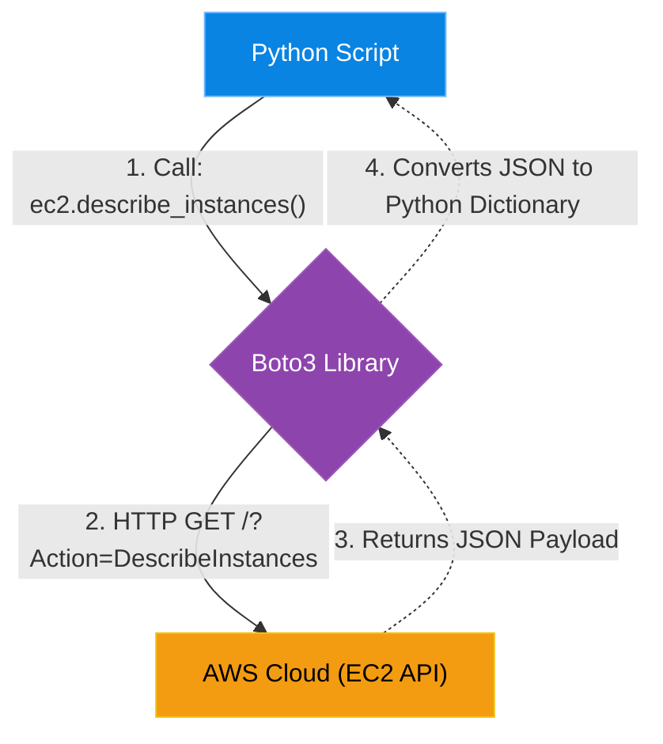

# Chapter 9 — Automating Cloud with Boto3

## Learning Objectives

Clicking through the AWS Console is a recipe for human error. In this chapter, we use Python and Boto3 to programmatically manage AWS infrastructure, completely automating cloud administration.

By the end of this chapter, you will be able to:
* Explain the role of AWS SDKs.
* Install and configure the `boto3` library for Python.
* Write a Python script to interact with AWS APIs (e.g., stopping EC2 instances).
* Handle AWS pagination in Python.

## Visual Architecture: The API Wrapper

In Volume 5, Chapter 5, we used the `aws-cli` combined with a Bash script and `jq` to find Zombie EBS volumes. While powerful, parsing JSON in Bash is clunky. 
If we want to automate the Cloud reliably, we use **Boto3**. Boto3 is the official AWS SDK (Software Development Kit) for Python. It acts as an API Wrapper. Instead of manually constructing complex HTTP requests to the AWS REST API, you simply type `ec2.stop_instances()`, and Boto3 automatically generates the HTTP request, signs it with your IAM credentials, sends it to AWS, and returns a native Python dictionary.

## Theory & Concepts

### 1. Boto3 Clients vs Resources
Boto3 offers two ways to interact with AWS:
* **Client:** The low-level interface. It maps 1:1 with the AWS REST API. It always returns complex Python dictionaries that you must manually parse. Example: `client = boto3.client('ec2')`.
* **Resource:** The high-level, object-oriented interface. It returns Python objects, allowing you to interact with infrastructure like variables. Example: `s3 = boto3.resource('s3'); bucket = s3.Bucket('my-bucket'); bucket.delete()`. 

### 2. AWS Authentication
Boto3 does not require you to hardcode passwords into your script. It automatically searches your local environment for credentials in this exact order:
1. Hardcoded variables (Never do this).
2. Environment Variables (`AWS_ACCESS_KEY_ID`).
3. The `~/.aws/credentials` file (created when you run `aws configure`).
4. An IAM Role attached to the EC2 instance or Lambda function running the script (The ultimate best practice!).

### 3. Pagination
AWS APIs are heavily throttled. If you have 50,000 S3 buckets and call `list_buckets()`, AWS will not return all 50,000 at once. It will return the first 1,000 and a `NextToken`. You must write a `while` loop in your Python script to pass that token back to AWS to get the next page. Boto3 provides built-in **Paginators** to automate this loop.

## Scenario-Based Troubleshooting

### Scenario A: The After-Hours Money Burner

> [!IMPORTANT]  
> **Incident Report: The After-Hours Money Burner**  
> **Reporter:** Automated Monitoring / End User  
> **The Incident:** A development team provisions twenty `t3.xlarge` EC2 instances for testing. The CTO discovers they are leaving them running 24/7, even though the developers only work from 9 AM to 5 PM. The instances are burning thousands of dollars every weekend for absolutely no reason.

**The Investigation (Single Engineer Diagnosis):**
1. The Senior Cloud Engineer decides to enforce FinOps via automation. 
2. **The Goal:** Build a script that shuts down all non-production developer instances every Friday at 6:00 PM.
3. The engineer mandates that the developers must tag their instances with `Environment: Development`. 
4. The engineer writes a Python script using `boto3`. 
5. The script uses the `boto3.client('ec2')` to query AWS for all instances that have the tag `Environment: Development` AND are currently in the `running` state.
6. The script extracts the Instance IDs of the matches, and then executes `ec2.stop_instances(InstanceIds=matched_ids)`.
7. **The Deployment:** The engineer places this Python script into an AWS Lambda function, and configures an Amazon EventBridge rule (like a Cloud Cron Job) to trigger the Lambda every Friday at 6:00 PM.
8. **The Resolution:** The next Friday, the Lambda triggers. The Boto3 script finds 20 running instances, stops them all in a fraction of a second, and logs a success message. The business saves $5,000 a month in weekend compute costs.

> [!CAUTION]  
> **Best Practice: Dry Runs**  
> When automating destructive actions (like `stop_instances` or `delete_volume`) across hundreds of cloud resources, always implement a "Dry Run" mode first. Have the script `print()` the Instance IDs it *intends* to terminate, and verify them manually. If your filtering logic is flawed, your Python script could accidentally terminate the production database in 0.5 seconds!

## Hands-on Lab

> [!TIP]
> **Practice Assignment Available**
> Proceed to the [Chapter 9 Practice Guide](../practice-files/V5-C09-practice.md) to conceptually write a Boto3 script that stops developer EC2 instances!

## Interview Questions

### Question 1: What is Boto3, and what is its primary advantage over using the `aws-cli` in a Bash script?
* **Target Answer**: "Boto3 is the official AWS SDK for Python. While the `aws-cli` is great for quick manual tasks, automating complex cloud workflows in Bash requires brittle text parsing (like `grep` and `jq`). Boto3 abstracts the AWS REST API, automatically handling HTTP headers, IAM signing, and retries, and returns the API responses as native Python dictionaries or objects, making complex logical operations significantly more robust."

### Question 2: Explain how a Python script running inside an AWS EC2 instance authenticates to the AWS API without having API keys hardcoded in the script.
* **Target Answer**: "Hardcoding API keys is a critical security vulnerability. When Boto3 executes on an EC2 instance (or a Lambda function), it looks for an attached IAM Instance Profile (IAM Role). The AWS Hypervisor automatically generates temporary, rotating security credentials and injects them into the instance's local metadata service. Boto3 seamlessly fetches these temporary credentials in the background, authenticating to the API without a single hardcoded secret."

### Question 3: What is API Pagination, and how does Boto3 handle it?
* **Target Answer**: "When querying AWS for a large number of resources (like 10,000 S3 objects), the API will not return them all in a single response to prevent timeouts and memory exhaustion. It returns a 'page' of results along with a `NextToken`. You must manually loop through the API, passing the token back each time to get the next page. Boto3 simplifies this by providing built-in 'Paginator' objects that abstract the while-loop and automatically iterate through all pages for you."

## Chapter Summary

The true power of the Cloud is that the entire datacenter is programmable. By mastering Boto3, you transition from someone who manages infrastructure, to someone who writes software that manages infrastructure.

## Completion Checklist

- [ ] I can explain what an SDK is.
- [ ] I understand the difference between a Boto3 Client and Resource.
- [ ] I know how Boto3 handles authentication securely.

---

## Navigation

⬅ Previous:
[Chapter 8 – Building Custom ChatOps Bots](V5-C08-chatops-bots.md)

🏠 Volume Contents:
[Table of Contents](../TOC.md)

➡ Next:
[Chapter 10 – Writing Custom Terraform Providers](V5-C10-custom-terraform.md)
