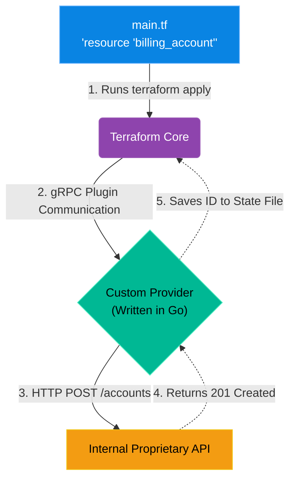

# Chapter 10 — Writing Custom Terraform Providers

## Learning Objectives

Standard Terraform modules don't always fit complex enterprise needs. In this chapter, we write Custom Terraform Providers and Modules to enforce organizational standards across hundreds of deployments.

By the end of this chapter, you will be able to:
* Explain how Terraform Core communicates with Terraform Providers via gRPC.
* Understand the CRUD (Create, Read, Update, Delete) lifecycle of a resource.
* Identify the scenarios where a custom provider is necessary.
* Understand the role of Golang (Go) in the Terraform ecosystem.

## Visual Architecture: Extending IaC Beyond the Cloud

In Volume 4, we used Terraform to provision AWS EC2 instances. HashiCorp wrote the `aws` Provider for you. But what if your company builds a proprietary internal billing system? There is no Terraform provider for it on the internet. 
A Senior Cloud Engineer realizes that **anything with a REST API can be managed by Terraform**. If the internal billing system has an API, you can write your own custom Terraform Provider in Go (Golang). This allows your developers to provision internal user accounts using standard `.tf` files, integrating your legacy systems seamlessly into modern CI/CD pipelines!

## Theory & Concepts

### 1. Terraform Core vs Providers
Terraform itself (Terraform Core) is a relatively dumb binary. It only knows how to parse `.tf` files, build a dependency graph, and read/write the `terraform.tfstate` file. It knows absolutely nothing about AWS, Azure, or your internal API.
When you run `terraform init`, Core downloads **Providers**. Providers are standalone executable plugin binaries (written in Go) that actually contain the logic to make the REST API calls to the target system. Core and the Provider talk to each other over a local gRPC connection.

### 2. The CRUD Lifecycle
When you write a custom provider in Go, you must define four mandatory functions for every resource you want to manage:
* **Create:** The Go code to send an HTTP POST request to create the resource and save its ID.
* **Read:** The Go code to send an HTTP GET request to check the current status of the resource and detect drift.
* **Update:** The Go code to send an HTTP PUT/PATCH request to modify the resource.
* **Delete:** The Go code to send an HTTP DELETE request to destroy the resource.

### 3. Why Golang?
HashiCorp writes almost all of their tools (Terraform, Vault, Consul, Nomad) in Golang (Go). Because Terraform Providers must be compiled into standalone binaries that communicate with Core via HashiCorp's specific gRPC SDK, writing custom providers in Python or Bash is virtually impossible. To reach the absolute pinnacle of Cloud Engineering, you must learn Go.

## Scenario-Based Troubleshooting

### Scenario A: The Disappearing State

> [!IMPORTANT]  
> **Incident Report: The Disappearing State**  
> **Reporter:** Automated Monitoring / End User  
> **The Incident:** A Senior Engineer writes a custom Terraform Provider to manage user accounts on a proprietary internal API. A junior admin uses it to deploy an account via Terraform. The deployment succeeds. The next day, the junior admin runs `terraform plan`. Terraform says the account was deleted, and proposes to recreate it. The admin panics and checks the internal API. The account is still there and perfectly healthy!

**The Investigation (Single Engineer Diagnosis):**
1. The Senior Engineer investigates the custom Go code of the Provider, specifically looking at the `Read` function.
2. **The Observation:** The engineer notices that the `Read` function makes an HTTP GET request to the API. If the API returns an error, the Go code does this: `d.SetId("")` (It blanks out the Resource ID in the state file).
3. **The Analysis:** The engineer checks the API server logs from the time the `terraform plan` was executed. The API server was undergoing brief maintenance and returned an `HTTP 503 Service Unavailable` error for 10 seconds.
4. **The Flaw:** The custom provider's error handling was terrible. Because the API returned a 503 error, the `Read` function incorrectly assumed the resource no longer existed, erased its ID from the state file, and told Terraform Core it was missing.
5. **The Resolution:** The engineer rewrites the Go `Read` function. If the API returns a `404 Not Found`, *then* it is safe to erase the ID because the resource was actually deleted. If the API returns a `5xx` error, the function must return an explicit `error` to Terraform Core, causing the `plan` to safely fail, rather than silently destroying the state file!

> [!IMPORTANT]  
> **Best Practice: The `terraform.tfstate` is the Source of Truth**  
> When writing a custom provider, the `Create` function MUST return the unique identifier generated by the target API and save it using `d.SetId(id)`. This ID is permanently written to the `.tfstate` file. All subsequent operations (`Read`, `Update`, `Delete`) rely exclusively on this ID to find the resource. If your `Create` function fails to save the ID properly, Terraform will immediately lose track of the resource, resulting in orphaned 'Zombie' infrastructure!

## Hands-on Lab

> [!TIP]
> **Practice Assignment Available**
> Proceed to the [Chapter 10 Practice Guide](../practice-files/V5-C10-practice.md) to conceptually review the Go code required to define a Terraform Resource schema!

## Interview Questions

### Question 1: Explain the architectural separation of concerns between Terraform Core and a Terraform Provider.
* **Target Answer**: "Terraform Core is responsible for reading configuration files (`.tf`), evaluating interpolations, building the execution graph, and managing the state file. It is completely agnostic to the underlying infrastructure. A Terraform Provider is a separate, domain-specific plugin (like the AWS provider) that implements the actual CRUD logic required to communicate with a specific vendor's REST API. Core and the Provider communicate locally via gRPC during execution."

### Question 2: In a custom Terraform Provider, why is the `Read` function executed during a `terraform plan`?
* **Target Answer**: "The `Read` function is executed during the planning phase to detect 'Configuration Drift'. Terraform uses the ID saved in the state file to query the live API and fetch the *current* state of the resource in the real world. It then compares the real-world state against the desired state defined in the `.tf` file. If a human manually changed a setting via the API, the `Read` function discovers the discrepancy, allowing Terraform to propose an `Update` to revert the drift."

### Question 3: Why must a custom Terraform Provider be written in Golang (Go)?
* **Target Answer**: "Terraform Providers must interact with Terraform Core using HashiCorp's proprietary `terraform-plugin-sdk` (or the newer `terraform-plugin-framework`), which are written exclusively in Go. These SDKs abstract the complex gRPC communication, state management, and schema validation. Attempting to write a provider in another language (like Python) would require manually reverse-engineering and maintaining the gRPC protocol buffers, which is highly impractical and unsupported."

## Chapter Summary

Infrastructure-as-Code is a methodology, not just an AWS tool. By learning Go and writing custom Terraform Providers, a Senior Engineer can bring the safety, consistency, and automation of Terraform to literally any system in the enterprise.

## Completion Checklist

- [ ] I understand how Terraform Core communicates with Plugins.
- [ ] I can define the four CRUD operations required for a Resource.
- [ ] I know why the `.tfstate` file relies entirely on the Resource ID.

---

## Navigation

⬅ Previous:
[Chapter 9 – Automating Cloud with Boto3](V5-C09-boto3-automation.md)

🏠 Volume Contents:
[Table of Contents](../TOC.md)

➡ Next:
[Volume 5, Part 3: Observability & SRE Principles *[Planned]*](#)
