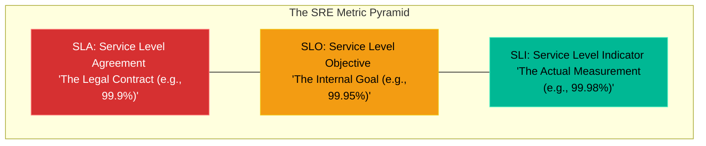

# Chapter 11 — Introduction to SRE (Site Reliability Engineering)

* **Difficulty:** Intermediate
* **Estimated Time:** 1 Hour
* **Hands-on Labs:** 1
* **Interview Questions:** 3

## Learning Objectives

By the end of this chapter, you will be able to:
* Define what Site Reliability Engineering (SRE) is.
* Differentiate between SLI, SLO, and SLA.
* Understand the concept of "Four Golden Signals".
* Shift from "Monitoring" (Is it up?) to "Observability" (Why is it slow?).

## Visual Architecture: The Reliability Stack

SysAdmins focus on keeping individual servers running. DevOps focuses on automating the deployment of code. **Site Reliability Engineering (SRE)**, a discipline pioneered by Google, focuses on treating operations as a software problem. 
SREs do not look at CPU graphs; they look at Customer Experience. If a web server's CPU is at 99%, but customer checkouts are still processing successfully in under 200 milliseconds, the SRE does not care. Customer experience is the ultimate metric.

## Theory & Concepts

### 1. Monitoring vs. Observability
* **Monitoring:** "The database CPU is at 100%." It answers the question: *What is broken?*
* **Observability:** "The database CPU is at 100% because the newly deployed `v2.4` shopping cart microservice is running a highly inefficient SQL `JOIN` query." It answers the question: *Why is it broken, and how do we fix it?*

### 2. SLIs, SLOs, and SLAs
* **SLI (Service Level Indicator):** A real-time measurement. Example: "99.98% of HTTP requests in the last 5 minutes returned a 200 OK status code."
* **SLO (Service Level Objective):** An internal goal set by the engineering team. Example: "We aim for 99.95% of HTTP requests to return a 200 OK over a 30-day period." If you drop below the SLO, the engineering team stops building new features and focuses entirely on fixing bugs.
* **SLA (Service Level Agreement):** A legal contract with the customer. Example: "If we drop below 99.9% uptime, we will refund 10% of the customer's monthly bill." Because SLAs cost the business real money, the internal SLO must always be stricter than the external SLA!

### 3. The Four Golden Signals
If you can only measure four things to determine the health of a system, SRE dictates they should be:
1. **Latency:** How long does it take to serve a request? (e.g., 50ms)
2. **Traffic:** How much demand is being placed on the system? (e.g., 1000 requests per second)
3. **Errors:** What is the rate of failing requests? (e.g., 2% of requests are returning HTTP 500)
4. **Saturation:** How "full" is the system? (e.g., The memory buffer is 90% full)

## Scenario-Based Troubleshooting

### Scenario A: The Flawed Dashboard
**The Incident:** The CEO logs into the company's e-commerce application. The page takes 15 seconds to load. The CEO immediately calls the Lead SRE, screaming that the website is broken. The Lead SRE checks the Datadog monitoring dashboard and says, "That's impossible. Average CPU is 30%. Average Database Memory is 50%. The infrastructure is perfectly healthy."

**The Investigation & Fix:**
1. The Senior SRE investigates the discrepancy between the CEO's experience and the dashboard.
2. **The Observation:** The engineer looks at the actual HTTP request logs. They notice a massive spike in *Latency*. The infrastructure is fine, but a third-party Javascript tracking pixel loaded by the marketing team is timing out, causing the end-user's browser to hang for 15 seconds.
3. **The Analysis:** The dashboard was built by a junior SysAdmin who only measured infrastructure (CPU, RAM, Disk). The dashboard was completely blind to the actual *Service Level Indicator* (the speed at which the customer's browser finishes rendering the page).
4. **The Resolution:** The SRE team completely scraps the old dashboards. They build new ones focused purely on the Four Golden Signals (Latency, Traffic, Errors, Saturation). They define an SLO: "99% of page loads must complete in under 2 seconds."
5. By tracking the metric that actually matters (the customer experience), the SRE team can now proactively alert on issues before the CEO discovers them.

> [!CAUTION]  
> **Best Practice: Averages Hide Outliers**  
> Never measure Latency using an "Average". If 99 users load a page in 10ms, and 1 user loads a page in 10,000ms (10 seconds), the *average* load time is a perfectly healthy 109ms. You will completely miss the fact that one user had a terrible experience! SREs use **Percentiles** (e.g., the p99 latency). The p99 tells you: "99% of users experienced a load time of X or better." If your p99 latency is 10 seconds, you immediately know you have a major problem!

## Hands-on Lab

> [!TIP]
> **Practice Assignment Available**
> Proceed to the [Chapter 11 Practice Guide](../practice-files/V5-C11-practice.md) to mathematically calculate SLIs and translate 'nines' into allowed downtime!

## Interview Questions

### Question 1: What is the primary difference between an SLO (Service Level Objective) and an SLA (Service Level Agreement)?
* **Target Answer**: "An SLO is an internal goal set by the engineering team (e.g., 99.95% uptime) to measure the reliability of a service. If breached, internal engineering priorities shift. An SLA is a legally binding contract with external customers (e.g., 99.9% uptime). If breached, the company usually owes financial penalties or service credits. Because of the financial risk, an internal SLO is always stricter than the external SLA."

### Question 2: Why do SREs prefer measuring 'Customer Experience' (like HTTP latency) rather than infrastructure metrics (like CPU utilization)?
* **Target Answer**: "A high CPU utilization does not necessarily mean the system is broken; a properly designed auto-scaling system might intentionally run at 90% CPU to maximize cost efficiency. However, if HTTP latency spikes to 10 seconds, the customer's experience is actively degraded, regardless of what the CPU is doing. SRE focuses on the outcome (is the customer happy?) rather than the underlying mechanism."

### Question 3: What are the 'Four Golden Signals' of monitoring distributed systems?
* **Target Answer**: "The Four Golden Signals are Latency (the time it takes to service a request), Traffic (the total demand or volume placed on the system), Errors (the rate of requests that fail), and Saturation (how 'full' or constrained the system's bottleneck resources are)."

## Chapter Summary

Site Reliability Engineering is a cultural shift. It stops engineers from blindly staring at green CPU graphs, and forces them to align their automation and monitoring efforts directly with the happiness of the end-user.

## Completion Checklist

- [ ] I can define SRE.
- [ ] I understand the difference between SLI, SLO, and SLA.
- [ ] I can list the Four Golden Signals.

---

## Navigation

⬅ Previous:
[Volume 5, Part 2: Advanced Automation & Scripting](../README.md)

🏠 Volume Contents:
[Table of Contents](../TOC.md)

➡ Next:
[Chapter 12 – Error Budgets & Toil Reduction](V5-C12-error-budgets.md)
