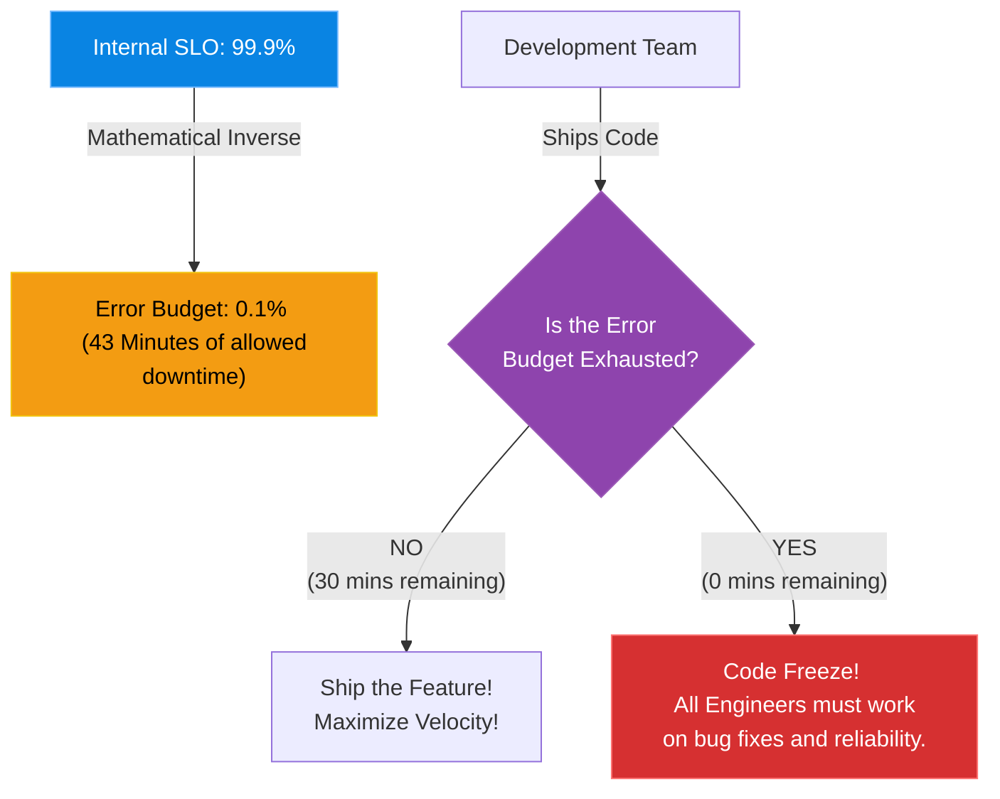

# Chapter 12 — Error Budgets & Toil Reduction

## Learning Objectives

100% uptime is impossible and pursuing it stalls innovation. In this chapter, we implement SLIs, SLOs, and Error Budgets, mathematically proving exactly when it is safe to deploy new code.

By the end of this chapter, you will be able to:
* Define an Error Budget.
* Use an Error Budget to balance feature velocity with system reliability.
* Define 'Toil' in the context of system administration.
* Understand the SRE mandate to automate toil away.

## Visual Architecture: The Engineering Tug-of-War

In traditional IT, there is a constant war. Developers want to ship 10 new features a day (Velocity). SysAdmins want to ship 0 features a day, because every change risks breaking the server (Reliability). 
SRE solves this war using an **Error Budget**. The Error Budget is a mathematical agreement between Development, Operations, and the Business. It explicitly defines how much unreliability the system is *allowed* to have.

## Theory & Concepts

### 1. The Error Budget
If your SLO is 99.9%, your Error Budget is the remaining 0.1%. (This equals roughly 43 minutes of allowed downtime per month). 
When the month starts, the Error Budget is full. Every time the system crashes, or every time a deployment goes wrong, you "spend" your Error Budget. 
If the budget drops to zero, a **Code Freeze** is enacted. The developers are legally forbidden from deploying new features. They must spend the rest of the month writing unit tests, fixing memory leaks, and improving infrastructure until the budget resets next month.

### 2. What is Toil?
In SRE, **Toil** is not just "work I don't like doing." Toil has a strict definition. It is work that is:
* **Manual:** A human typing commands.
* **Repetitive:** You do it every Tuesday.
* **Automatable:** A Python script could do it.
* **Tactical:** It provides no long-term engineering value.
* **Scales Linearly:** If the company doubles in size, the toil doubles.
*Example of Toil:* Resetting a user's password. Adding a new user to a database. Manually increasing the size of an EBS volume.

### 3. The 50% Rule
Google's SRE book mandates that an SRE must spend a maximum of 50% of their time on operational work (Toil, Tickets, On-call). The other 50% of their time **must** be spent writing software to automate that Toil out of existence. If an SRE is spending 80% of their time fighting fires, the system is fundamentally broken and management must step in.

## Scenario-Based Troubleshooting

### Scenario A: The Pushy Product Manager

> [!IMPORTANT]  
> **Incident Report: The Pushy Product Manager**  
> **Reporter:** Automated Monitoring / End User  
> **The Incident:** A SaaS company has an SLO of 99.9%. In the first two weeks of the month, the primary database crashed twice due to bad code deployments, causing 45 minutes of downtime. The Error Budget is now zero. 
In week three, the Product Manager (PM) demands that the engineering team deploy a massive new "AI Chatbot" feature. The Lead SRE refuses, citing the empty Error Budget. The PM escalates to the CEO, claiming the SRE team is "blocking innovation."

**The Investigation (Single Engineer Diagnosis):**
1. The CEO calls a meeting with the PM and the Lead SRE.
2. **The SRE's Argument:** The Lead SRE opens the monitoring dashboard. They show that the SLI (the actual uptime) is currently 99.8%. The customer SLA is 99.9%. The company is currently breaching its legal contract with customers and will owe $50,000 in refunds this month.
3. The SRE explains that deploying a massive new feature will inherently introduce new bugs, which will cause more downtime, costing the company even more money.
4. **The Resolution:** Because the Error Budget was agreed upon by the CEO months ago, it removes all emotion from the argument. The CEO sides with the SRE. 
5. The AI Chatbot deployment is paused. The PM is instructed to have the development team focus entirely on optimizing the database queries that caused the crashes earlier in the month. 
6. On the 1st of the next month, the Error Budget resets, and the Chatbot is deployed safely.

> [!CAUTION]  
> **Best Practice: Spending the Budget Intentionally**  
> An Error Budget is not just a limit; it is a resource! If it is the 28th of the month and you have 40 minutes of Error Budget remaining, you should *spend it*. Use that remaining budget to run Chaos Engineering experiments (killing servers intentionally), test risky database migrations, or deploy experimental code. If you end the month with a 100% full Error Budget, you are moving too slowly and leaving innovation on the table!

## Hands-on Lab

> [!TIP]
> **Practice Assignment Available**
> Proceed to the [Chapter 12 Practice Guide](../practice-files/V5-C12-practice.md) to conceptually identify Toil and write a Python automation plan!

## Interview Questions

### Question 1: How does an Error Budget resolve the inherent conflict between Developers and System Administrators?
* **Target Answer**: "Developers are incentivized to deploy code quickly, while Admins are incentivized to maintain stability by freezing deployments. The Error Budget aligns both teams using a mathematical metric. As long as the budget (e.g., 43 minutes of allowed downtime) is not exhausted, developers have total freedom to deploy at maximum velocity. If the budget is exhausted, both teams agree to halt feature deployments and focus exclusively on reliability, removing emotion and politics from the decision."

### Question 2: Provide an example of 'Toil' versus 'Engineering Work'.
* **Target Answer**: "Toil is manual, repetitive, tactical work that scales linearly. An example is a human logging into a server every Monday to clear out old log files because the disk is full. Engineering Work produces enduring value. An example is writing a Python script and a Cron job that automatically truncates old log files, or configuring an S3 lifecycle policy. The engineering work permanently eliminates the toil."

### Question 3: What is the SRE '50% Rule' regarding Toil?
* **Target Answer**: "The 50% Rule dictates that a Site Reliability Engineer must spend at least 50% of their time on project-based engineering work (writing automation, improving architectures, building tools). If they spend more than 50% of their time on operational toil (closing tickets, fighting fires, manual deployments), they are acting as traditional SysAdmins, and the organization is failing to scale."

## Chapter Summary

Reliability is not about perfection; it is about balance. By utilizing Error Budgets, you protect the customer experience. By aggressively automating Toil, you protect the mental health of the engineering team.

## Completion Checklist

- [ ] I can define an Error Budget.
- [ ] I can explain what a Code Freeze is.
- [ ] I can identify the defining characteristics of Toil.

---

## Navigation

⬅ Previous:
[Chapter 11 – Introduction to SRE](V5-C11-sre-intro.md)

🏠 Volume Contents:
[Table of Contents](../TOC.md)

➡ Next:
[Chapter 13 – Time-Series Databases & Metrics](V5-C13-time-series-metrics.md)
