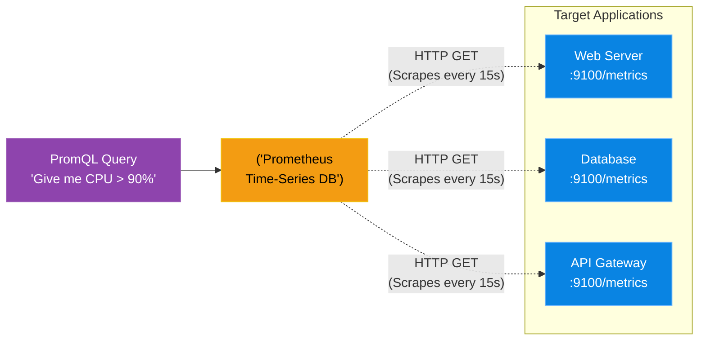

# Chapter 13 — Time-Series Databases & Metrics

* **Difficulty:** Advanced
* **Estimated Time:** 1.5 Hours
* **Hands-on Labs:** 1
* **Interview Questions:** 3

## Learning Objectives

By the end of this chapter, you will be able to:
* Explain the difference between Relational and Time-Series data.
* Understand the architecture of Prometheus.
* Explain the Pull vs. Push metric collection models.
* Write basic PromQL queries.

## Visual Architecture: The Prometheus Model

If you have 500 servers, you cannot SSH into them one by one to run `top` and check their CPU. You need a centralized monitoring system.
Older monitoring systems (like Nagios) rely on the servers "Pushing" their status to the central hub. In modern cloud-native architectures (like Kubernetes), containers live and die every few seconds. Pushing data does not scale. 
**Prometheus** uses a "Pull" model. It reaches out to all your servers every 15 seconds, "scrapes" their current metrics, and stores them in a highly optimized **Time-Series Database (TSDB)**.

## Theory & Concepts

### 1. Time-Series Databases (TSDB)
A standard Relational Database (like MySQL) stores users, orders, and products. A TSDB stores exactly three things: A Metric Name, a Timestamp, and a Number. 
Example: `cpu_usage_percent 1704067200 85`. 
Because TSDBs are hyper-optimized for this exact structure, Prometheus can ingest millions of data points per second.

### 2. The Node Exporter
Prometheus cannot magically read the CPU of a Linux server. You must install a small agent on the server called the **Node Exporter**. The Exporter gathers the local CPU, RAM, and Disk metrics, and hosts them on a tiny web server (usually port `9100`). When you browse to `http://<server-ip>:9100/metrics`, you will see hundreds of lines of plain text data. Prometheus visits this URL to scrape the data.

### 3. PromQL (Prometheus Query Language)
To extract data from the TSDB, you use PromQL. It is highly mathematical.
* `up`: Shows if a server is online (1) or offline (0).
* `node_memory_Active_bytes`: Shows the raw memory usage.
* `rate(http_requests_total[5m])`: Calculates the *per-second average rate* of HTTP requests over the last 5 minutes. (This is how SREs measure "Traffic", one of the Four Golden Signals!).

## Scenario-Based Troubleshooting

### Scenario A: The Silent Metric Drop
**The Incident:** A company uses Prometheus to monitor their Kubernetes cluster. The SRE team has an alert configured: "If average CPU across the cluster drops below 5%, send an alert, because it means no customers are using the site."
At 4:00 PM, traffic is normal. However, the SRE team receives a catastrophic alert that CPU is at 0%. They frantically check the website; it is perfectly healthy and processing thousands of orders.

**The Investigation & Fix:**
1. The SRE queries PromQL: `node_cpu_seconds_total`. 
2. **The Observation:** The graph shows healthy CPU usage until exactly 4:00 PM, at which point the line simply vanishes. It doesn't go to zero; the data stops existing entirely.
3. **The Analysis:** The SRE checks the Prometheus 'Targets' page. All the targets are marked `DOWN` with the error `context deadline exceeded (Timeout)`. 
4. The engineer checks the AWS Security Groups. A junior admin had modified the firewall rules at 4:00 PM, accidentally blocking Port `9100` between the Prometheus server and the Kubernetes worker nodes. 
5. **The Flaw:** Because Prometheus uses a *Pull* model, the worker nodes were perfectly healthy, but the central Prometheus server was being blocked by the firewall and couldn't scrape them!
6. **The Resolution:** The engineer reverts the Security Group change. The port opens, the scrape succeeds, the data instantly reappears on the graph, and the false alert resolves itself.

> [!CAUTION]  
> **Best Practice: High Cardinality**  
> In Prometheus, every unique combination of labels creates a new time series in the database. If you add a label like `user_id="1234"` to your HTTP requests metric, and you have 10 million users, you will instantly create 10 million unique metric streams. This is known as a **Cardinality Explosion**, and it will cause your Prometheus server to run out of RAM and crash within minutes! Never put high-cardinality data (like User IDs or unique IP addresses) into Prometheus labels.

## Hands-on Lab

> [!TIP]
> **Practice Assignment Available**
> Proceed to the [Chapter 13 Practice Guide](../practice-files/V5-C13-practice.md) to conceptually write PromQL queries to monitor system health!

## Interview Questions

### Question 1: What is the primary difference between a Time-Series Database (TSDB) and a Relational Database (RDBMS)?
* **Target Answer**: "An RDBMS (like PostgreSQL) is designed for complex, structured, relational data (users, orders) and supports complex ACID transactions. A TSDB (like Prometheus) is highly specialized for append-only, high-velocity metric ingestion. It stores only a metric name, a timestamp, and a numeric float value. Because of this specialized structure and aggressive compression, a TSDB can ingest and query millions of data points per second, which an RDBMS cannot handle."

### Question 2: Contrast the Pull model (Prometheus) with the Push model (StatsD/Datadog).
* **Target Answer**: "In a Push model, individual agents (servers/containers) are responsible for transmitting their metrics to a central monitoring server. This is easy to configure, but can cause a DDoS effect on the central server if 10,000 agents push simultaneously. Prometheus uses a Pull model. The central server actively reaches out to scrape HTTP endpoints (e.g., `/metrics`) on the targets. This gives the central server total control over the scrape rate and prevents overloading, but requires firewalls to be explicitly opened to allow the inbound scrape requests."

### Question 3: What is a 'Cardinality Explosion' in Prometheus, and how do you prevent it?
* **Target Answer**: "Cardinality refers to the number of unique time-series generated by the combinations of metric labels. If an engineer adds a label with unbounded values (such as a unique `session_id`, `user_id`, or a public IP address) to a metric, Prometheus will generate a brand new time-series file in RAM for every single user. This Cardinality Explosion will quickly consume all available memory and crash the TSDB. You prevent it by ensuring labels only contain bounded, categorical data (e.g., `status_code="200"`, `method="GET"`, `region="us-east-1"`)."

## Chapter Summary

You cannot manage what you cannot measure. By utilizing the Prometheus Pull model and Time-Series Databases, SREs can ingest millions of metrics from global infrastructure, creating the mathematical foundation for Observability.

## Completion Checklist

- [ ] I can define a Time-Series Database.
- [ ] I understand the Prometheus Pull model.
- [ ] I can explain why High Cardinality destroys databases.

---

## Navigation

⬅ Previous:
[Chapter 12 – Error Budgets & Toil Reduction](V5-C12-error-budgets.md)

🏠 Volume Contents:
[Table of Contents](../TOC.md)

➡ Next:
[Chapter 14 – Data Visualization & Dashboards](V5-C14-grafana-dashboards.md)
