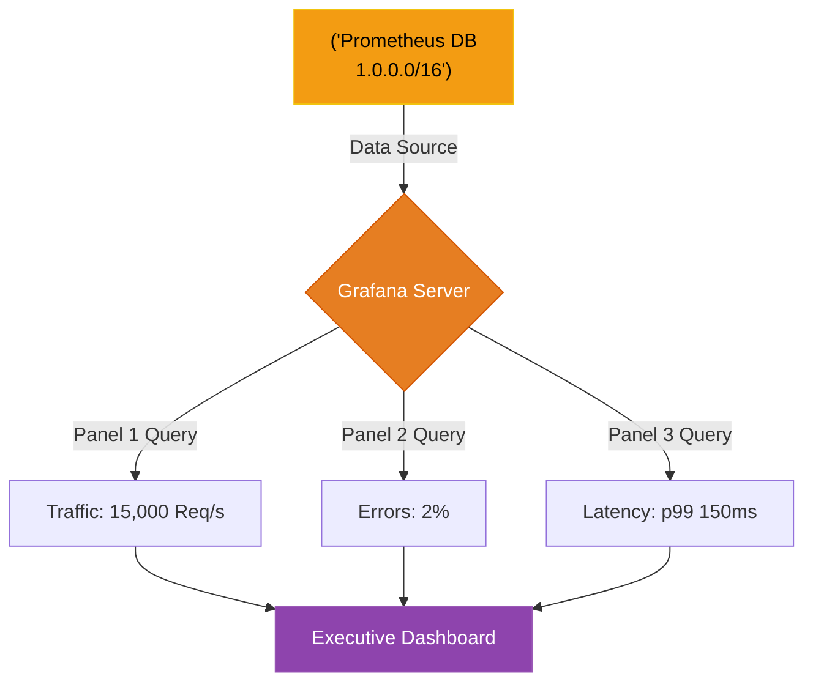

# Chapter 14 — Data Visualization & Dashboards

## Learning Objectives

Data without context is just noise. In this chapter, we build advanced Grafana dashboards, transforming millions of metric data points into instantly understandable visualizations of system health.

By the end of this chapter, you will be able to:
* Explain the relationship between Prometheus and Grafana.
* Design a dashboard that tells a cohesive story during an outage.
* Use Dashboard Variables for dynamic filtering.
* Avoid the "Wall of Graphs" anti-pattern.

## Visual Architecture: The Storyboard

Prometheus is a brilliant database, but its native interface is just a raw query bar. If an outage occurs at 3:00 AM, a panicked engineer does not want to type complex PromQL mathematics into a terminal. They want to look at a screen and instantly know what is broken.
**Grafana** is the industry standard for data visualization. It connects directly to Prometheus (and dozens of other databases), executes the PromQL queries in the background, and renders beautiful, dynamic graphs. 

## Theory & Concepts

### 1. The Anti-Pattern: The "Wall of Graphs"
Junior engineers love to build a dashboard containing 50 tiny graphs showing every single metric available (Disk I/O, CPU Steal, RAM Buffers). During an outage, this is useless cognitive overload.
A Senior SRE builds a dashboard hierarchically:
* **Top Row (The Business):** The Four Golden Signals (Traffic, Errors, Latency, Saturation). A CEO can look at this row and know if the business is making money.
* **Middle Row (The Application):** Database query times, Cache Hit Ratios, Active connections.
* **Bottom Row (The Infrastructure):** CPU, RAM, Disk Space.

### 2. Dashboard Variables
Instead of creating 10 separate dashboards for 10 separate web servers, you use **Variables**. You create a dropdown menu at the top of the dashboard called `Server_ID`. Your Grafana panels use the PromQL query: `cpu_usage{instance="$Server_ID"}`. When the engineer changes the dropdown, the entire dashboard dynamically updates to show data for that specific server.

### 3. Alerting via Grafana
While Prometheus has its own Alertmanager, Grafana also provides visual alerting. You can draw a red threshold line across a Latency graph at `500ms`. If the graph crosses the red line, Grafana will automatically trigger a Webhook and send a message to Slack (as learned in Chapter 8).

## Scenario-Based Troubleshooting

### Scenario A: The Useless Dashboard

> [!IMPORTANT]  
> **Incident Report: The Useless Dashboard**  
> **Reporter:** Automated Monitoring / End User  
> **The Incident:** The primary billing database goes offline. The On-Call engineer wakes up and opens the "Billing Service Dashboard" in Grafana. The dashboard contains 40 different graphs. Every single graph is flashing red. The engineer stares at the screen for 10 minutes, completely overwhelmed, unable to determine the root cause.

**The Investigation (Single Engineer Diagnosis):**
1. The Lead SRE conducts a post-mortem on the slow incident response.
2. **The Observation:** The engineer notes that the dashboard was built with zero hierarchy. The graph for "Active Database Connections" was buried at the bottom right corner, hidden behind "Linux Kernel Context Switches."
3. **The Analysis:** When the database went offline, the web servers started throwing HTTP 500 errors. Because everything broke at once, all 40 graphs spiked. The dashboard provided data, but it did not provide *context*.
4. **The Resolution:** The SRE team redesigns the dashboard using the USE method (Utilization, Saturation, Errors) for the infrastructure, and the RED method (Rate, Errors, Duration) for the application.
5. The new dashboard has exactly 6 large graphs. 
6. Next month, a similar issue occurs. The On-Call engineer opens the dashboard. The top row (Customer Experience) shows a massive spike in Errors. The bottom row shows that Database Connections are maxed out, while CPU and RAM are perfectly fine. 
7. The engineer instantly identifies the root cause (Connection Pool exhaustion) and fixes the issue in 2 minutes.

> [!CAUTION]  
> **Best Practice: Dashboards as Code**  
> Never build a production Grafana dashboard by clicking around the UI with your mouse! If the Grafana server crashes, your dashboard is gone forever. Grafana supports "Provisioning." You can export your beautiful dashboard as a massive JSON file, save it in a Git repository, and use Terraform or Ansible to automatically load it into Grafana. This ensures your dashboards are version-controlled and instantly recoverable!

## Hands-on Lab

> [!TIP]
> **Practice Assignment Available**
> Proceed to the [Chapter 14 Practice Guide](../practice-files/V5-C14-practice.md) to conceptually review the JSON code behind a Grafana Dashboard Panel!

## Interview Questions

### Question 1: What is the architectural relationship between Prometheus and Grafana?
* **Target Answer**: "Prometheus is the backend Time-Series Database and metric scraping engine. It stores the raw data and processes the PromQL queries. Grafana is the frontend visualization layer. It does not store data itself; it connects to Prometheus as a 'Data Source', passes PromQL queries to it, and renders the mathematical results into human-readable graphs, charts, and dashboards."

### Question 2: Describe the 'Wall of Graphs' anti-pattern and how to fix it using hierarchy.
* **Target Answer**: "The 'Wall of Graphs' occurs when an engineer places dozens of highly detailed infrastructure metrics on a single dashboard without logical grouping, causing cognitive overload during an outage. A Senior SRE fixes this by structuring the dashboard hierarchically: The top row displays high-level business health (The Four Golden Signals like Error Rate and Latency). The rows below drill down into application health, and the very bottom rows contain the granular infrastructure metrics (CPU, I/O Wait) used for deep root-cause analysis."

### Question 3: Why should Grafana Dashboards be managed as code (JSON/Terraform) rather than built manually in the UI?
* **Target Answer**: "If dashboards are built manually via 'Click-Ops' in the UI, they lack version control. If an engineer accidentally deletes a panel or misconfigures a query, there is no way to audit the change or roll it back. By exporting the dashboard as a JSON file and managing it in a Git repository (Infrastructure-as-Code), teams can require Pull Requests for dashboard changes, ensure consistency across environments, and instantly recover the dashboards if the Grafana server is destroyed."

## Chapter Summary

Data without context is useless noise. Grafana allows SREs to translate billions of data points into a clear, hierarchical story that immediately highlights the root cause of an outage, protecting the engineer from cognitive overload at 3:00 AM.

## Completion Checklist

- [ ] I understand how Grafana queries Prometheus.
- [ ] I can design a hierarchical dashboard using the Four Golden Signals.
- [ ] I know why Dashboards must be saved as Code.

---

## Navigation

⬅ Previous:
[Chapter 13 – Time-Series Databases & Metrics](V5-C13-time-series-metrics.md)

🏠 Volume Contents:
[Table of Contents](../TOC.md)

➡ Next:
[Chapter 15 – Distributed Tracing](V5-C15-distributed-tracing.md)
