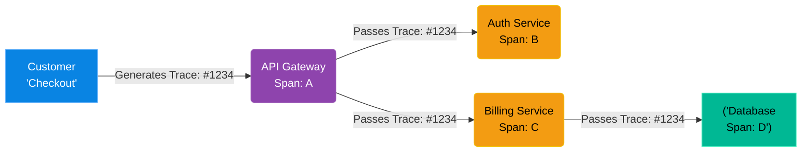

# Chapter 15 — Distributed Tracing

## Learning Objectives

In a microservices architecture, a single request touches twenty different servers. In this chapter, we use Distributed Tracing to definitively prove exactly which microservice caused a timeout.

By the end of this chapter, you will be able to:
* Define Distributed Tracing and its necessity in Microservices.
* Understand the concept of Trace IDs and Span IDs.
* Explain the role of OpenTelemetry.
* Use a visualization tool (like Jaeger or DataDog) to find latency bottlenecks.

## Visual Architecture: The Microservice Maze

In a monolithic architecture, a user clicks "Checkout", and a single server processes the request. If it is slow, you look at the logs for that one server.
In a modern Kubernetes architecture, a user clicks "Checkout", and the request jumps through the API Gateway, to the Auth Service, to the Inventory Service, to the Billing Service, and finally to the Database. If the checkout takes 10 seconds, which of the 5 microservices caused the delay?
**Distributed Tracing** solves this. The API Gateway generates a unique `Trace ID` (e.g., `#1234`) and injects it into the HTTP headers. Every microservice passes that exact same Trace ID to the next service. An SRE can then search for `#1234` and see a beautiful waterfall graph of exactly how many milliseconds the request spent inside each individual microservice!

## Theory & Concepts

### 1. Traces and Spans
* **Trace:** The entire journey of a single customer request from start to finish. (e.g., The Checkout Process).
* **Span:** A single logical operation within that Trace. (e.g., The Auth Service verifying the token, or the Database executing a SQL query). A Trace is made up of a parent Span and multiple child Spans.

### 2. Context Propagation
For tracing to work, the Trace ID must be passed along. This is called *Context Propagation*. 
When the API Gateway calls the Auth Service, it must add `traceparent: 00-1234-abcd-01` to the HTTP Headers of the request. The developers must write their code to read this header, and attach it to any outbound network calls they make. If a developer forgets to pass the header, the Trace breaks, and the SRE loses visibility.

### 3. OpenTelemetry (OTel)
Historically, every vendor (Datadog, New Relic, AppDynamics) had their own proprietary tracing code. If you wanted to switch vendors, you had to rewrite your entire application. 
**OpenTelemetry** is the new open-source industry standard. You instrument your application using OTel libraries. OTel can then export that standard trace data to Jaeger (open-source), Datadog, or any other backend. You are never locked in.

## Scenario-Based Troubleshooting

### Scenario A: The Invisible Bottleneck

> [!IMPORTANT]  
> **Incident Report: The Invisible Bottleneck**  
> **Reporter:** Automated Monitoring / End User  
> **The Incident:** The customer support team reports that the new "Generate Invoice" button is taking 15 seconds to load. 
The junior admin looks at the Grafana dashboards. The Invoice Microservice CPU is at 10%. The Database CPU is at 20%. The infrastructure metrics show absolutely nothing wrong. The admin throws their hands up and blames "the network."

**The Investigation (Single Engineer Diagnosis):**
1. The Senior SRE takes over. They open **Jaeger**, the distributed tracing UI.
2. They filter for traces where the service is `invoice-service` and the latency is `> 10000ms`.
3. They open the slowest Trace.
4. **The Observation:** The waterfall graph shows the request entering the `invoice-service`. Inside that service, there are 500 sequential child Spans, all calling the `user-service`. Each call takes 30ms. `500 * 30ms = 15,000ms (15 seconds)`.
5. **The Analysis:** The infrastructure is healthy, but the application code is terribly inefficient. The developer wrote a loop (the "N+1 Query Problem"). Instead of asking the `user-service` for 500 users in a single bulk API call, the `invoice-service` is making 500 separate, sequential API calls over the network.
6. **The Resolution:** The SRE takes a screenshot of the Jaeger Trace and attaches it to a Jira ticket for the development team. The developers rewrite the code to perform a single bulk API call. The latency drops from 15 seconds to 200 milliseconds. 

> [!CAUTION]  
> **Best Practice: Sampling Rates**  
> If you run a massive website with 10,000 requests per second, you absolutely cannot generate and store a Distributed Trace for every single request. The tracing backend would require petabytes of storage and cost millions of dollars! You must implement **Sampling**. You configure OpenTelemetry to only trace 1% of all successful requests (to provide a statistical baseline), but 100% of all requests that result in an HTTP 500 error (so you can debug the failures!).

## Hands-on Lab

> [!TIP]
> **Practice Assignment Available**
> Proceed to the [Chapter 15 Practice Guide](../practice-files/V5-C15-practice.md) to conceptually analyze the JSON structure of an OpenTelemetry Span!

## Interview Questions

### Question 1: In a microservice architecture, why are traditional server logs insufficient for debugging high latency?
* **Target Answer**: "In a monolith, a request is processed by a single server, so you can read a single log file top-to-bottom. In a microservice architecture, a single user request might jump across 20 different servers asynchronously. Traditional logs are scattered across those 20 servers with no inherent way to link them. Distributed Tracing injects a unique Trace ID at the entry point, allowing an SRE to search that single ID and instantly reconstruct the exact path and latency of the request across the entire distributed system."

### Question 2: Explain the concepts of Context Propagation and the Trace Header.
* **Target Answer**: "For a Distributed Trace to work, every microservice must know the ID of the trace it is participating in. Context Propagation is the mechanism of passing this state. When Service A makes a network call to Service B, it injects a specific HTTP header (like the W3C standard `traceparent` header) containing the Trace ID and the parent Span ID. Service B must extract this header, use it to generate its own child spans, and inject it into any further downstream calls to Service C."

### Question 3: What is the N+1 Query Problem, and how does a Distributed Trace reveal it?
* **Target Answer**: "The N+1 Query Problem is an anti-pattern where an application makes 1 initial call to get a list of items, and then makes N individual network calls (often in a `for` loop) to get the details of each item, rather than making a single bulk query. In a Distributed Trace UI like Jaeger, this is instantly recognizable visually as a massive 'staircase' or waterfall of hundreds of tiny, sequential child spans originating from a single parent span, allowing the SRE to pinpoint the exact line of inefficient code."

## Chapter Summary

Metrics tell you there is a problem. Logs tell you what the error was. Tracing tells you *where* the problem is. By mastering OpenTelemetry, a Senior Engineer gains absolute visibility into the chaotic web of microservices.

## Completion Checklist

- [ ] I can define a Trace and a Span.
- [ ] I understand the necessity of Context Propagation via HTTP Headers.
- [ ] I can visually identify the N+1 Query problem in a Trace.

---

## Navigation

⬅ Previous:
[Chapter 14 – Data Visualization & Dashboards](V5-C14-grafana-dashboards.md)

🏠 Volume Contents:
[Table of Contents](../TOC.md)

➡ Next:
[Volume 5, Part 4: Career Development & The Senior Mindset *[Planned]*](#)
