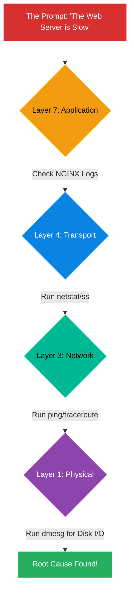

# Chapter 17 — Surviving the Technical Deep-Dive

* **Difficulty:** Expert
* **Estimated Time:** 1 Hour
* **Hands-on Labs:** 1
* **Interview Questions:** 3

## Learning Objectives

By the end of this chapter, you will be able to:
* Navigate the "Deep-Dive" technical interview without panicking.
* Explain the "I don't know, but..." methodology.
* Debug a hypothetical, complex Linux scenario out loud.
* Understand the psychology of a Senior Technical Interviewer.

## Visual Architecture: The Troubleshooting Funnel

The Technical Deep-Dive is distinct from the System Design interview. Instead of a whiteboard, you are given a deeply specific scenario: "You type `google.com` into your browser, hit enter, and the screen is blank. Walk me through exactly what happens, down to the kernel level, and how you would troubleshoot it."
The interviewer is looking for the **Troubleshooting Funnel**. They want to see if you randomly guess, or if you systematically eliminate layers of the OSI model from top to bottom.

## Theory & Concepts

### 1. The "I don't know, but..." Rule
In a junior interview, saying "I don't know" is acceptable. In a senior interview, the interviewer will actively push you until you reach the limit of your knowledge. They *want* you to not know the answer. 
When they hit your limit, you must never say "I don't know" and stop talking. 
You must say: **"I don't know the exact syntax, but I know how I would find out."** Or, **"I don't know the specific Linux kernel parameter, but conceptually, I would look for a way to increase the TCP backlog queue."** This proves you understand the architecture, even if you forgot the specific command.

### 2. Thinking Out Loud
If the interviewer asks a complex question, and you sit in silence for 45 seconds thinking, you have failed. The interviewer is grading your *thought process*, not just the final answer. 
You must verbalize your internal monologue: "Okay, the database is slow. First, I would check if it's a CPU bottleneck by running `top`. If CPU is fine, I would check disk I/O using `iostat`. If disk I/O is maxed out, I know the database is thrashing the disk..." 

### 3. The Power of "Strace"
If you are ever completely stuck in a Linux interview scenario, and the interviewer asks "How do you figure out why the program is failing silently?", the ultimate trump card is `strace`. 
Mentioning `strace` (System Call Trace) proves you know how to look underneath the application and see exactly what it is asking the Linux Kernel to do. 

## Scenario-Based Troubleshooting

### Scenario A: The Infamous DNS Question
**The Interview:** You are interviewing for a Senior Site Reliability Engineer position at Google. The interviewer asks: "A user complains they cannot reach our website. You SSH into the Linux server. The server can ping `8.8.8.8` perfectly fine. But if you `ping google.com`, it says 'Name or service not known'. Walk me through how you fix this."

**The Internal Monologue & Answer:**
1. **The Trap:** The junior engineer immediately says, "I would check `/etc/resolv.conf`." The interviewer smiles and says, "It looks perfectly fine. Now what?" The junior engineer freezes.
2. **The Senior Approach (Systematic Elimination):**
3. "Okay, so Layer 3 networking is working because we can ping an IP. The issue is purely DNS resolution. First, I would verify `/etc/resolv.conf` to ensure our nameservers are correct." 
4. *(Interviewer: "It's correct.")*
5. "Next, I would use `dig google.com` to completely bypass the local Linux resolver and ask the DNS server directly. If `dig` succeeds, I know the network and the DNS server are healthy, and the problem is localized strictly to the Linux OS's internal resolver."
6. *(Interviewer: "Dig succeeds. The problem is inside Linux. Where do you look next?")*
7. "I would check `/etc/nsswitch.conf`. This file dictates the order in which Linux resolves names. If the `hosts:` line is missing `dns`, or if it prioritizes something else that is broken, the OS won't even attempt to read `/etc/resolv.conf`."
8. *(Interviewer: "nsswitch.conf is correct. The OS is trying to resolve it, but it's failing silently.")*
9. **The Trump Card:** "In that case, the local caching daemon might be hung, or there's a permission issue. I would run `strace ping google.com`. The `strace` output will show me exactly which system files `ping` is attempting to open (like `/etc/resolv.conf` or `/lib64/libnss_dns.so`) and whether the Kernel is returning a `Permission Denied` or `File Not Found` error."
10. **The Result:** You pass. You didn't just guess the answer; you demonstrated a deep, systematic understanding of how the Linux Kernel handles DNS.

> [!CAUTION]  
> **Best Practice: Don't Fight the Interviewer**  
> Sometimes, an interviewer will give you a scenario that makes no logical sense in the real world. Do not argue with them and say "That would never happen in production." Accept the parameters of their hypothetical world. They are testing your adaptability, not your ability to critique their scenario.

## Hands-on Lab

> [!TIP]
> **Practice Assignment Available**
> Proceed to the [Chapter 17 Practice Guide](../practice-files/V5-C17-practice.md) to practice answering realistic, rapid-fire technical questions!

## Interview Questions (Rapid-Fire Technical Screen)

### Question 1: "A Java process is consuming 100% of the CPU, but when you run `top`, the CPU usage is mostly 'wa' (I/O Wait) rather than 'us' (User). What does this mean, and how do you fix it?"
* **Target Answer**: "A high 'I/O Wait' means the CPU is actually sitting idle, waiting for a slow physical disk to return data. The Java process isn't doing heavy computation; it's thrashing the disk (likely reading massive files or experiencing heavy Swap memory usage). To fix it, I would use `iostat` to verify the disk bottleneck, check if the server has run out of RAM and is swapping to disk, and potentially move the database to faster SSD storage."

### Question 2: "You type `ls -l` in a directory, and it takes 30 seconds for the files to appear on the screen. Why?"
* **Target Answer**: "If a simple `ls` hangs, it almost always points to a storage mount issue. Most likely, the directory contains a stale NFS (Network File System) mount point. The Linux kernel is attempting to query the metadata of the files across the network, but the remote NFS server is offline, causing the `ls` command to hang until the TCP connection times out. I would run `df -h` or `mount` to check for hung network drives."

### Question 3: "A developer complains their application cannot connect to the local PostgreSQL database on port 5432. You run `netstat -tulnp` and confirm the database is listening. What are the next three commands you run to isolate the issue?"
* **Target Answer**: "First, I'd run `ping localhost` to ensure the local loopback interface is up. Second, I'd use `telnet localhost 5432` or `nc -vz localhost 5432` to see if the TCP handshake completes, proving the application layer is reachable. Third, if `nc` fails despite `netstat` showing it's listening, I would check the local firewall by running `iptables -L` or `firewall-cmd --list-all` to ensure port 5432 isn't being blocked internally."

## Chapter Summary

The Deep-Dive interview is designed to break you. By utilizing a systematic funnel approach, verbalizing your thoughts, and knowing how to fall back to core Linux debugging tools, you can survive even the most grueling technical interrogations.

## Completion Checklist

- [ ] I can explain the Troubleshooting Funnel.
- [ ] I know how to use the "I don't know, but..." response.
- [ ] I understand the power of `strace`.

---

## Navigation

⬅ Previous:
[Chapter 16 – The System Design Interview](V5-C16-system-design.md)

🏠 Volume Contents:
[Table of Contents](../TOC.md)

➡ Next:
[Chapter 18 – Writing Technical Documentation & RFCs](V5-C18-writing-rfcs.md)
