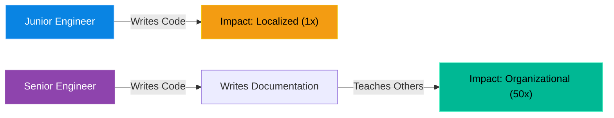

# Chapter 18 — Writing Technical Documentation & RFCs

* **Difficulty:** Intermediate
* **Estimated Time:** 1 Hour
* **Hands-on Labs:** 1
* **Interview Questions:** 3

## Learning Objectives

By the end of this chapter, you will be able to:
* Understand why writing is the most important skill for a Staff/Principal Engineer.
* Structure a Request for Comments (RFC) document.
* Write Runbooks that are actually useful at 3:00 AM.
* Learn how to accept architectural feedback gracefully.

## Visual Architecture: The Amplifier Effect

If a brilliant engineer writes an amazing Bash script that saves 5 hours a week, but never documents it, the impact is isolated to that one engineer. 
If a Senior Engineer writes a brilliant Python script, and then writes a one-page **Standard Operating Procedure (SOP)** explaining exactly how to use it, and shares it with 50 other engineers... the impact is multiplied by 50. 
**Writing is a multiplier.** It is how you scale your knowledge across the entire organization.

## Theory & Concepts

### 1. The Request for Comments (RFC)
Also known as a Design Doc or Architectural Decision Record (ADR). When you want to propose a massive change (e.g., "We should migrate our databases from Oracle to PostgreSQL"), you do not just start coding. 
You write a 3-page RFC. It outlines the Problem, the Proposed Solution, the Trade-offs, and crucially, the **Alternatives Considered**. You send this document to the other Senior Engineers in the company and ask them to tear it apart. This forces consensus *before* millions of dollars are spent on engineering time.

### 2. The 3:00 AM Runbook
A Runbook is a set of instructions used during an outage. Most runbooks are terrible. They contain long, meandering paragraphs of theoretical architecture.
At 3:00 AM, an On-Call engineer's cognitive ability is severely reduced. A Runbook must be:
* **Action-Oriented:** Start with the exact commands to run.
* **Copy-Pasteable:** Format commands in code blocks. Do not assume the reader remembers syntax.
* **Idempotent:** Emphasize commands that are safe to run multiple times.

### 3. Ego vs. Feedback
When you write an RFC, other engineers will leave comments pointing out flaws in your design. Junior engineers take this personally. Senior engineers welcome it. A flaw discovered on a Google Doc costs $0. A flaw discovered in Production costs $50,000. 

## Scenario-Based Troubleshooting

### Scenario A: The Failed Migration
**The Incident:** A mid-level engineer realizes the company's Jenkins CI/CD pipeline is outdated. Over the weekend, they work 20 hours to migrate the entire build system to GitHub Actions. On Monday morning, they proudly announce the switch. 
Immediately, the QA team revolts because their automated testing plugins don't work in GitHub Actions. The Security team halts the deployment because GitHub Actions hasn't passed compliance auditing. The migration is rolled back, and the engineer's 20 hours of work are thrown in the trash. The engineer is furious.

**The Investigation & Fix:**
1. The Staff Engineer pulls the frustrated mid-level engineer aside. 
2. **The Analysis:** "Your code was brilliant, but your methodology failed. You attempted a massive organizational shift without gathering consensus. You surprised people."
3. **The Resolution:** The Staff Engineer teaches them how to write an RFC. 
4. The engineer writes a document titled *'RFC: Migrating from Jenkins to GitHub Actions'*. In the document, they list the security implications, the required QA changes, and the estimated cost savings.
5. They send it to the QA Lead and the Security Lead. The Security Lead comments, "We can approve this if we use self-hosted GitHub runners." The QA Lead says, "We need 2 weeks to rewrite our plugins before you switch."
6. The engineer updates the design doc with these requirements. All stakeholders sign off. The migration proceeds smoothly a month later. The engineer is promoted to Senior.

> [!CAUTION]  
> **Best Practice: The "Alternatives Considered" Section**  
> If you propose a solution in an RFC (e.g., "Let's use Kafka"), you MUST include a section titled "Alternatives Considered". In it, you write: "We also considered RabbitMQ. While RabbitMQ is easier to deploy, it cannot handle the 1,000,000 messages/sec scale we require." If you do not list alternatives, the reviewing engineers will assume you didn't do your research, and they will reject your proposal out of hand.

## Hands-on Lab

> [!TIP]
> **Practice Assignment Available**
> Proceed to the [Chapter 18 Practice Guide](../practice-files/V5-C18-practice.md) to practice writing a 3:00 AM Runbook!

## Interview Questions (Realistic Soft-Skills Scenarios)

### Question 1: (Hiring Manager) "Tell me about a time you proposed a technical solution, and another engineer strongly disagreed with you. How did you handle the conflict?"
* **Target Answer**: "At my last company, I proposed moving our caching layer from Memcached to Redis. A senior developer strongly opposed it, arguing the migration was too risky. Instead of arguing in a chat room, I wrote a formal RFC document outlining the exact technical benefits, the migration rollback plan, and explicitly acknowledging their risk concerns in the 'Drawbacks' section. By moving the debate to a structured document, we removed the emotion. They reviewed the rollback plan, agreed it mitigated the risk, and approved the change."

### Question 2: (Tech Lead) "You are paged at 3:00 AM for a database outage. You open the Runbook for the alert, and it's a 10-page document full of architectural diagrams and deep theory. What is wrong with this?"
* **Target Answer**: "A Runbook is not an architectural textbook; it is an emergency checklist. At 3:00 AM, my cognitive function is impaired. I don't want to read a paragraph about how the database replication works. I need immediate, copy-pasteable commands to check the status, find the primary node, and initiate a failover. Architectural deep-dives belong in the general wiki; Runbooks must be brutally concise, action-oriented, and foolproof."

### Question 3: (Hiring Manager) "Why is writing documentation considered a 'Force Multiplier' for a Senior Engineer?"
* **Target Answer**: "A Senior Engineer's value isn't measured by how many tickets they can close, but by how much they elevate the rest of the team. If I spend two hours solving a complex Kubernetes networking bug, I've solved it once. If I spend an additional hour documenting the exact fix in the team Wiki, I've ensured that the other 20 engineers on my team can now solve that exact bug in 5 minutes without ever needing to ask me. Writing scales my knowledge across the entire organization."

## Chapter Summary

Code is easy. People are hard. The transition from Mid-Level to Senior is the realization that the most powerful tool in your arsenal is not a Bash script, but a well-written, persuasive document.

## Completion Checklist

- [ ] I understand the purpose of an RFC / Design Doc.
- [ ] I know why the "Alternatives Considered" section is mandatory.
- [ ] I can format a Runbook for a 3:00 AM emergency.

---

## Navigation

⬅ Previous:
[Chapter 17 – Surviving the Technical Deep-Dive](V5-C17-technical-interviews.md)

🏠 Volume Contents:
[Table of Contents](../TOC.md)

➡ Next:
[Chapter 19 – On-Call Mental Health](V5-C19-on-call-health.md)
