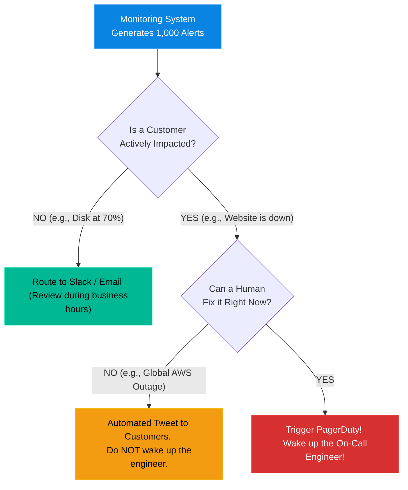

# Chapter 19 — On-Call Mental Health & Alert Fatigue

## Learning Objectives

Burnout destroys more engineering careers than technical incompetence. In this chapter, we address the human element of operations, structuring on-call rotations that protect mental health and reduce fatigue.

By the end of this chapter, you will be able to:
* Define "Alert Fatigue" and its devastating impact on operations.
* Architect a sustainable on-call rotation.
* Differentiate between "Actionable" alerts and "Informational" alerts.
* Understand the concept of "Blameless Post-Mortems."

## Visual Architecture: The Noise Filter

A toxic engineering culture routes every single system hiccup directly to a human's pager at 3:00 AM. A healthy SRE culture builds a massive filter. Only alerts that represent an active, customer-impacting outage that a human can *immediately* fix are allowed to page an engineer. Everything else is routed to a Chat room or an email queue to be reviewed the next morning.

## Theory & Concepts

### 1. Alert Fatigue
If a junior admin configures an alert for "CPU > 80%", the pager will go off 20 times a day during normal business traffic. The on-call engineer will log in, see the website is fine, and hit "Acknowledge" on the pager. 
After doing this 100 times, the engineer's brain is trained to believe *all* alerts are false alarms. When a real alert fires ("Database Offline"), the engineer will instinctively hit "Acknowledge" and go back to sleep. This is **Alert Fatigue**, and it causes catastrophic outages.

### 2. Actionable vs Informational
* **Actionable Alert:** "The Primary Database is offline. Failover failed. Revenue is dropping." -> *Page the engineer immediately.*
* **Informational Alert:** "A secondary web server rebooted successfully and rejoined the cluster." -> *Log it to Slack. Do not page anyone.*
If an alert wakes an engineer up at 3:00 AM, and the engineer does not have to type a command to fix it, that alert must be permanently deleted.

### 3. The Blameless Post-Mortem
When an outage happens (and it will), traditional IT culture looks for a scapegoat: "Bob deployed bad code, fire Bob." 
SRE culture mandates a **Blameless Post-Mortem**. You assume Bob is a good engineer who was doing his best. You ask: "Why did the system *allow* Bob to deploy bad code? Why didn't the CI/CD pipeline catch the syntax error? Why didn't the staging environment mimic production?" 
You fix the system, not the human. If you fire Bob, you just wasted the $100,000 it cost the company to train him on what not to do.

## Scenario-Based Troubleshooting

### Scenario A: The Hero Complex

> [!IMPORTANT]  
> **Incident Report: The Hero Complex**  
> **Reporter:** Automated Monitoring / End User  
> **The Incident:** A mid-level SysAdmin named Sarah is brilliant. She knows the infrastructure better than anyone. Because she wants to prove her value, she volunteers to be on-call 24/7. For six months, she saves the company from dozens of outages. The CEO calls her a "Hero."
In month seven, Sarah makes a minor typo in a firewall rule and accidentally takes the entire production network offline for 4 hours. She bursts into tears and quits the company the next day.

**The Investigation (Single Engineer Diagnosis):**
1. The incoming Lead SRE reviews the incident. 
2. **The Analysis:** The CEO blames Sarah for the typo. The SRE blames the CEO for creating a toxic "Hero Culture". 
3. The SRE explains that Sarah was suffering from severe burnout. Working 24/7 on-call destroys cognitive function. A tired engineer will always make a catastrophic typo eventually.
4. **The Resolution:** The SRE institutes strict On-Call policies. 
   * No one is allowed to be on-call for more than 7 days in a row.
   * If an engineer is woken up in the middle of the night, they are legally mandated to take the next morning off to sleep.
   * "Heroes" are banned. If a single person is the only one who knows how to fix a system, it is a massive organizational risk (the "Bus Factor"). 
5. The SRE forces the team to write Runbooks (Chapter 18) so that *any* junior engineer can fix a 3:00 AM outage, distributing the load and protecting the mental health of the senior staff.

> [!CAUTION]  
> **Best Practice: The Pager Handoff**  
> When you finish your 7-day on-call shift, you do not just silently hand the pager to the next engineer. You must conduct a formal **Handoff Meeting**. You spend 15 minutes reviewing every single alert that fired during your shift. If an alert fired 5 times and required no action, you both agree to delete the alert permanently before the next shift starts. This ensures the on-call rotation gets continuously quieter and healthier over time.

## Hands-on Lab

> [!TIP]
> **Practice Assignment Available**
> Proceed to the [Chapter 19 Practice Guide](../practice-files/V5-C19-practice.md) to practice writing an incident Post-Mortem!

## Interview Questions (Cultural Fit Scenarios)

### Question 1: (Hiring Manager) "Our monitoring system currently generates about 500 email alerts a day. The engineers just set up a rule to route them to a folder they never read. How would you fix this?"
* **Target Answer**: "This is textbook Alert Fatigue. If an alert is safely ignored 500 times, it is not an alert; it is a log metric. I would implement a strict 'Actionable Only' policy. I would delete all 500 of those alerts from the paging system. I would then rewrite the alerts based entirely on Customer SLIs (like Latency or Error Rate). If an alert fires, it must mean a customer is actively suffering, and the engineer must be required to take immediate action. Everything else should be relegated to a Grafana dashboard for daytime review."

### Question 2: (Tech Lead) "An engineer on your team runs a database migration script on production instead of staging, dropping the users table and causing a 2-hour outage. You are running the post-mortem. How do you handle it?"
* **Target Answer**: "I would conduct a strictly Blameless Post-Mortem. The goal is not to punish the engineer; human error is inevitable. The goal is to investigate the systemic failures that allowed the human error to reach production. I would ask: Why were the production and staging database credentials identical? Why did the engineer have raw SQL access to production instead of using a CI/CD automation pipeline? By focusing on fixing the systemic guardrails, we ensure that *no* engineer can ever make that specific mistake again."

### Question 3: (Hiring Manager) "You've been on-call for 3 days and have been woken up every single night at 2:00 AM for the same minor memory leak issue. What do you do on day 4?"
* **Target Answer**: "I do not suffer in silence. On day 4, I escalate. I hand the pager to the secondary on-call, or the manager, and I dedicate my entire workday to permanently fixing the memory leak (or writing a script to auto-restart the service before it alerts). Being on-call is not about enduring pain; it's about identifying systemic pain points and writing software to automate them away."

## Chapter Summary

Burnout is the silent killer of engineering teams. A Senior Engineer fiercely protects their team's mental health by silencing useless alerts, distributing knowledge via runbooks, and fostering a culture where mistakes are treated as learning opportunities rather than fireable offenses.

## Completion Checklist

- [ ] I can define Alert Fatigue.
- [ ] I understand the difference between Actionable and Informational alerts.
- [ ] I know how to conduct a Blameless Post-Mortem.

---

## Navigation

⬅ Previous:
[Chapter 18 – Writing Technical Documentation & RFCs](V5-C18-writing-rfcs.md)

🏠 Volume Contents:
[Table of Contents](../TOC.md)

➡ Next:
[Chapter 20 – The Future of the Engineer](V5-C20-future-engineer.md)
