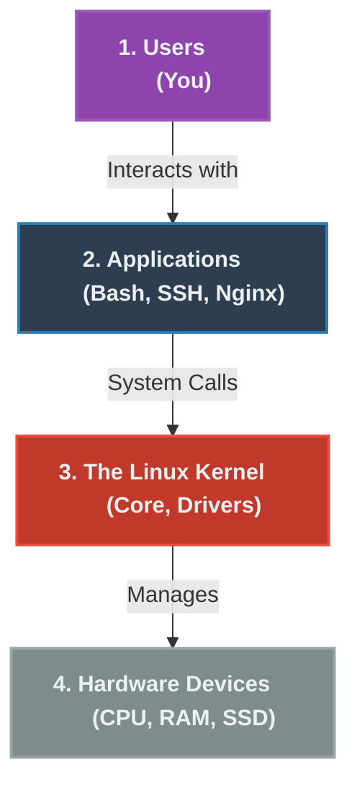

# Chapter 2 — Linux Architecture & Distributions


*"You cannot troubleshoot what you don't understand."*

## Learning Objectives

Linux isn't just one operating system; it's a vast ecosystem of distributions built on a shared foundation. In this chapter, we explore the core architecture that makes Linux tick and how different distributions tailor it to their needs.

By the end of this chapter, you will be able to:
* Explain the architecture of a Linux operating system.
* Understand how users interact with the kernel.
* Describe what happens when a command is executed.
* Explain system calls.
* Understand why processes crash and how memory is allocated.
* Explain the Linux boot sequence at a high level.
* Understand where troubleshooting begins.

## Introduction: Why Linux Architecture Matters

Most beginners learn Linux like this: they memorize commands (`ls`, `cd`, `cp`, `mv`, `systemctl`, `journalctl`).

Professional engineers ask different questions.

When troubleshooting, you must first ask: **Where is the crash happening?**
* Application?
* Library?
* Kernel?
* Filesystem?
* Memory?
* CPU?
* Hardware?
* Network?

To answer those questions, you must understand Linux architecture.

## Linux Is Like a City

> [!TIP] Support Engineer Tip #2
> **You cannot troubleshoot what you don't understand.** Memorize the 4 layers of the OS. When a server crashes, your first thought shouldn't be "What command do I run?" but "Which layer is failing?"

Imagine Linux as a modern city. Every request travels through these layers. Understanding those layers is the foundation of troubleshooting.



## The Four Major Layers

Linux consists of four primary layers: **User → Applications → Kernel → Hardware**. Let's examine each one.

### Layer 1 — User Space

Everything you interact with lives here (e.g., Bash, Firefox, SSH client, Nginx, Docker). Applications cannot directly access hardware. They must request access from the kernel. This separation protects the operating system.

> [!NOTE]
> **Windows ↔ Linux Comparison**
> In Windows, the equivalent flow is: `Applications → Windows API → Windows Kernel → Hardware`. The concept is highly similar.

### Layer 2 — System Libraries

Applications rarely talk directly to the kernel. Instead, they use libraries (e.g., `glibc`, `OpenSSL`, `libpthread`, `zlib`). Think of a library as a translator. Instead of every program knowing how to communicate with the kernel, the library handles it.

**Real Example:** You type `cat test.txt`. The `cat` program doesn't know how to read a disk directly. Instead, the flow is:
`cat → glibc → System Call → Kernel → Disk`

### Layer 3 — System Calls

This is one of the most important concepts. A system call is simply a request from a program asking the kernel to perform a privileged operation.

Every application depends on them: reading a file, writing a file, creating a process, allocating memory, opening a network socket, mounting a disk.
*Common system calls include: `open()`, `read()`, `write()`, `close()`, `fork()`, `execve()`, `socket()`, `connect()`, `accept()`, `mmap()`, `clone()`.*

### Layer 4 — Kernel

The kernel is the heart of Linux. Everything depends on it. If the kernel stops, Linux stops.
Responsibilities include: CPU scheduling, memory management, process management, device drivers, networking, filesystems, security, and system calls.

> [!TIP]
> **The Kernel Is Like a Traffic Police Officer**
> Imagine thousands of applications, millions of operations, and only one CPU. The kernel decides which process runs, when, for how long, how much RAM it receives, which files it can access, and which network packets are allowed.

## Hardware Layer

Hardware includes the CPU, Memory, SSD/HDD, Network Interface Card (NIC), GPU, and USB devices. The kernel communicates with hardware through device drivers. Without the correct driver, the hardware may not function properly.

## How a Command Really Works

Let's follow a simple command: `ls`. What actually happens?

1. **Keyboard** input is sent.
2. **Shell** receives input.
3. **Shell searches PATH** and loads `/bin/ls`.
4. **Creates Process**.
5. **Kernel allocates memory**.
6. **Kernel schedules CPU**.
7. **ls requests directory contents**.
8. **Kernel reads filesystem**.
9. **Kernel returns data**.
10. **Terminal displays result**.

This entire process usually completes in milliseconds.

## Processes & Memory

Everything running on Linux is represented as a process (`bash`, `systemd`, `sshd`, `nginx`, `mysql`). Each process has a Process ID (PID), Parent Process ID (PPID), User, Memory allocation, and Open files.

#### Process Lifecycle
`Created → Ready → Running → Sleeping → Waiting → Stopped → Terminated`

Support engineers often investigate processes that become stuck in one of these states. Every running process needs memory (Code, Data, Heap, Stack, Shared memory). When available memory becomes scarce, Linux may use swap space or invoke the Out-Of-Memory (OOM) Killer to terminate processes.

> [!IMPORTANT]
> **Senior Engineer Thinking**
> **Customer**: *"The server rebooted itself."*
> A beginner says: *"Hardware problem?"*
> A senior engineer considers: *Kernel panic? OOM Killer? Power issue? Hypervisor restart? Watchdog timer? Cloud maintenance event?* Multiple hypotheses are explored before conclusions are drawn.

## The Linux Boot Process

At a high level, Linux starts by loading the kernel through a bootloader before handing control to `systemd`. We'll examine every stage of this process in detail in **V1-C18 – Linux Boot Process**.

> [!CAUTION]
> **Common Beginner Mistakes**
> ❌ Rebooting before collecting evidence.
> ❌ Assuming every issue is application-related.
> ❌ Ignoring logs.
> ❌ Treating symptoms instead of identifying root causes.
> ❌ Restarting services without understanding why they failed.

## Real-World Scenarios

> [!IMPORTANT] Incident Report: The Frozen Application
>
> **Problem:** End User (Dave): "My application freezes completely whenever it tries to save a file."
>
> **Investigation:** Charlie checks `top` and sees the application process in a `D` (Uninterruptible Sleep) state.
> 
> ```bash
> charlie@prod-db1:~$ ps aux | grep myapp
> USER       PID %CPU %MEM    VSZ   RSS TTY      STAT START   TIME COMMAND
> appuser   4123  0.0  1.2  45012 12000 ?        D    10:15   0:02 /opt/myapp/bin
> ```
>
> **Evidence:** The `D` state indicates the process is waiting on the kernel (usually disk I/O) and cannot be killed.
>
> **Wrong Assumption:** Bob (Junior Admin) says: "The app is frozen, let's `kill -9` the process and start it again." (Note: `kill -9` does not work on processes in `D` state).
>
> **Root Cause:** Alice (Senior Admin) traces the system calls using `strace` and discovers the application is trying to write to `/mnt/nfs_share`. Running `df -h` hangs completely. The underlying issue is that the remote NFS storage server went offline, causing the kernel to block all write requests to that mount.
>
> **Lessons Learned:** The application itself was perfectly healthy; the failure was at the hardware/network layer (the remote storage). By understanding that an application freezing on file access is a storage layer issue, Alice avoided wasting time debugging the application code.
## Hands-on Lab

> [!NOTE]
> **Practice Assignment Available**
> Before moving on, complete the exercises in the [Chapter 2 Practice Guide](../practice-files/V1-C02-practice.md) to explore the system architecture and observe system calls.

### Lab 2.1: Exploring the System Architecture

#### Objective
Familiarize yourself with the system's architecture, processes, and memory.

#### Step-by-Step Instructions

1. **Explore the Running System**
   ```bash
   $ uname -a
   $ hostnamectl
   $ cat /etc/os-release
   ```
   *Questions*: Which kernel version are you running? Which Ubuntu release is installed? What architecture (x86_64, ARM) is the system using?

2. **Inspect Processes**
   ```bash
   $ ps -ef
   $ top
   ```
   *Observe*: PID, PPID, User, CPU usage, and Memory usage.

3. **Explore Memory**
   ```bash
   $ free -h
   $ cat /proc/meminfo
   ```
   *Questions*: How much RAM is installed? How much is currently available? Is swap enabled?

4. **Observe System Calls (Preview)**
   ```bash
   $ strace ls
   ```
   Don't worry about understanding every line yet. Notice that even a simple command generates many system calls.

> [!IMPORTANT] Engineering Wisdom #2
> Automation without understanding creates faster mistakes. Don't write a script to fix a problem until you can fix it manually first.


## Interview Questions

### Question 1: What happens when you execute ls?
**Scenario**: You are asked this during an interview to gauge your architectural depth.
* **Target Answer**: "The shell parses the command, searches the executable in the PATH, creates a new process, the kernel schedules it, the process requests directory information through system calls, the kernel retrieves the data from the filesystem, and the results are returned to the terminal."

### Question 2: Why can't user-space applications access hardware directly?
* **Target Answer**: For security and stability. User space is separated from the kernel to ensure that a crashing application or malicious code cannot directly manipulate hardware or memory belonging to other processes. Applications must request privileged operations via system calls.

> [!NOTE] Things I Learned the Hard Way
> **The Wrong Distribution**
> I once deployed a new application stack on a bleeding-edge Fedora server because it had the newest packages. Six months later, the application broke because an automatic update fundamentally changed a core library. Production servers should use stable, Long Term Support (LTS) distributions like Ubuntu LTS or RHEL. Save the bleeding edge for your personal laptop.


## Chapter Summary

You learned that Linux is organized into layers: user space, libraries, system calls, kernel, and hardware. Applications rely on the kernel to access system resources, and every command creates one or more processes. Understanding where a failure occurs is the first step toward effective troubleshooting, transforming it from trial-and-error into logical investigation.

## Cheat Sheet

Remember this flow:
`User → Application → System Libraries → System Calls → Kernel → Device Drivers → Hardware`

When something fails, your first task is not to fix it. Your first task is to identify which layer is failing. That single habit will make your troubleshooting faster, more accurate, and more professional.

## Completion Checklist

- [ ] I can describe the 4 major layers of Linux architecture.
- [ ] I understand the role of System Calls.
- [ ] I know the difference between User Space and Kernel Space.
- [ ] I completed Lab 2.1 and reviewed the `strace` output.

---

## Navigation

⬅ Previous:
[Chapter 1 – Welcome to Linux Support Engineering](V1-C01-welcome-to-linux-support-engineering.md)

🏠 Volume Contents:
[Table of Contents](../TOC.md)

➡ Next:
[Chapter 3 – Provisioning Linux](V1-C03-provisioning-linux.md)
