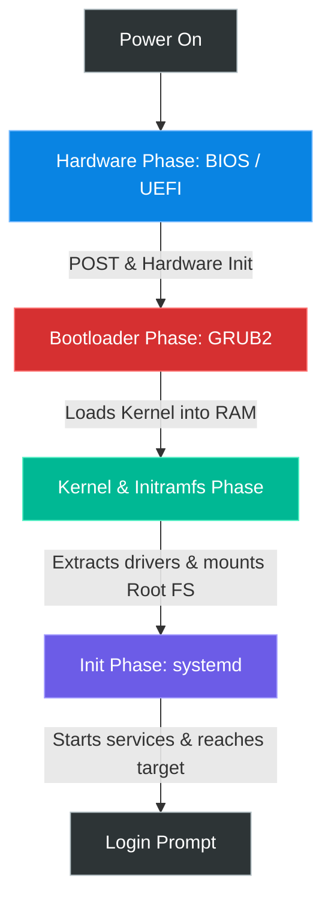

# Chapter 4 — Linux Boot Process


## Learning Objectives

Have you ever wondered what exactly happens the millisecond you press the power button? The journey from a cold CPU to a fully functioning operating system is complex, fascinating, and critical for troubleshooting boot failures.

By the end of this chapter, you will be able to:
* Map the exact sequence of events from pushing the power button to the login prompt.
* Explain the role of the bootloader (GRUB2) and how to configure it.
* Understand why the kernel requires an `initramfs` (Initial RAM Filesystem) to boot.
* Interrupt the boot sequence to recover a broken system (Single User Mode / Emergency Target).

## Introduction

As a Linux Support Engineer, one of the most critical incidents you will handle is a "Server Down" ticket where a machine refuses to boot. 

If you do not understand the boot process, you will stare blankly at a black screen with a flashing cursor, or a `grub>` rescue prompt, and have no idea how to fix it. Understanding the exact sequence of how Linux wakes up allows you to pinpoint *exactly* which component failed, enabling surgical, rapid recovery.

## Visual Architecture: The Boot Sequence



## Theory & Concepts

The boot process is divided into four distinct phases. If a boot fails, it fails in one of these four areas.

### Phase 1: Hardware (BIOS / UEFI)
When you power on the server, the motherboard executes firmware (either legacy **BIOS** or modern **UEFI**).
1. It performs a **POST** (Power-On Self-Test) to ensure RAM and CPU are functional.
2. It looks for a bootable device (Hard Drive, Network PXE, or USB).
3. Once found, it hands control over to the bootloader located on that device.

### Phase 2: The Bootloader (GRUB2)
**GRUB2** (GRand Unified Bootloader) is the standard bootloader for modern Linux systems. 
* **The Goal**: GRUB's only job is to find the Linux Kernel on the hard drive, load it into RAM, and execute it.
* **The Problem**: To read the kernel from the hard drive, GRUB needs to understand filesystems (like `ext4` or `xfs`). GRUB has basic filesystem drivers built-in just for this purpose.
* **Configuration**: GRUB is configured via `/etc/default/grub`. 

### Phase 3: Kernel and Initramfs
Once GRUB executes the Kernel, the Kernel takes over the hardware.
* **The Goal**: The Kernel must mount the primary root filesystem (`/`) so it can start running the actual operating system.
* **The Problem**: The Kernel doesn't have all the drivers built into it (that would make the Kernel massive). The drivers needed to read the hard drive (e.g., LVM, RAID, or specific SCSI drivers) are stored *on the hard drive*. It's a chicken-and-egg problem.
* **The Solution (`initramfs`)**: GRUB also loads a compressed file into RAM called the **Initial RAM Filesystem** (`initramfs`). This acts as a temporary, miniature root filesystem that contains the exact drivers the Kernel needs to unlock and mount the real hard drive. 

### Phase 4: Init System (`systemd`)
Once the Kernel successfully mounts the real root filesystem (`/`), it executes the very first program: `/sbin/init` (which is a symlink to `systemd` on modern systems).
* `systemd` becomes Process ID 1 (PID 1).
* It reads its configuration and begins starting services (Network, SSH, Web Servers) in parallel.
* It stops once it reaches its default **target** (e.g., `multi-user.target` for a CLI server, or `graphical.target` for a GUI desktop).

> [!TIP] Support Engineer Tip #5
> **Isolate the Boot Phase.** If a server boots but the network is down, the failure happened in Phase 4 (`systemd`). If the server throws a `Kernel Panic - Not syncing: VFS: Unable to mount root fs`, the failure happened in Phase 3 (`initramfs`). If you see a `grub rescue>` prompt, the failure is in Phase 2. Isolate the phase before you start fixing.

## Real-World Scenarios

> [!IMPORTANT] Incident Report: The Missing Kernel
>
> **Problem:** End User (Dave): "We updated the system packages yesterday and rebooted the server. Now it won't come back online. The hypervisor console shows a `grub>` prompt."
>
> **Investigation:** Charlie opens the VMware console and sees the system halted at `grub>`. He types `ls` at the prompt.
> 
> ```terminal
> grub> ls
> (hd0) (hd0,msdos1) (hd0,msdos2)
> grub> ls (hd0,msdos1)/
> lost+found/ efi/ grub2/ initramfs-3.10.0.img vmlinuz-3.10.0
> ```
>
> **Evidence:** The boot partition exists and contains a kernel (`vmlinuz`) and an `initramfs`, but GRUB did not load them automatically.
>
> **Wrong Assumption:** Bob (Junior Admin) says: "The hard drive is corrupted, we need to restore from yesterday's backup."
>
> **Root Cause:** Alice (Senior Admin) realizes that during the package update, the `/boot/grub2/grub.cfg` file was either deleted or improperly generated. GRUB loaded, but it had no configuration file telling it *which* kernel to boot. 
>
> **Lessons Learned:** At the `grub>` prompt, Alice manually sets the root partition (`set root=(hd0,msdos1)`), specifies the kernel path (`linux16 /vmlinuz-3.10.0`), specifies the initramfs (`initrd16 /initramfs-3.10.0.img`), and types `boot`. The system boots perfectly. Once inside, she re-runs `grub2-mkconfig` to permanently rebuild the missing configuration file, avoiding a multi-hour backup restoration.
## Hands-on Lab

> [!CAUTION]
> **Practice Assignment Available**
> Before moving on, complete the exercises in the [Chapter 4 Practice Guide](../practice-files/V1-C04-practice.md). You will learn how to interrupt GRUB and bypass the root password, simulating an emergency recovery scenario.

## Interview Questions

### Question 1: Explain the Linux Boot Process from power-on to the login prompt.
* **Target Answer**: "First, the BIOS/UEFI performs hardware checks and locates the boot device. It then hands control to the Bootloader, typically GRUB2. GRUB2 loads the Kernel and the `initramfs` into memory. The Kernel uses the drivers inside the `initramfs` to mount the actual root filesystem. Finally, the Kernel executes the init system (usually `systemd` as PID 1), which mounts the remaining filesystems, starts all configured services, and presents the login prompt."

### Question 2: What is the purpose of the `initramfs`?
* **Target Answer**: "It solves the chicken-and-egg problem during boot. The kernel needs drivers to access the root filesystem, but those drivers are stored on the root filesystem itself. The `initramfs` is a temporary filesystem loaded into RAM by the bootloader that contains the necessary modules for the kernel to mount the real root disk."

## Chapter Summary

The boot process is highly logical. Firmware hands off to the Bootloader. The Bootloader hands off to the Kernel. The Kernel mounts the disk and hands off to `systemd`. `systemd` starts the services. When troubleshooting boot failures, your first job is identifying exactly which of these hand-offs failed.

## Completion Checklist

- [ ] I can draw or explain the four phases of the boot process.
- [ ] I understand why the `initramfs` is critical for mounting the root filesystem.
- [ ] I know which configuration file controls GRUB2.


**Chapter Transition**
> The kernel is loaded and running, but where does it store all its configuration and data? Welcome to the Filesystem Hierarchy Standard.

---

## Navigation

⬅ Previous:
[Chapter 3 — Provisioning Linux](V1-C03-provisioning-linux.md)

🏠 Volume Contents:
[Table of Contents](../TOC.md)

➡ Next:
[Chapter 5 — Linux Filesystem](V1-C05-linux-filesystem.md)
