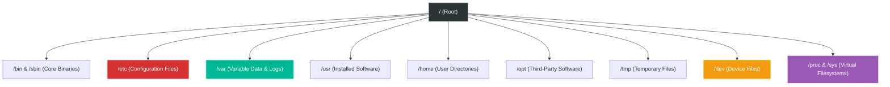

# Chapter 5 — Linux Filesystem


## Learning Objectives

In Linux, 'everything is a file.' But where are those files actually stored? Navigating the Filesystem Hierarchy Standard is like learning the map of a new city—once you know the layout, you'll never get lost.

By the end of this chapter, you will be able to:
* Explain the "Everything is a file" philosophy.
* Navigate the Filesystem Hierarchy Standard (FHS) intuitively.
* Identify exactly where configuration files, logs, and binaries are stored.
* Differentiate between persistent storage on disk and virtual filesystems in RAM.

## Visual Architecture: The Filesystem Hierarchy



## Theory & Concepts

### 1. "Everything is a file"
In Linux, almost everything you interact with is represented as a file. A text document is a file. A directory is a file that contains a list of other files. Your hard drive is a file (e.g., `/dev/sda`). Even your network socket or a running process is represented as a file.

Because everything is a file, the same tools you use to read a text document (`cat`, `less`) can often be used to read hardware information.

### 2. The Filesystem Hierarchy Standard (FHS)
Unlike Windows, which assigns drive letters (C:\, D:\), Linux uses a single, unified tree structure starting at the **Root Directory (`/`)**. The FHS dictates exactly where certain types of files must live. If you memorize this, you will never have to guess where something is installed.

#### Core Binaries (`/bin` and `/sbin`)
* `/bin`: Contains essential user commands (like `ls`, `cat`, `echo`).
* `/sbin`: Contains essential system administration commands (like `fdisk`, `reboot`). These typically require `root` privileges.

#### Configuration (`/etc`)
If you need to change how a service behaves, you go here. **Nothing in `/etc` is an executable binary.** It contains purely text-based configuration files (e.g., `/etc/ssh/sshd_config` or `/etc/fstab`). 

#### Variable Data (`/var`)
This directory contains data that frequently changes while the system is running.
* `/var/log`: System and application log files.
* `/var/lib`: Databases (like MySQL or PostgreSQL data).
* `/var/spool`: Mail and print queues.

#### Installed Software (`/usr` and `/opt`)
* `/usr`: The secondary hierarchy for read-only user data. Most user-installed software and libraries live here (e.g., `/usr/bin/python`).
* `/opt`: Optional third-party software that doesn't follow standard Linux packaging conventions (e.g., proprietary enterprise agents or massive self-contained Java apps).

### 3. Virtual Filesystems (`/dev`, `/proc`, `/sys`)
Not everything in the tree exists on the hard drive. Some directories exist entirely in RAM and are generated dynamically by the Linux Kernel.

* `/dev`: Device nodes. When you plug in a USB drive, the kernel creates a file here (like `/dev/sdb`) so software can communicate with it.
* `/proc`: The process information pseudo-filesystem. It contains live data about the system's running processes and hardware state.
* `/sys`: Similar to `/proc`, it provides an interface to kernel data structures and hardware attributes.

## Real-World Scenarios

> [!IMPORTANT] Incident Report: The Missing Command
>
> **Problem:** End User (Dave): "I just installed a proprietary monitoring agent, but when I type its command in the terminal, it says 'command not found'. Where did it install?"
>
> **Investigation:** Charlie checks if the package was installed via standard repositories (`apt`/`yum`), but it was downloaded as a `.tar.gz` and run via an installer script.
> 
> ```bash
> charlie@prod-web1:~$ custom-monitor
> bash: custom-monitor: command not found
> charlie@prod-web1:~$ ls -l /opt/custom-monitor/bin/
> total 1204
> -rwxr-xr-x 1 root root 1230400 Jul 12 10:14 custom-monitor
> ```
>
> **Evidence:** The binary exists, but the shell cannot find it because it is not in the system's `$PATH`.
>
> **Wrong Assumption:** Bob (Junior Admin) says: "The installation failed. Let's run the installer again as root."
>
> **Root Cause:** Alice (Senior Admin) knows the FHS. Proprietary or self-contained software that doesn't integrate with the OS package manager installs to `/opt`. The binary is sitting safely at `/opt/custom-monitor/bin/custom-monitor`.
>
> **Lessons Learned:** Rather than reinstalling blindly, Alice runs the agent using its absolute path (`/opt/custom-monitor/bin/custom-monitor start`). To fix it permanently, she adds `/opt/custom-monitor/bin` to the system's `$PATH` profile. Understanding the FHS saves hours of wild-goose chases.
## Hands-on Lab

> [!NOTE]
> **Practice Assignment Available**
> Before moving on, complete the exercises in the [Chapter 5 Practice Guide](../practice-files/V1-C05-practice.md) to practice navigating the hierarchy and reading live kernel data from the virtual filesystems.

> [!TIP] Support Engineer Tip #6
> ```bash
> rm -rf *
> ```
> **The Most Dangerous Command:** If you run this in the wrong directory, you will silently and permanently delete everything inside it. Linux does not have a recycle bin. Before running `rm -rf *`, ALWAYS run `pwd` to verify exactly where you are, or specify the absolute path like `rm -rf /tmp/myfolder/*`.

## Interview Questions

### Question 1: What is the difference between `/bin` and `/sbin`?
* **Target Answer**: "Both contain executable binaries. However, `/bin` contains standard commands that any user can run, like `ls` or `mkdir`. `/sbin` contains system binaries intended specifically for the root user to perform administrative tasks, like `fdisk` or `iptables`."

### Question 2: If a web server fails to start, which directory do you check first?
* **Target Answer**: "I would immediately check `/var/log/` (specifically `/var/log/nginx` or `/var/log/httpd`) for error logs to understand why the service is crashing."

### Question 3: Is `/proc/cpuinfo` a file stored on the hard drive?
* **Target Answer**: "No. The `/proc` directory is a virtual, pseudo-filesystem created by the kernel in RAM. When you run `cat /proc/cpuinfo`, the kernel intercepts that read request and dynamically generates text output containing the live hardware specifications."

> [!CAUTION] Industry Incident Spotlight: GitLab Database Deletion (2017)
> **What Happened:** In January 2017, a systems administrator for GitLab was trying to fix a database replication issue. Intending to clear the database on a staging server, the engineer accidentally ran `rm -rf` on the primary production database directory instead.
> 
> **Why it Happened:** The engineer had multiple terminal windows open. They thought they were logged into the staging database server (e.g., `db2.staging`), but they were actually logged into the primary production server (`db1.prod`).
> 
> **The Loss:** 300 GB of production data was permanently deleted in seconds. The outage lasted for 18 hours as they struggled to restore from various backup mechanisms (many of which had silently failed).
> 
> **Lessons Learned:** 
> 1. Always verify your hostname (`hostname`) and path (`pwd`) before running destructive commands.
> 2. Change the terminal prompt color for production servers (e.g., red for prod, green for staging) to provide visual awareness.
> 3. Linux will happily execute exactly what you tell it to do, even if it destroys the company.

## Chapter Summary

The Linux Filesystem is highly organized. Configuration goes in `/etc`. Logs go in `/var/log`. Normal software goes in `/usr`, and weird proprietary software goes in `/opt`. The kernel exposes itself through `/proc` and `/sys`. Mastering this layout is the difference between blindly searching a server and surgically navigating it.

## Completion Checklist

- [ ] I can explain why `/etc` contains no executable files.
- [ ] I know exactly where to look for application log files.
- [ ] I understand that `/proc` exists only in memory, not on disk.


**Chapter Transition**
> You know where files are supposed to live. Now, how do you actually traverse the filesystem and manipulate them?

---

## Navigation

⬅ Previous:
[Chapter 4 — Linux Boot Process](V1-C04-linux-boot-process.md)

🏠 Volume Contents:
[Table of Contents](../TOC.md)

➡ Next:
[Chapter 6 — Working with Files & Directories](V1-C06-working-with-files-and-directories.md)
