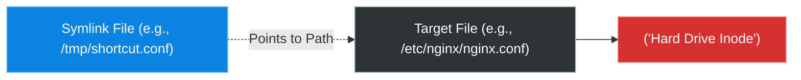

# Chapter 6 — Working with Files & Directories


## Learning Objectives

Mastering the command line starts with file manipulation. In this chapter, we move beyond basic navigation and dive into the powerful utilities that allow you to create, move, and manage data at lightning speed.

By the end of this chapter, you will be able to:
* Create, copy, move, and delete files and directories confidently.
* Differentiate between viewing static files (`cat`, `less`) and streaming live files (`tail -f`).
* Understand and create Symbolic Links (Soft Links) to alias files across the filesystem.

## Visual Architecture: Symbolic Links

A **Symbolic Link** (or symlink) is a special file that acts as a shortcut to another file. If you delete the symlink, the target file is safe. If you delete the target file, the symlink breaks.



## Theory & Concepts

### 1. Creation and Deletion
* `touch <file>`: Creates an empty file or updates its timestamp if it already exists.
* `mkdir <dir>`: Creates a directory. Use `-p` to create nested directories (e.g., `mkdir -p /app/logs/2026`).
* `rm <file>`: Deletes a file permanently. Linux has no Recycle Bin.
* `rm -r <dir>`: Deletes a directory and everything inside it. 

> [!CAUTION]
> **Senior Engineer Warning**
> Never run `rm -rf /` or `rm -rf *` blindly. Always verify your current directory using `pwd` before running a recursive delete.

### 2. Copying and Moving
* `cp <source> <destination>`: Copies a file. Use `cp -r` for directories.
* `mv <source> <destination>`: Moves a file. Interestingly, `mv` is also used to rename files. If you type `mv oldname.txt newname.txt`, the file is renamed instantly.

### 3. Viewing Files
As a Support Engineer, you will spend 80% of your time reading configuration and log files.
* `cat <file>`: Dumps the entire file to the screen. Good for short files.
* `less <file>`: Opens the file in an interactive pager. You can scroll up/down and search by typing `/keyword`. Press `q` to exit.
* `head <file>`: Shows the first 10 lines of a file.
* `tail <file>`: Shows the last 10 lines of a file.

**The Golden Command: `tail -f`**
When troubleshooting, you don't just want to see the end of a log file; you want to watch it update in real-time while a user tries to log in.
* `tail -f /var/log/syslog` will lock onto the file and stream new log entries live to your terminal. Press `Ctrl + C` to stop.

### 4. Linking
Sometimes a script expects a file to be in `/usr/local/bin`, but you installed it in `/opt`. Instead of copying the binary and wasting space, you create a link.
* **Symbolic Link (`ln -s <target> <link_name>`)**: Creates a shortcut. 
* **Hard Link (`ln <target> <link_name>`)**: Points directly to the data on the disk (the inode). Rarely used by beginners, but crucial to know they exist.

## Real-World Scenarios

> [!IMPORTANT] Incident Report: The Silent Crash
>
> **Problem:** End User (Dave): "Our application is crashing immediately when it starts up. We can't figure out why."
>
> **Investigation:** Charlie asks the developer to trigger the startup script while he monitors the application's live log stream.
> 
> ```bash
> charlie@prod-app1:~$ tail -f /var/log/myapp/error.log
> [10:45:01] INFO: Initializing application...
> [10:45:02] INFO: Loading configuration from /etc/myapp.conf
> [10:45:03] ERROR: Cannot write to /tmp/myapp.lock - Permission denied
> [10:45:03] FATAL: Application halted.
> ```
>
> **Evidence:** The application crashes because it lacks permission to write its lock file to `/tmp/`.
>
> **Wrong Assumption:** Bob (Junior Admin) says: "The application is broken, let's reinstall it."
>
> **Root Cause:** Alice (Senior Admin) sees the exact error in real-time. Another user previously ran the application as `root`, creating `/tmp/myapp.lock` with root ownership. Now, when the normal application user tries to run it, it cannot overwrite the root-owned lock file.
>
> **Lessons Learned:** Without `tail -f`, they would have had to dig through millions of lines of historical logs to find the error. By watching the log stream *while* the issue was reproduced, Alice caught the exact permission error instantly, deleted the stale lock file, and restored service in 2 minutes.
## Hands-on Lab

> [!NOTE]
> **Practice Assignment Available**
> Before moving on, complete the exercises in the [Chapter 6 Practice Guide](../practice-files/V1-C06-practice.md) to practice linking files and watching log streams.

## Interview Questions

### Question 1: What is the difference between `cat` and `less`?
* **Target Answer**: "`cat` prints the entire contents of a file to standard output at once, which makes it terrible for reading large log files. `less` opens the file in a paginated view, allowing you to scroll, search, and consume the file without flooding your terminal."

### Question 2: What happens if you delete the target of a symbolic link?
* **Target Answer**: "The symbolic link becomes a 'broken link' or an 'orphan'. It will still exist in the filesystem, but attempting to read or execute it will result in a 'No such file or directory' error, because the path it points to no longer exists."

## Chapter Summary

The ability to swiftly manipulate the filesystem is the foundation of Linux administration. Creating, copying, moving, and deleting files are the nouns and verbs of your daily job. Furthermore, mastering `tail -f` will drastically reduce your time-to-resolution during live outages. 

## Completion Checklist

- [ ] I can create and safely delete directories.
- [ ] I understand the difference between renaming a file and moving it.
- [ ] I can use `tail -f` to monitor logs in real-time.

---

## Navigation

⬅ Previous:
[Chapter 5 – Linux Filesystem](V1-C05-linux-filesystem.md)

🏠 Volume Contents:
[Table of Contents](../TOC.md)

➡ Next:
[Chapter 7 – Text Editors (nano & vim)](V1-C07-text-editors.md)
