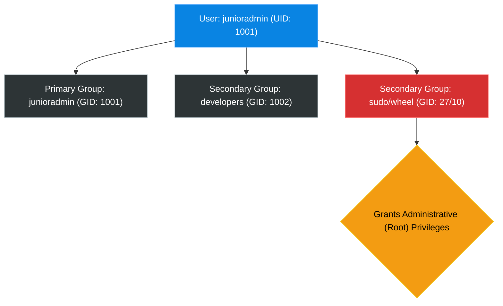

# Chapter 8 — Users & Groups


## Learning Objectives

Linux is inherently a multi-user system. Understanding how identities are managed, authenticated, and grouped is the bedrock of system security and access control.

By the end of this chapter, you will be able to:
* Differentiate between the `root` user and standard users.
* Understand how Linux maps usernames to numerical UIDs and GIDs.
* Manage user accounts using `useradd`, `usermod`, and `userdel`.
* Safely grant and revoke administrative privileges using `sudo` and `/etc/sudoers`.

## Visual Architecture: Identity Mapping

In Linux, a user is not just a name; it is a numerical ID (UID). Every user is assigned a Primary Group, and can optionally be a member of multiple Secondary Groups (like the `sudo` group).



## Theory & Concepts

### 1. Root vs. Standard Users
Linux is a multi-user operating system. 
* **The `root` user**: The omnipotent superuser. It has a User ID (UID) of `0`. Root can delete any file, kill any process, and destroy the system instantly. You should *never* log in directly as root.
* **Standard users**: Regular accounts (usually UID 1000 and above). They are heavily restricted. They cannot install software or read other users' private files.

### 2. Identity Files
Linux stores user information in plain-text configuration files located in `/etc`.

* `/etc/passwd`: Stores the username, UID, Primary Group ID (GID), home directory, and default shell. It **does not** store passwords.
* `/etc/shadow`: Stores the heavily encrypted password hashes. Only the root user can read this file.
* `/etc/group`: Defines all the groups on the system and lists their members.

### 3. Managing Users
* `useradd <username>`: Creates a new user. (On Ubuntu, `adduser` is often preferred as it is interactive, but `useradd` is the universal standard).
* `passwd <username>`: Sets or changes a user's password.
* `usermod -aG <group> <username>`: Appends a user to a supplementary group. (The `-aG` is critical. If you forget the `a` for append, it removes them from all other groups!)
* `userdel -r <username>`: Deletes the user and recursively deletes their home directory.

### 4. Privilege Escalation (`sudo`)
If you never log in as root, how do you install software? You use `sudo` (Superuser DO). 
When a standard user types `sudo apt update`, the system checks the `/etc/sudoers` file to see if they are allowed to borrow root's powers.

**Dual-Distribution Standard:**
How do you give a user `sudo` privileges? You add them to the admin group.
* **Debian/Ubuntu 26.04**: Add the user to the `sudo` group. (`usermod -aG sudo username`)
* **RHEL 10 / CentOS**: Add the user to the `wheel` group. (`usermod -aG wheel username`)

> [!CAUTION]
> **Editing the Sudoers File**
> Never edit `/etc/sudoers` with `vim` or `nano` directly. If you make a typo, you will lock yourself out of `sudo` forever. ALWAYS use the `visudo` command. It safely opens the file and checks it for syntax errors before saving.

## Real-World Scenarios

> [!IMPORTANT] Incident Report: The Restricted Restart
>
> **Problem:** End User (Dave): "We hired a new developer, Sarah. She needs to be able to restart the Nginx web server when she deploys code, but we do not want to give her full root access."
>
> **Investigation:** Charlie reviews Sarah's current permissions. She is a standard user (UID 1005). If she tries to restart Nginx, she is blocked.
> 
> ```bash
> sarah@prod-web1:~$ systemctl restart nginx
> Failed to restart nginx.service: Interactive authentication required.
> sarah@prod-web1:~$ sudo systemctl restart nginx
> [sudo] password for sarah:
> sarah is not in the sudoers file. This incident will be reported.
> ```
>
> **Evidence:** The system correctly blocks Sarah from managing system-level services.
>
> **Wrong Assumption:** Bob (Junior Admin) says: "I'll just add her to the `sudo` group so she can restart it."
>
> **Root Cause:** Adding her to the `sudo` group grants her absolute root power over the entire server, violating the Principle of Least Privilege. 
>
> **Lessons Learned:** Alice (Senior Admin) types `visudo` and adds a custom rule at the bottom of the file: 
> `sarah ALL=(ALL) NOPASSWD: /bin/systemctl restart nginx` 
> Sarah can now restart the web server instantly. However, if she tries to run `sudo rm /etc/passwd`, it will be blocked. Alice solved the problem securely.
## Hands-on Lab

> [!NOTE]
> **Practice Assignment Available**
> Before moving on, complete the exercises in the [Chapter 8 Practice Guide](../practice-files/V1-C08-practice.md) to practice safely escalating privileges.

> [!TIP] Support Engineer Tip #7
> ```bash
> usermod -G docker myuser
> ```
> **The Appending Disaster:** You forgot the `-a` (append) flag. The `-G` flag alone *replaces* the user's secondary groups with ONLY the `docker` group.
> **Consequence**: The user is instantly removed from the `sudo` or `wheel` group and loses all admin rights, potentially locking you out of the server forever! Always use `usermod -aG`.

## Interview Questions

### Question 1: What does the `/etc/shadow` file do, and why is it separate from `/etc/passwd`?
* **Target Answer**: "Historically, passwords were stored in `/etc/passwd`. However, because all standard users need to read `/etc/passwd` (to map UIDs to names), attackers could steal the password hashes. To fix this, the encrypted hashes were moved to `/etc/shadow`, which is locked down with strict permissions so only the `root` user can read it."

### Question 2: You want to add a user to the `docker` group. Why is it dangerous to run `usermod -G docker myuser`?
* **Target Answer**: "Running `usermod -G` will replace the user's supplementary groups entirely. If they were in the `wheel` or `sudo` group, they would be removed from it, instantly stripping their administrative privileges. You must always use `-aG` to *append* the new group."

### Question 3: Why should you use `visudo` instead of editing `/etc/sudoers` directly?
* **Target Answer**: "`visudo` acts as a safety wrapper. It locks the `sudoers` file to prevent simultaneous edits, and most importantly, it performs a syntax check when you try to save. If you made a syntax error, it warns you and refuses to save, preventing you from permanently locking all admins out of `sudo`."

> [!IMPORTANT] Engineering Wisdom #12
> `root` solves everything, but `root` creates bigger problems. If an application requires `root` to run, it is a security risk. Always find out *which* specific permission it needs rather than granting it everything.

## Chapter Summary

Identity in Linux is numerical. The `root` user is UID 0 and has absolute power. Standard users are restricted. As a Support Engineer, your job is to embrace the principle of least privilege: give users exactly the permissions they need to do their jobs (often via custom `sudoers` rules), and absolutely nothing more.

## Completion Checklist

- [ ] I understand the relationship between `/etc/passwd` and `/etc/shadow`.
- [ ] I can confidently add a user to a supplementary group without breaking their existing memberships.
- [ ] I know why `visudo` is a mandatory command.


**Chapter Transition**
> Users exist, but how do we prevent Alice from deleting Bob's files? We must strictly define ownership and permissions.

---

## Navigation

⬅ Previous:
[Chapter 7 — Text Editors (nano & vim)](V1-C07-text-editors.md)

🏠 Volume Contents:
[Table of Contents](../TOC.md)

➡ Next:
[Chapter 9 — File Permissions & Ownership](V1-C09-file-permissions-and-ownership.md)
