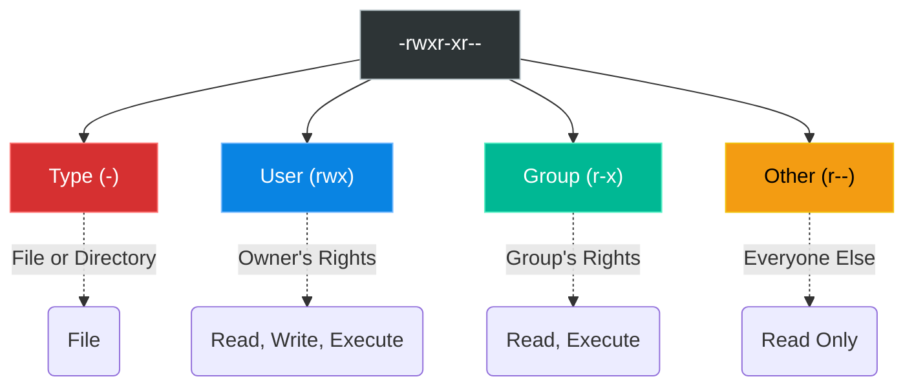

# Chapter 9 — File Permissions & Ownership


## Learning Objectives

A single incorrect permission can either lock users out of their data or expose the entire server to a breach. Here, we decode the octal permission model and explore how ownership dictates security.

By the end of this chapter, you will be able to:
* Decode the 10-character `ls -l` permission string (e.g., `-rwxr-xr--`).
* Understand the Octal permission model (Read=4, Write=2, Execute=1).
* Use `chmod` to securely restrict file access.
* Use `chown` to transfer ownership of files to different users and groups.

## Visual Architecture: Decoding Permissions

When you type `ls -l`, you see a string like `-rwxr-xr--`. This string is divided into four distinct blocks.



## Theory & Concepts

### 1. The Triad (User, Group, Other)
Every file and directory in Linux belongs to one specific **User** (the Owner) and one specific **Group**. 
Permissions dictate what the Owner can do, what members of the Group can do, and what Everyone Else (Other) can do.

### 2. The Actions (Read, Write, Execute)
* **Read (r)**: View the contents of a file, or list the contents of a directory.
* **Write (w)**: Modify or delete the file, or create/delete files inside a directory.
* **Execute (x)**: Run the file as a script/program, or `cd` into the directory. *(If a directory does not have the 'x' permission, you cannot enter it, even if you have 'r'!).*

### 3. The Octal Model (Math Time)
To change permissions quickly, Linux engineers use Octal math.
* `Read` = 4
* `Write` = 2
* `Execute` = 1

You add these numbers together for each of the three blocks (User, Group, Other).
* **7** = Read + Write + Execute (4+2+1)
* **6** = Read + Write (4+2+0)
* **5** = Read + Execute (4+0+1)
* **4** = Read Only (4+0+0)
* **0** = No Access

If you want the Owner to have full access (7), the Group to have read/execute (5), and Others to have read/execute (5), the permission is **755**.

### 4. `chmod` (Change Mode)
Use `chmod` to apply these permissions to a file.
* `chmod 644 document.txt`: Owner can read/write. Group and Other can only read. This is the standard for most files.
* `chmod 755 script.sh`: Owner can do everything. Group and Other can read and execute. This is standard for executable scripts.
* `chmod 600 id_rsa`: Owner can read/write. Group and Other are completely blocked. This is mandatory for private SSH keys.

### 5. `chown` (Change Ownership)
Use `chown` to transfer ownership of a file. Only the root user can assign files to someone else.
* `chown sarah document.txt`: Gives ownership to the user Sarah.
* `chown sarah:developers document.txt`: Gives ownership to the user Sarah, and assigns the file to the `developers` group.
* `chown -R www-data:www-data /var/www/html`: Recursively changes the owner and group for an entire web directory.

## Real-World Scenarios

> [!IMPORTANT] Incident Report: The 403 Forbidden
>
> **Problem:** End User (Dave): "We uploaded our new website files to the server via SFTP, but when we go to the URL, the web browser throws a '403 Forbidden' error!"
>
> **Investigation:** Charlie checks the web server error logs (`/var/log/nginx/error.log`) and sees a "permission denied" error. He then inspects the files on the filesystem.
> 
> ```bash
> charlie@prod-web1:~$ ls -l /var/www/html/index.html
> -rw------- 1 dave dave 4096 Jul 12 11:00 /var/www/html/index.html
> ```
>
> **Evidence:** The file is owned by `dave` with `600` permissions. This means *only* `dave` can read it.
>
> **Wrong Assumption:** Bob (Junior Admin) says: "The file is corrupted. Let's run `chmod 777` on the whole folder to fix it."
>
> **Root Cause:** Alice (Senior Admin) intervenes. The web server process runs under the `www-data` (or `nginx`) system user. Because `www-data` is not `dave`, it falls into the "Other" permissions block, which is currently set to `0` (No Access). The kernel successfully blocked the web server from reading Dave's private file.
>
> **Lessons Learned:** Alice runs `sudo chmod 644 /var/www/html/index.html`. This keeps `dave` as the owner (with read/write), but grants the "Other" block read access (4). The web server can now read the file, and the website loads perfectly. Alice solves the problem without compromising the server's security posture with `777`.
## Hands-on Lab

> [!CAUTION]
> **Practice Assignment Available**
> Before moving on, complete the exercises in the [Chapter 9 Practice Guide](../practice-files/V1-C09-practice.md). You will create a highly sensitive file and use permissions to successfully block unauthorized users from reading it.

> [!TIP] Support Engineer Tip #8
> ```bash
> chmod -R 777 /var/www/html
> ```
> **The Desperation Command:** Never use `777` to 'fix' a permission denied error. `777` grants every user and every process on the system the ability to execute, read, and delete those files. If the web application is compromised, the attacker can instantly overwrite your codebase. Always use the principle of least privilege (e.g., `644` for files, `755` for directories).

## Interview Questions

### Question 1: A user has Read (`r`) permission on a directory, but they cannot `cd` into it. Why?
* **Target Answer**: "To enter a directory, a user must have Execute (`x`) permissions on that directory. Read (`r`) only allows them to list the contents using `ls`, but without `x`, they cannot traverse into it."

### Question 2: What does `chmod 777` do, and why is it dangerous?
* **Target Answer**: "`chmod 777` grants Read, Write, and Execute permissions to the Owner, the Group, and Everyone Else on the system. It is dangerous because it allows any user (or any compromised process) to modify, delete, or execute malicious code within that file or directory."

### Question 3: What is the numerical (octal) equivalent of `-rw-r--r--`?
* **Target Answer**: "644. The owner has read (4) + write (2) = 6. The group has read (4) = 4. Others have read (4) = 4."

## Chapter Summary

Permissions are the bedrock of Linux security. Every time you create a file or install an application, you must understand exactly who is allowed to touch it. If a service is failing to read a configuration file, or failing to write to a log file, the answer is almost always a misconfigured permission string or incorrect ownership.

## Completion Checklist

- [ ] I can translate a string like `rwxr-xr-x` into its octal equivalent (`755`).
- [ ] I understand why directories require the Execute (`x`) permission.
- [ ] I know how to change both the Owner and the Group of a file in one command.

---

## Navigation

⬅ Previous:
[Chapter 8 – Users & Groups](V1-C08-users-and-groups.md)

🏠 Volume Contents:
[Table of Contents](../TOC.md)

➡ Next:
[Chapter 10 – Package Management](V1-C10-package-management.md)
