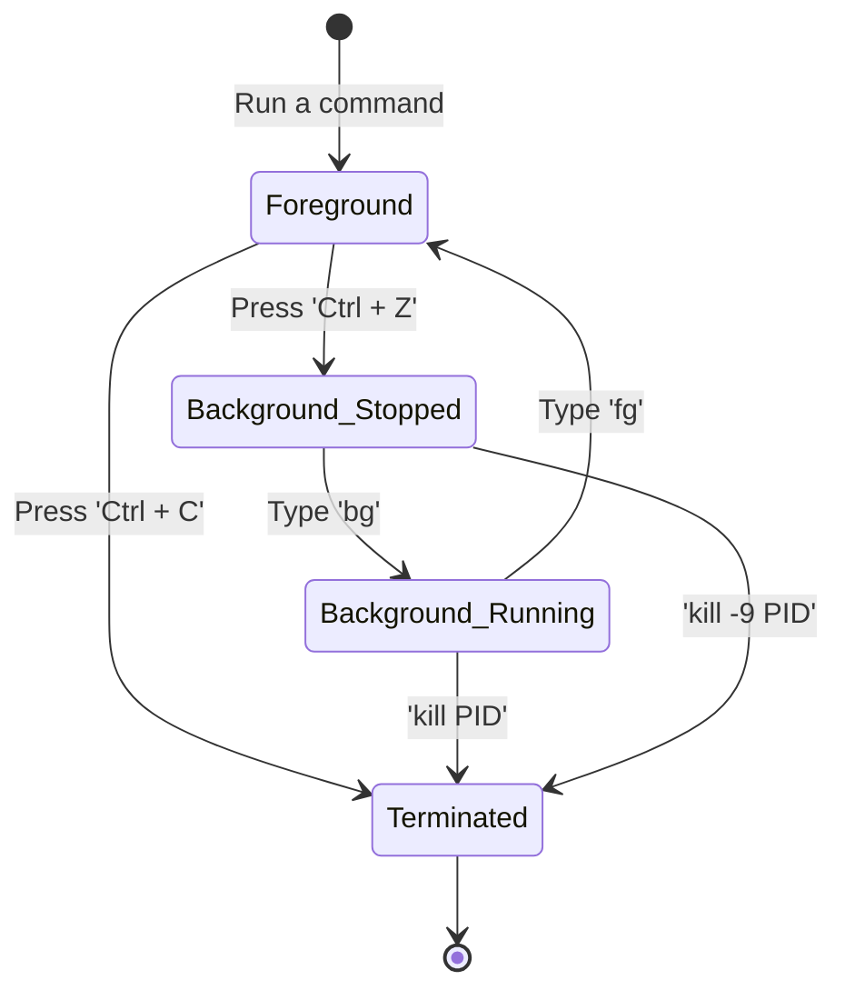

# Chapter 11 — Process Management


## Learning Objectives

Every running application is a process competing for CPU and RAM. When a server crawls to a halt, your ability to identify, trace, and terminate rogue processes is your most valuable weapon.

By the end of this chapter, you will be able to:
* Define what a Process ID (PID) is.
* Use `ps aux` and `top` to locate runaway or frozen applications.
* Manipulate process states (Foreground vs. Background).
* Send surgical POSIX signals (`kill -15` vs `kill -9`) to terminate frozen applications safely.

## Visual Architecture: Process Lifecycle

Every command you run creates a process. If you type `ping google.com`, the `ping` process takes over your terminal (the Foreground). You can pause it, throw it into the Background, and eventually terminate it.



## Theory & Concepts

### 1. What is a Process?
If a program is sitting on your hard drive (like `/usr/bin/nginx`), it is just a file. The moment you execute it, the Linux Kernel loads it into RAM, assigns it a unique number called a **PID (Process ID)**, and schedules it for CPU time. It is now a **Process**.

### 2. Hunting Processes (`ps` and `top`)
To fix a broken server, you must see what is running.
* `ps aux`: The most famous Linux command. It takes a static snapshot of every single process running on the system right now. 

> [!TIP] Support Engineer Tip #10
> **Piping `ps`:** Because `ps aux` outputs hundreds of lines, engineers almost never run it by itself. They always pipe it into `grep` to filter the output for the exact service they are hunting: `ps aux | grep nginx`.

* `top`: An interactive, real-time dashboard of system processes, sorted by CPU usage. (If you installed `htop` in Chapter 10, use that instead, as it is much easier to read).

### 3. Foreground vs Background
When you run a command like `sleep 600`, your terminal is locked for 600 seconds. This is a **Foreground** process.
* **`Ctrl + C`**: Immediately kills the foreground process.
* **`Ctrl + Z`**: Suspends (pauses) the foreground process and gives you your terminal back.
* **`bg`**: Takes the paused process and tells it to continue running in the **Background**.
* **`&`**: If you add an ampersand to the end of a command (e.g., `sleep 600 &`), it immediately launches in the background, never locking your terminal in the first place.

### 4. The `kill` Command (POSIX Signals)
The `kill` command does not actually "kill" anything. It sends **Signals** to processes.
* **SIGTERM (Signal 15)**: `kill -15 <PID>` or just `kill <PID>`. This is the polite request. It asks the process to save its data, close its files, and shut down gracefully. You should *always* try this first.
* **SIGKILL (Signal 9)**: `kill -9 <PID>`. The nuclear option. It does not ask the process. It tells the Linux Kernel to immediately rip the process out of RAM. Data corruption can occur. Only use this if a process is frozen and ignoring Signal 15.

## Real-World Scenarios

> [!IMPORTANT] Incident Report: The Rogue Script
>
> **Problem:** End User (Dave): "Our server is completely unresponsive. Everything is incredibly slow. We think a data scientist ran a heavy Python script."
>
> **Investigation:** Charlie SSHes into the server (which takes 30 seconds just to connect) and immediately runs `top` to identify the resource hog.
> 
> ```bash
> charlie@prod-app1:~$ top -b -n 1 | head -n 8
> top - 11:32:01 up 14 days,  3:20,  2 users,  load average: 4.50, 2.10, 0.90
> Tasks: 110 total,   2 running, 108 sleeping,   0 stopped,   0 zombie
> %Cpu(s): 99.9 us,  0.1 sy,  0.0 ni,  0.0 id,  0.0 wa,  0.0 hi,  0.0 si,  0.0 st
> MiB Mem :   7954.0 total,    450.0 free,   6500.0 used,   1004.0 buff/cache
> 
>     PID USER      PR  NI    VIRT    RES    SHR S  %CPU  %MEM     TIME+ COMMAND
>    4092 datauser  20   0 1500000 120000  10000 R  99.9  25.0  15:02.32 python3 bad_script.py
>    1024 www-data  20   0  200000  15000   5000 S   0.1   0.2   0:05.10 nginx
> ```
>
> **Evidence:** Process `4092` (`python3 bad_script.py`) is consuming 99.9% of the CPU.
>
> **Wrong Assumption:** Bob (Junior Admin) says: "The server is overloaded. Let's restart the server."
>
> **Root Cause:** Alice (Senior Admin) intervenes. Restarting the server is overkill for a single rogue application. Instead, she targets the specific process.
>
> **Lessons Learned:** Alice runs `kill 4092` (the polite Signal 15). She runs `top` again, but the process is still there, ignoring the signal. She then escalates to the nuclear option: `kill -9 4092`. The kernel instantly rips the python script out of memory. The CPU usage immediately drops to 2%, and the server recovers without a reboot.
## Hands-on Lab

> [!CAUTION]
> **Practice Assignment Available**
> Before moving on, complete the exercises in the [Chapter 11 Practice Guide](../practice-files/V1-C11-practice.md). You will simulate a rogue process, isolate its PID, and forcefully terminate it.

## Interview Questions

### Question 1: You need to find the Process ID of the Apache web server (`httpd`). How do you find it?
* **Target Answer**: "I would run `ps aux | grep httpd`. This dumps all running processes and filters the output to only show lines containing 'httpd'. The second column in the output will be the PID."

### Question 2: What is the difference between `kill -15` and `kill -9`?
* **Target Answer**: "`kill -15` sends a SIGTERM, asking the application to gracefully shut down and clean up its temporary files. `kill -9` sends a SIGKILL directly to the kernel, forcing it to immediately destroy the process without giving it a chance to clean up, which can lead to data corruption."

### Question 3: How do you start a script so that it runs in the background immediately, without locking your terminal?
* **Target Answer**: "Append an ampersand (`&`) to the end of the command string. For example: `./backup_script.sh &`."

## Chapter Summary

Managing processes is about maintaining control over the CPU and RAM. You use `ps aux` and `top` to achieve visibility, `&` and `bg` to multitask in a single terminal, and POSIX signals (`kill`) to maintain order when software misbehaves. 

## Completion Checklist

- [ ] I can filter `ps aux` to find a specific application.
- [ ] I understand the danger of using `kill -9` as a first resort.
- [ ] I can push a running foreground command into the background.

---

## Navigation

⬅ Previous:
[Chapter 10 – Package Management](V1-C10-package-management.md)

🏠 Volume Contents:
[Table of Contents](../TOC.md)

➡ Next:
[Chapter 12 – Services & systemd](V1-C12-services-and-systemd.md)
