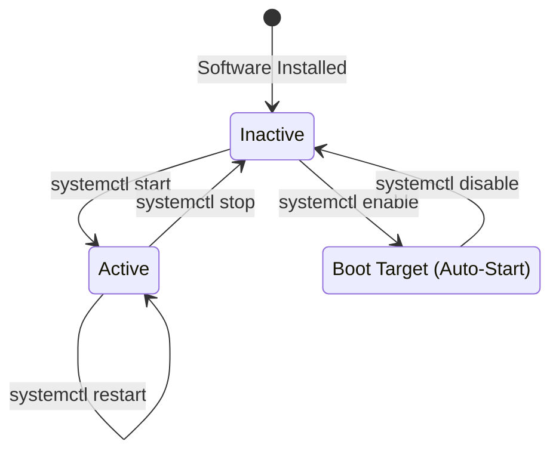

# Chapter 12 — Services & systemd


## Learning Objectives

Systemd has fundamentally changed how Linux manages services. From starting web servers on boot to managing dependencies, mastering systemd is essential for modern server administration.

By the end of this chapter, you will be able to:
* Define what a daemon is.
* Explain the role of `systemd` (Process ID 1).
* Manage service states using `systemctl` (`start`, `stop`, `restart`, `status`).
* Configure services to start automatically on boot using `enable`.

## Visual Architecture: The systemd Lifecycle

When you install a web server, it doesn't just run once; it needs to run constantly in the background. The `systemctl` command is your remote control for managing these background processes (services).



## Theory & Concepts

### 1. Daemons and PID 1
A **daemon** is a computer program that runs as a background process, rather than being under the direct control of an interactive user. In Linux, daemon names usually end with the letter `d` (e.g., `sshd` for the Secure Shell Daemon, `httpd` for the Apache Web Daemon).

When the Linux Kernel finishes loading into RAM, it executes the very first process: **`systemd` (PID 1)**. 
`systemd` is the "mother of all processes". Its primary job is to start, monitor, and manage every other daemon on the system.

### 2. The Remote Control: `systemctl`
To talk to `systemd`, Support Engineers use the `systemctl` command. 

* `systemctl status <service>`: Prints whether the service is currently running, if it crashed, and shows the last few log entries. **Always run this first when troubleshooting.**
* `systemctl start <service>`: Starts the service right now.
* `systemctl stop <service>`: Kills the service right now.
* `systemctl restart <service>`: Stops and immediately starts the service. Useful when you modify a configuration file in `/etc` and need the daemon to load the new settings.

### 3. Start vs. Enable
This is a massive point of confusion for beginners.
* **`start`** only affects the *current* session. If you type `systemctl start nginx` and then reboot the server, Nginx will be dead when the server comes back up.
* **`enable`** tells `systemd` to add this service to the boot sequence. If you type `systemctl enable nginx`, the web server will automatically start every time the machine is powered on. 

> [!TIP] Support Engineer Tip #11
> **Two birds, one stone:** You can start and enable a service simultaneously using the `--now` flag: `systemctl enable --now nginx`. This is the preferred method for modern deployments.

## Real-World Scenarios

> [!IMPORTANT] Incident Report: The Missing Database
>
> **Problem:** End User (Dave): "Our server underwent a scheduled reboot last night for kernel patching. This morning, our database is offline. We had to manually start it. Why did this happen?"
>
> **Investigation:** Charlie checks the current status of the database service.
> 
> ```bash
> charlie@prod-db1:~$ systemctl status postgresql
> ● postgresql.service - PostgreSQL RDBMS
>      Loaded: loaded (/lib/systemd/system/postgresql.service; disabled; vendor preset: enabled)
>      Active: active (exited) since Fri 2026-07-12 08:30:00 UTC; 2h ago
> ```
>
> **Evidence:** The service is currently `active` (because Dave manually started it), but the loaded line explicitly says it is `disabled`.
>
> **Wrong Assumption:** Bob (Junior Admin) says: "The reboot broke the database. Let's reinstall it."
>
> **Root Cause:** Alice (Senior Admin) explains that when the database was originally installed, the administrator ran `systemctl start postgresql`, but forgot to run `systemctl enable postgresql`. Therefore, `systemd` had no instruction to start it automatically upon boot.
>
> **Lessons Learned:** Alice runs `sudo systemctl enable postgresql`. The symlink is created in the boot target directory. The database will now survive all future reboots seamlessly.
## Hands-on Lab

> [!NOTE]
> **Practice Assignment Available**
> Before moving on, complete the exercises in the [Chapter 12 Practice Guide](../practice-files/V1-C12-practice.md). You will install a web server, intentionally disable it, and practice managing its lifecycle states.

## Interview Questions

### Question 1: What is PID 1 on a modern Linux system, and what does it do?
* **Target Answer**: "On modern systems, PID 1 is `systemd`. It is the init system responsible for bootstrapping the user space, managing background daemons, resolving service dependencies, and mounting filesystems during the boot process."

### Question 2: A developer edited a configuration file in `/etc`, but the application is still acting like the old configuration is active. What did they forget to do?
* **Target Answer**: "They forgot to restart the service. Daemons load their configuration files into memory when they start. If a configuration file on the disk changes, you must run `systemctl restart <service>` (or `reload`) to force the daemon to read the new changes."

### Question 3: What is the exact difference between `systemctl start` and `systemctl enable`?
* **Target Answer**: "`start` changes the state of the service right now; it turns it on for the current session, but it will not survive a reboot. `enable` creates a symlink in `systemd`'s boot target directory, ensuring the service starts automatically during the next boot cycle, but it does not start the service immediately unless you add the `--now` flag."

## Chapter Summary

`systemd` brings order to the chaos of background processes. As an engineer, `systemctl` will be one of your most frequently typed commands. Always remember to `enable` critical services so they survive reboots, and always use `status` to verify if a daemon is actually healthy.

## Completion Checklist

- [ ] I understand that `systemd` is the first process the kernel executes.
- [ ] I can differentiate between a service being "active" and being "enabled".
- [ ] I know how to check the status of a daemon.


**Chapter Transition**
> Systemd is managing the services, but when a service fails to start, how do you find out *why*? You must read the logs.

---

## Navigation

⬅ Previous:
[Chapter 11 — Process Management](V1-C11-process-management.md)

🏠 Volume Contents:
[Table of Contents](../TOC.md)

➡ Next:
[Chapter 13 — Software Logs & Journals](V1-C13-software-logs-and-journals.md)
