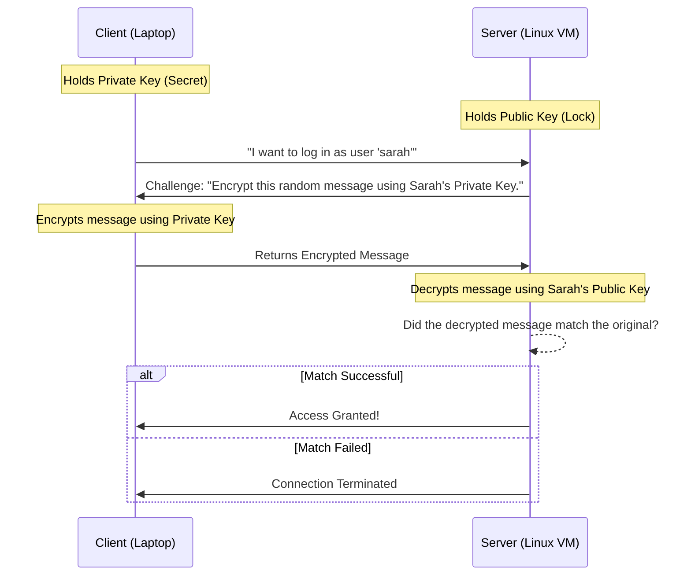

# Chapter 15 — SSH Administration


## Learning Objectives

SSH is your primary gateway into any remote system. Beyond just logging in, we'll cover key-based authentication, secure configurations, and tunneling to protect your remote sessions.

By the end of this chapter, you will be able to:
* Explain how the Public/Private Key exchange protocol works.
* Generate cryptographic keypairs using `ssh-keygen`.
* Distribute public keys using `ssh-copy-id`.
* Harden a server by modifying `/etc/ssh/sshd_config` and restarting the daemon.

## Visual Architecture: The Cryptographic Handshake

Passwords can be guessed. Cryptographic keys cannot. When you use SSH Key Authentication, your computer mathematically proves it holds a private key without ever transmitting it over the network.



## Theory & Concepts

### 1. The Secure Shell (SSH)
SSH is a cryptographic network protocol for operating network services securely over an unsecured network. It operates on **TCP Port 22**.
The server runs the SSH Daemon (`sshd`), and you connect to it using an SSH Client (`ssh`).

### 2. Passwords vs PKI
By default, SSH asks for a password. However, enterprise environments disable password authentication entirely. Instead, they use PKI (Public Key Infrastructure).
* **Private Key (`id_rsa`)**: The secret key. It lives on your laptop. You NEVER share it. If someone steals it, they are you.
* **Public Key (`id_rsa.pub`)**: The lock. You give this to any server you want to log into. The server places it in a file called `~/.ssh/authorized_keys`.

### 3. Generating and Distributing Keys
* `ssh-keygen -t rsa -b 4096`: This command creates the keypair on your laptop. The `-t` specifies the type (RSA), and `-b` specifies the bit length (4096 is highly secure).
* `ssh-copy-id username@192.168.1.50`: This command takes your Public Key and copies it into the remote server's `authorized_keys` file.

> [!TIP] Support Engineer Tip #14
> **The Golden Rule of SSH:** You **never** copy your private key (`id_rsa`) to a remote server. The private key never leaves the machine you are sitting at. You only ever distribute the public key (`id_rsa.pub`).

### 4. Hardening the Daemon (`sshd_config`)
The SSH daemon's behavior is controlled by `/etc/ssh/sshd_config`. 
*Note: Do not confuse `sshd_config` (server config) with `ssh_config` (client config).*

As a Support Engineer, you will frequently edit this file to lock down the server.
1. `sudo vim /etc/ssh/sshd_config`
2. Change `PermitRootLogin yes` to `PermitRootLogin no`.
3. Change `PasswordAuthentication yes` to `PasswordAuthentication no` *(Only do this AFTER you have successfully tested key-based login!)*
4. Save the file.
5. `sudo systemctl restart sshd`. *(You must restart the daemon for it to read the new configuration).*

## Real-World Scenarios

> [!IMPORTANT] Incident Report: The Brute Force
>
> **Problem:** End User (Dave): "We are failing our security audit. The auditor's bot is brute-forcing our server on Port 22 with millions of password guesses for the root user. Stop this immediately."
>
> **Investigation:** Charlie logs into the server and checks the authentication logs (`/var/log/auth.log` or `journalctl -u sshd`).
> 
> ```bash
> charlie@prod-web1:~$ sudo tail -n 4 /var/log/auth.log
> Jul 12 11:32:01 prod-web1 sshd[4490]: Failed password for root from 192.168.1.100 port 49021 ssh2
> Jul 12 11:32:01 prod-web1 sshd[4492]: Failed password for root from 192.168.1.100 port 49023 ssh2
> Jul 12 11:32:02 prod-web1 sshd[4495]: Failed password for root from 192.168.1.100 port 49026 ssh2
> Jul 12 11:32:02 prod-web1 sshd[4499]: Failed password for root from 192.168.1.100 port 49028 ssh2
> ```
>
> **Evidence:** The server is exposed to the network, and bots are actively guessing the root password multiple times per second.
>
> **Wrong Assumption:** Bob (Junior Admin) says: "Let's just block the IP address `192.168.1.100`."
>
> **Root Cause:** Alice (Senior Admin) intervenes. Attackers have thousands of IPs. Blocking one is useless. The structural vulnerability is that the server accepts passwords and allows direct root logins.
>
> **Lessons Learned:** Alice opens `/etc/ssh/sshd_config`. She sets `PermitRootLogin no` and `PasswordAuthentication no`. She runs `systemctl restart sshd`. The bot immediately fails because the server mathematically rejects all password attempts and outright refuses to let anyone log in as `root`. The audit passes.
## Hands-on Lab

> [!CAUTION]
> **Practice Assignment Available**
> Before moving on, complete the exercises in the [Chapter 15 Practice Guide](../practice-files/V1-C15-practice.md). You will generate an RSA keypair and successfully harden your local SSH configuration.

## Interview Questions

### Question 1: What is the difference between `/etc/ssh/ssh_config` and `/etc/ssh/sshd_config`?
* **Target Answer**: "`ssh_config` controls the behavior of the SSH *client* (when you are connecting *out* to another machine). `sshd_config` controls the behavior of the SSH *daemon* (when users are connecting *in* to your machine)."

### Question 2: A customer lost their Private Key. Can you recover it from the Public Key stored on the server?
* **Target Answer**: "No. It is mathematically impossible (within current computational limits) to reverse-engineer a private key from a public key. The customer has permanently lost access. They must generate a new keypair, and we must manually copy their new public key to the server."

### Question 3: After changing `PermitRootLogin no` in the configuration file, you can still log in as root. Why?
* **Target Answer**: "You did not restart or reload the SSH daemon. Changes to `/etc/ssh/sshd_config` do not take effect dynamically; they require a `systemctl restart sshd` (or `reload`) to force the daemon to read the updated configuration from the disk."

## Chapter Summary

SSH is your primary weapon as a Linux Support Engineer. Understanding how to generate cryptographic keys, distribute them, and harden the `sshd_config` file is the difference between a secure enterprise environment and a compromised server. Remember: never share your private key, and always test your access before disabling passwords!

## Completion Checklist

- [ ] I understand the difference between a Public Key (the lock) and a Private Key (the key).
- [ ] I know which configuration file controls the server daemon.
- [ ] I remember to restart the `sshd` service after making configuration changes.

---

## Navigation

⬅ Previous:
[Chapter 14 – Networking Fundamentals](V1-C14-networking-fundamentals.md)

🏠 Volume Contents:
[Table of Contents](../TOC.md)

➡ Next:
[Chapter 16 – Archiving and Compression](V1-C16-archiving-and-compression.md)
