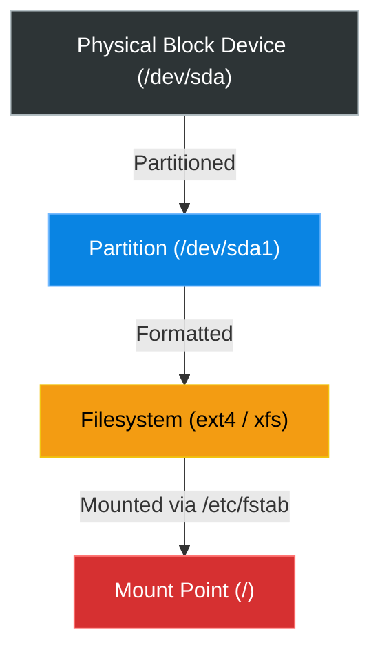

# Chapter 17 — Storage & Disk Management


## Learning Objectives

Disks fill up and drives fail. Learn how to partition raw block devices, format them with modern filesystems, and mount them persistently so your data survives a reboot.

By the end of this chapter, you will be able to:
* Map the physical and logical layout of disks using `lsblk`.
* Identify a 100% full hard drive using `df -h`.
* Hunt down massive files causing storage outages using `du -sh`.
* Understand the concept of Mount Points and `/etc/fstab`.

## Visual Architecture: The Anatomy of Storage

In Windows, you plug in a hard drive and it becomes the `D:\` drive. In Linux, there are no drive letters. A physical block device is partitioned, formatted, and then **mounted** to an arbitrary folder on the system.



## Theory & Concepts

### 1. `lsblk` (List Block Devices)
A block device is a physical (or virtual) hard drive. 
Running `lsblk` shows you a hierarchical tree of all disks attached to the server. 
* `/dev/sda`: The first hard drive.
* `/dev/sda1`: The first partition on the first hard drive.
* `/dev/sdb`: The second hard drive.

### 2. `df` (Disk Free)
When a server starts crashing randomly, the very first thing a Support Engineer does is check if the hard drive is full.
* `df -h`: The `-h` flag stands for **Human-readable**. It prints the sizes in Megabytes (M) and Gigabytes (G) instead of raw bytes. 

> [!TIP] Support Engineer Tip #16
> **Watch the Use% Column:** When you run `df -h`, look closely at the `Use%` column. If a partition says `100%`, the server is dead in the water. Databases cannot write transactions, logs cannot be saved, and services will crash on startup.

### 3. `du` (Disk Usage)
If `df -h` tells you the disk is full, `du` is the weapon you use to hunt down *why* it is full.
* `du -sh *`: This is a mandatory troubleshooting command. 
  * `-s`: **Summarize** (only show the total size of each directory, don't list every single file inside).
  * `-h`: **Human-readable**.
  * `*`: Run this against everything in the current directory.

### 4. Mount Points and `/etc/fstab`
Because Linux has no drive letters, everything exists under the single Root directory (`/`). 
You can take a massive 10 Terabyte hard drive (`/dev/sdb1`) and mount it to the `/var/log` directory. Now, whenever the system writes a log file, it is transparently writing it to the second hard drive.
* `/etc/fstab` (File System Table): This configuration file tells the Linux Kernel which partitions belong to which mount points so they connect automatically on boot.

## Real-World Scenarios

> [!IMPORTANT] Incident Report: The Runaway Log
>
> **Problem:** End User (Dave): "Our MySQL database suddenly crashed. When we try to restart it using `systemctl`, it says 'No space left on device'. Please help!"
>
> **Investigation:** Charlie knows exactly what "No space left on device" means. The hard drive is 100% full.
> 
> ```bash
> charlie@prod-db1:~$ df -h
> Filesystem      Size  Used Avail Use% Mounted on
> udev            3.9G     0  3.9G   0% /dev
> /dev/sda1       100G  100G     0 100% /
> ```
>
> **Evidence:** The Root partition (`/`) is completely saturated at 100%. Charlie must find out *why*. He navigates to the root directory and starts the hunt using `du -sh * | sort -hr`.
> 
> ```bash
> charlie@prod-db1:/$ sudo du -sh * | sort -hr | head -n 3
> 90G     var
> 5.2G    usr
> 1.1G    opt
> charlie@prod-db1:/$ cd var && sudo du -sh * | sort -hr | head -n 2
> 85G     log
> 3.1G    lib
> ```
>
> **Wrong Assumption:** Bob (Junior Admin) says: "We need to buy a bigger hard drive and attach it immediately."
>
> **Root Cause:** Alice (Senior Admin) steps in. Buying a bigger drive treats the symptom, not the cause. Following Charlie's trail into `/var/log/mysql`, they find a single `error.log` file that has bloated to 85GB because an application bug is spamming the log 1,000 times a second.
>
> **Lessons Learned:** Alice deletes the runaway log file using `rm error.log`. She runs `df -h` again and sees usage instantly drop to 15%. She restarts the database via `systemctl restart mysql`, and the service comes back online. Always hunt down the bloat before expanding storage.
## Hands-on Lab

> [!CAUTION]
> **Practice Assignment Available**
> Before moving on, complete the exercises in the [Chapter 17 Practice Guide](../practice-files/V1-C17-practice.md). You will map your virtual machine's block devices and practice hunting for large directories.

## Interview Questions

### Question 1: A customer complains their server is slow. You run `df -h` and see `/dev/sda1` is at 100% usage. What command do you use to figure out which specific folder is consuming the most space?
* **Target Answer**: "I would navigate to the root directory and run `du -sh *`. This will summarize the total disk usage of every top-level folder in human-readable format. I would then identify the largest folder, `cd` into it, and repeat the command until I isolate the massive files."

### Question 2: What is the purpose of the `/etc/fstab` file?
* **Target Answer**: "The File System Table (`fstab`) is read by the system during the boot process. It maps physical block devices or partitions (like `/dev/sdb1`) to logical Mount Points (like `/data`), ensuring that extra hard drives are mounted automatically on startup."

### Question 3: Why should you always use the `-h` flag with commands like `df` and `du`?
* **Target Answer**: "The `-h` flag stands for 'Human-readable'. Without it, the commands output sizes in raw bytes or 1K-blocks, which are extremely difficult to read quickly when dealing with gigabytes or terabytes of data during an emergency."

## Chapter Summary

Running out of disk space is one of the most common causes of server outages. Remember the workflow: use `lsblk` to understand the physical layout, `df -h` to confirm the outage, and `du -sh *` to hunt down the files responsible.

## Completion Checklist

- [ ] I understand that Linux uses Mount Points instead of drive letters like `C:\`.
- [ ] I can check if my hard drive is 100% full using `df -h`.
- [ ] I know how to summarize folder sizes using `du -sh *`.

---

## Navigation

⬅ Previous:
[Chapter 16 – Archiving and Compression](V1-C16-archiving-and-compression.md)

🏠 Volume Contents:
[Table of Contents](../TOC.md)

➡ Next:
[Chapter 18 – Advanced Grep & Awk](V1-C18-advanced-grep-and-awk.md)
