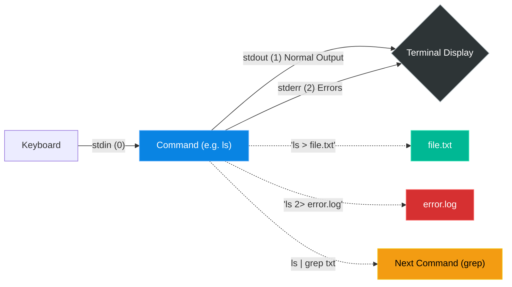

# Chapter 19 — Output Redirection (Piping)


## Learning Objectives

The true power of the Linux shell lies in its pipelines. By connecting the output of one command into the input of another, you can build complex data processing chains on the fly.

By the end of this chapter, you will be able to:
* Identify the three standard streams: `stdin` (0), `stdout` (1), and `stderr` (2).
* Route output to files using `>` (overwrite) and `>>` (append).
* Chain commands together using the pipe `|`.
* Send error messages to the void using `2> /dev/null`.

## Visual Architecture: The Three Streams

Every command you run in Linux automatically opens three invisible data streams. Understanding these streams is the foundation of Linux scripting.



## Theory & Concepts

### 1. The Pipe (`|`)
You used this in Chapter 18. The pipe takes the Standard Output (`stdout`) of the command on the left, and feeds it into the Standard Input (`stdin`) of the command on the right.
* `cat /var/log/syslog | grep "error" | awk '{print $1}'`

### 2. Overwriting vs Appending (`>` and `>>`)
Instead of sending output to the terminal screen, you can send it directly into a file.
* **`>` (Overwrite)**: `echo "Hello" > file.txt`. If `file.txt` exists, its entire contents are instantly wiped out and replaced with "Hello". This is dangerous.
* **`>>` (Append)**: `echo "World" >> file.txt`. This safely adds "World" to the bottom of the existing file without destroying data.

### 3. Splitting Streams (`1>` and `2>`)
By default, the `>` operator only redirects `stdout` (Stream 1). It does *not* redirect errors (Stream 2). 
If you run `ls /root > output.txt` as a normal user, the screen will still print "Permission Denied". Why? Because errors travel on `stderr`, and `stderr` still points to the screen.

To redirect errors, you explicitly use the number 2:
* `ls /root 2> error.log`: Normal output goes to the screen, but errors are saved into `error.log`.

> [!TIP] Support Engineer Tip #18
> **Redirecting Both:** If you want to run a script and send *both* normal output and errors into the exact same file, use `> file.txt 2>&1`. This tells the shell to redirect Stream 1 to `file.txt`, and redirect Stream 2 exactly where Stream 1 is going.

### 4. The Void (`/dev/null`)
Sometimes a command spits out hundreds of annoying warnings that you don't care about. Linux has a magical file called `/dev/null`. It is a black hole. Anything you send into it is instantly deleted forever.
* `find / -name "password.txt" 2> /dev/null`
*(Translation: Search the entire hard drive for a file named password.txt. Hide all the "Permission Denied" errors by sending them into the black hole, so my screen only shows the actual successes).*

## Real-World Scenarios

> [!IMPORTANT] Incident Report: The Noisy Script
>
> **Problem:** End User (Dave): "I am running a massive data-processing script. It outputs thousands of lines. Most of it is normal, but occasionally it throws a critical error. I can't read the errors because the normal output scrolls past too fast!"
>
> **Investigation:** Charlie asks Dave to demonstrate how he is running the script.
> 
> ```bash
> dave@prod-db1:~$ ./process_data.sh
> Processing record 1... OK
> Processing record 2... OK
> Processing record 3... OK
> ERROR: Failed to connect to database for record 4!
> Processing record 5... OK
> ... (thousands of lines fly by)
> ```
>
> **Evidence:** The customer is letting `stdout` (normal text) and `stderr` (errors) mix together on the screen.
>
> **Wrong Assumption:** Bob (Junior Admin) says: "We should rewrite the bash script to stop running when it hits an error so we can read it."
>
> **Root Cause:** Alice (Senior Admin) intervenes. Rewriting the script is unnecessary. The shell already inherently separates normal output from errors; we just need to route them properly.
>
> **Lessons Learned:** Alice tells the customer to run the script like this:
> 
> ```bash
> dave@prod-db1:~$ ./process_data.sh > /dev/null 2> critical_errors.log
> dave@prod-db1:~$ cat critical_errors.log
> ERROR: Failed to connect to database for record 4!
> ERROR: Failed to connect to database for record 892!
> ```
> 
> All normal output is sent into the black hole (`/dev/null`) to keep the screen quiet. All errors (`2>`) are neatly organized into a dedicated log file (`critical_errors.log`) for the customer to review at their leisure.
## Hands-on Lab

> [!CAUTION]
> **Practice Assignment Available**
> Before moving on, complete the exercises in the [Chapter 19 Practice Guide](../practice-files/V1-C19-practice.md). You will create a file using redirection, append to it, and intentionally break a command to practice redirecting errors into `/dev/null`.

## Interview Questions

### Question 1: What is the difference between `>` and `>>`?
* **Target Answer**: "The single chevron `>` overwrites the destination file completely, destroying any existing data. The double chevron `>>` appends the standard output to the bottom of the destination file, preserving existing data."

### Question 2: You are running a script and want to save the errors to `error.log`, but you want the normal output to continue displaying on the screen. How do you do this?
* **Target Answer**: "I would run `./script.sh 2> error.log`. By explicitly redirecting file descriptor 2 (stderr), the errors go to the file, while file descriptor 1 (stdout) continues to print to the default destination, which is the terminal screen."

### Question 3: What is `/dev/null`?
* **Target Answer**: "It is a special pseudo-device file in Linux often referred to as the 'black hole'. Any data written to `/dev/null` is immediately discarded by the operating system. It is commonly used to suppress unwanted output or errors, such as appending `2> /dev/null` to a command."

## Chapter Summary

Piping and Redirection allow you to mold Linux commands like clay. By stringing small, single-purpose utilities together with `|`, and precisely routing the resulting data streams with `>` and `2>`, you unlock the true power of the command line.

## Completion Checklist

- [ ] I can append data to a file without overwriting it.
- [ ] I understand that `stdout` and `stderr` are two separate streams.
- [ ] I know how to suppress errors by sending them to `/dev/null`.

---

## Navigation

⬅ Previous:
[Chapter 18 – Advanced Grep & Awk](V1-C18-advanced-grep-and-awk.md)

🏠 Volume Contents:
[Table of Contents](../TOC.md)

➡ Next:
[Chapter 20 – Bash Scripting Basics](V1-C20-bash-scripting-basics.md)
