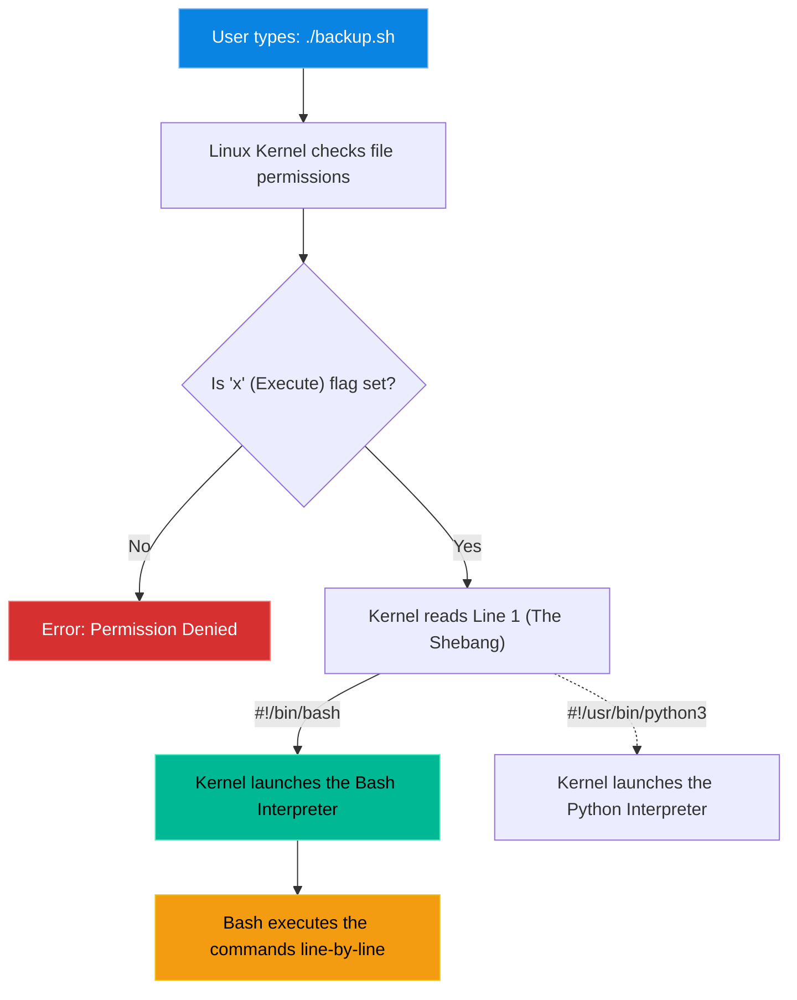

# Chapter 20 — Bash Scripting Basics


## Learning Objectives

Why do something twice when you can automate it? Bash scripting allows you to codify your troubleshooting workflows, transforming manual toil into executable solutions.

By the end of this chapter, you will be able to:
* Understand the purpose of a shell script.
* Write a basic script with the mandatory Shebang (`#!/bin/bash`).
* Apply executable permissions using `chmod +x`.
* Declare and use simple variables.

## Visual Architecture: The Script Lifecycle

When you type `./script.sh`, how does Linux know what to do with the text inside the file? It reads the very first line (the Shebang) to determine which interpreter to launch.



## Theory & Concepts

### 1. What is a Shell Script?
A shell script is simply a text file containing a list of Linux commands. Instead of typing `apt update`, `apt upgrade`, and `systemctl restart nginx` one by one, you put them in a file. When you run the file, Linux types them for you, in order, at lightning speed.

### 2. The Shebang (`#!`)
Every bash script **must** start with this exact line: `#!/bin/bash`.
* The `#` is a hash.
* The `!` is a bang.
* Together, they tell the Linux Kernel: "Do not read the rest of this file. Hand this file over to the `/bin/bash` program to read."

### 3. Execution Permissions
By default, when you create a file in Linux, it is created with Read and Write (`rw-`) permissions. It is *never* created with Execute (`x`) permissions.
If you try to run it, the Kernel will block you.
* **The Fix**: You must run `chmod +x script.sh`. This adds the Execute permission, turning the text file into an application.

### 4. Running the Script (`./`)
To run a script in your current directory, you cannot just type `script.sh`. You must type `./script.sh`. 
* The `.` means "the folder I am currently standing in".
* The `/` is the directory separator.
* You are telling Linux: "Run the script.sh file located exactly where I am standing right now."

> [!TIP] Support Engineer Tip #19
> **The Path Variable:** Linux refuses to run `script.sh` by itself because the current directory is intentionally *not* in your `$PATH` (a list of safe folders Linux checks for commands) for security reasons. Using `./` explicitly bypasses the `$PATH` search.

### 5. Variables
Scripts become powerful when they can store data dynamically.
* **Setting a variable**: `NAME="Laxman"` *(Do not put spaces around the equals sign!)*
* **Using a variable**: `echo "Hello, $NAME"` *(You must use the `$` symbol to extract the data from the variable).*

## Real-World Scenarios

> [!IMPORTANT] Incident Report: The Morning Routine
>
> **Problem:** End User (Dave): "Every morning, I log into our database server and run `df -h` to check disk space, `free -m` to check RAM, and `uptime` to see how long it has been running. It takes me 10 minutes to do this across all our servers."
>
> **Investigation:** Charlie realizes this is manual, repetitive toil. It must be automated. Why type three commands when you can type one?
>
> **Wrong Assumption:** Bob (Junior Admin) says: "We should buy an expensive enterprise monitoring software suite to run these checks."
>
> **Root Cause:** Alice (Senior Admin) steps in. Enterprise monitoring is good, but for simple daily tasks, a Bash script is free, instant, and already native to the operating system.
>
> **Lessons Learned:** Alice creates a script called `health_check.sh`:
> 
> ```bash
> alice@prod-db1:~$ cat health_check.sh
> #!/bin/bash
> echo "--- Disk Space ---"
> df -h | grep "/dev/sda1"
> echo "--- RAM Usage ---"
> free -m | grep "Mem:"
> echo "--- Uptime ---"
> uptime
> alice@prod-db1:~$ chmod +x health_check.sh
> alice@prod-db1:~$ ./health_check.sh
> --- Disk Space ---
> /dev/sda1       100G   15G   85G  15% /
> --- RAM Usage ---
> Mem:            7954    4500    3454
> --- Uptime ---
>  08:30:00 up 14 days, 3:20,  1 user,  load average: 0.10, 0.05, 0.01
> ```
> 
> Now, Dave just runs one command and instantly receives a perfectly formatted report. The 10-minute chore becomes a 2-second automated workflow.
## Hands-on Lab

> [!NOTE]
> **Practice Assignment Available**
> Before moving on, complete the exercises in the [Chapter 20 Practice Guide](../practice-files/V1-C20-practice.md) to write, authorize, and execute your very first Bash script.

## Interview Questions

### Question 1: What is the purpose of the `#!/bin/bash` line at the top of a script?
* **Target Answer**: "It is called the shebang. It instructs the operating system's kernel to use the `/bin/bash` interpreter to parse and execute the subsequent lines in the file."

### Question 2: You wrote a script, but when you type `./backup.sh`, the terminal says "Permission Denied". You are the owner of the file. What is wrong?
* **Target Answer**: "The file does not have the Execute (`x`) permission set. By default, Linux text files are not executable for security reasons. You must run `chmod +x backup.sh` to make it executable."

### Question 3: In bash, why will the command `USER = "admin"` fail?
* **Target Answer**: "In bash variable assignment, there cannot be any spaces around the equals sign. It must be `USER="admin"`. If you include spaces, bash will attempt to run the word 'USER' as a command, and '=' as its argument."

## Chapter Summary

Scripting is the difference between a Junior Administrator and a Senior Engineer. A script is just a list of commands you were going to type anyway, bundled under a Shebang, made executable with `chmod +x`, and run with `./`. 

## Completion Checklist

- [ ] I can write the Shebang from memory.
- [ ] I know why `chmod +x` is mandatory for new scripts.
- [ ] I know how to declare a variable without syntax errors.

---

## Navigation

⬅ Previous:
[Chapter 19 – Output Redirection (Piping)](V1-C19-output-redirection.md)

🏠 Volume Contents:
[Table of Contents](../TOC.md)

➡ Next:
[Chapter 21 – Environment Variables](V1-C21-environment-variables.md)
