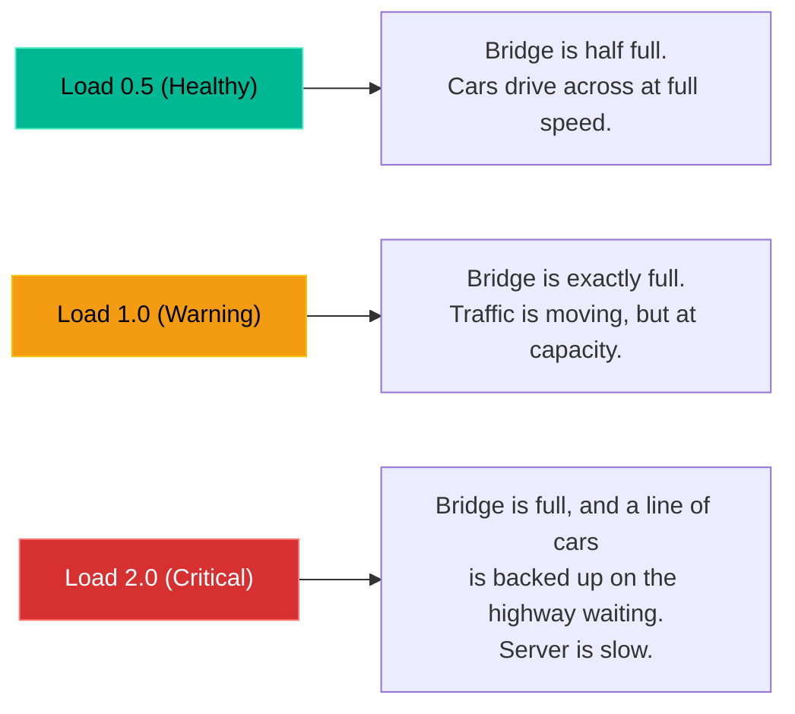

# Chapter 23 — Basic System Monitoring


## Learning Objectives

You can't fix what you can't measure. We'll explore the real-time monitoring tools that help you instantly identify whether the CPU, RAM, or Disk I/O is the bottleneck.

By the end of this chapter, you will be able to:
* Parse the `uptime` command to read 1-minute, 5-minute, and 15-minute Load Averages.
* Understand Load Average using the "Bridge Analogy".
* Use `free -h` to differentiate between "Free" and "Available" memory.
* Use `top` to locate and terminate runaway CPU processes.

## Visual Architecture: The Bridge Analogy (Load Average)

Load Average is not a percentage. It is a measurement of the queue of processes waiting for CPU time. Imagine your CPU is a single-lane bridge.


*(Note: If you have a 4-Core CPU server, you have a 4-lane bridge. In that case, a load of `4.0` means the bridge is exactly full).*

## Theory & Concepts

### 1. `uptime` (The Quick Health Check)
If a server feels slow, your very first instinct should be to type `uptime`.
It prints the current time, how long the server has been running, how many users are logged in, and the **Load Averages**.
* Output format: `load average: 0.20, 0.55, 1.20`
* These numbers represent the 1-minute, 5-minute, and 15-minute averages.

> [!TIP] Support Engineer Tip #22
> **Reading the Trend:** If the 1-minute load is high (e.g. 5.0), but the 15-minute load is low (e.g. 0.5), it means a sudden spike of traffic just occurred. If the 15-minute load is high and the 1-minute load is low, the server *was* struggling, but is now recovering.

### 2. `top` (The Process Monitor)
If `uptime` reveals a high load, you must find out *which* process is causing it.
* `top`: This is the built-in task manager. It refreshes every 3 seconds.
* Press `P` while it is running to sort the list by CPU usage.
* Look at the `PID` (Process ID) and the `COMMAND` columns. If you see a PHP script consuming 99% CPU, you have found the culprit.
* *(Modern Alternative: `htop` is a colorful, interactive version of `top` that you can navigate with your mouse, though it often requires manual installation).*

### 3. `free -h` (The Memory Check)
Checking RAM in Linux is tricky because Linux intentionally uses "free" RAM to cache hard drive data to make the system faster. 
* Do not look at the `free` column! It will often say 0 MB, which panics junior engineers.
* **Always look at the `available` column**. This is the actual amount of RAM your applications can claim before the server runs out of memory.

## Real-World Scenarios

> [!IMPORTANT] Incident Report: The Sluggish Server
>
> **Problem:** End User (Dave): "My e-commerce website is completely unresponsive. It takes 30 seconds just to load the homepage!"
>
> **Investigation:** Charlie knows the server is bottlenecking on CPU, RAM, or Disk Space. He checks them in order.
> 
> ```bash
> charlie@prod-web1:~$ df -h | grep "/dev/sda1"
> /dev/sda1       100G   40G   60G  40% /
> charlie@prod-web1:~$ free -h
>                total        used        free      shared  buff/cache   available
> Mem:           8.0Gi       2.0Gi       1.0Gi       0.0Ki       5.0Gi       4.0Gi
> charlie@prod-web1:~$ uptime
>  10:00:00 up 50 days,  4:20,  1 user,  load average: 18.50, 12.00, 5.00
> ```
>
> **Evidence:** Disk space is at 40% (Healthy). The `available` RAM is 4GB (Healthy). The server has 2 CPUs, but the load average is `18.5`. The CPU is massively overloaded (a critical traffic jam).
>
> **Wrong Assumption:** Bob (Junior Admin) says: "The server is infected with malware! We need to reboot it immediately."
>
> **Root Cause:** Alice (Senior Admin) intervenes. Rebooting destroys the evidence. They run `top` and sort by CPU usage. They see a massive, runaway database query consuming 200% CPU (maxing out both cores).
>
> **Lessons Learned:** Alice identifies the Process ID (PID) of the database query and kills it. The load average immediately drops back to `0.5`, and the website instantly loads. Always find the specific process causing the load before resorting to a reboot.
## Hands-on Lab

> [!CAUTION]
> **Practice Assignment Available**
> Before moving on, complete the exercises in the [Chapter 23 Practice Guide](../practice-files/V1-C23-practice.md). You will parse your system's load averages and learn how to navigate the `top` interface.

## Interview Questions

### Question 1: A customer with a 2-Core CPU server complains of slowness. You run `uptime` and see a load average of `1.50`. Is the CPU overloaded?
* **Target Answer**: "No. Because the server has 2 cores, the maximum 'full capacity' load is 2.0. A load of 1.50 means the CPUs are working hard, but there is still 25% of the total processing capacity sitting idle. The slowness is likely caused by something else, such as network latency or disk I/O."

### Question 2: Why does the `free` command often show 0MB of free RAM, even on a healthy server?
* **Target Answer**: "Linux is designed to use all unused RAM for disk caching to improve system performance. This fills up the 'free' column. However, if an application requests memory, Linux instantly drops the cache to hand over the RAM. Therefore, you should always look at the 'available' column, not the 'free' column."

### Question 3: How do you find the exact Process ID (PID) of the application consuming the most CPU?
* **Target Answer**: "I would run the `top` command. By default, it often sorts by CPU usage, but I can press `Shift+P` (or just `P`) to ensure the highest CPU consumers are pushed to the top of the list. The PID is located in the far-left column."

## Chapter Summary

Monitoring is about proving theories. If the server is slow, don't guess. Run `uptime` to check the CPU queue, run `free -h` to check the available memory, and run `df -h` to check the disk space. Once you isolate the bottleneck, use `top` to identify the specific process responsible.

## Completion Checklist

- [ ] I understand the Bridge Analogy for Load Averages.
- [ ] I know why the `free` memory column is deceptive.
- [ ] I can launch `top`, read it, and exit it by pressing `q`.


**Chapter Transition**
> We are monitoring the system, but what stops a malicious actor from exploiting our open ports? We need a basic firewall.

---

## Navigation

⬅ Previous:
[Chapter 22 — User Automation (Cron)](V1-C22-user-automation-cron.md)

🏠 Volume Contents:
[Table of Contents](../TOC.md)

➡ Next:
[Chapter 24 — Introduction to Networking (Firewalls)](V1-C24-introduction-to-networking-firewalls.md)
