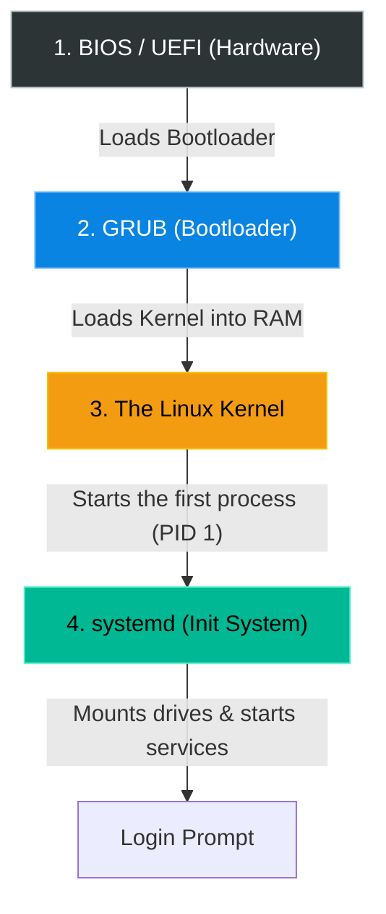

# Chapter 26 — System Startup & Troubleshooting


## Learning Objectives

Have you ever wondered how Linux handles System Startup & Troubleshooting? In this chapter, we dive deep into the mechanics, exploring the tools and strategies that separate a junior admin from a true Linux Support Engineer.

By the end of this chapter, you will be able to:
* Identify the 4 main stages of the Linux boot sequence.
* Query the boot logs using `journalctl -b`.
* Identify silent service failures using `systemctl --failed`.
* Troubleshoot and escape from the dreaded "Emergency Mode".

## Visual Architecture: The Boot Sequence

When you press the power button, Linux does not instantly appear. It hands control through four distinct software layers. If any layer fails, the server crashes.



## Theory & Concepts

### 1. The 4 Stages of Boot
1. **BIOS / UEFI**: The motherboard wakes up, checks the RAM and CPU, and looks for a hard drive.
2. **GRUB**: The Grand Unified Bootloader. It presents a menu (if you have a monitor plugged in) asking which operating system you want to load.
3. **The Kernel**: The core of Linux wakes up, takes control of the CPU and RAM, and mounts the root filesystem as Read-Only.
4. **systemd**: The Kernel starts the very first program (Process ID 1), which is `systemd`. `systemd` remounts the hard drive as Read/Write, turns on the network, and starts all your services (like Nginx, SSH, and Cron).

### 2. Reading the Boot Log
When a server reboots, all the text that flies by on the screen is saved into the journal.
* `journalctl -b`: Prints the logs generated *only* during the most recent boot cycle.
* `journalctl -b -1`: Prints the logs from the *previous* boot cycle (useful if the server crashed and you just restarted it).

> [!TIP] Support Engineer Tip #25
> **The Kernel Buffer:** If you ever need to specifically see *only* the kernel hardware messages from boot (without all the `systemd` service startup noise), just run `dmesg`. It is incredibly useful for diagnosing failing hard drives or missing network cards immediately after a reboot.

### 3. Silent Failures
Sometimes a server boots perfectly, but a specific service fails silently in the background.
* `systemctl --failed`: This command instantly lists any service that attempted to start during boot but crashed. 

> [!IMPORTANT] Incident Report: The `fstab` Crash (Emergency Mode)
>
> **Problem:** End User (Dave): "I added a new hard drive to the server and rebooted. It never came back online. The console says: `Welcome to Emergency Mode! Root password required for maintenance.`"
>
> **Investigation:** Charlie knows this almost always means a critical drive failed to mount during boot.
>
> **Wrong Assumption:** Bob (Junior Admin) says: "The operating system is corrupted. We have to reinstall Linux."
>
> **Root Cause:** Alice (Senior Admin) intervenes. The OS is perfectly fine, it's just protecting itself. She logs in with the root password and runs `journalctl -xb` to read the boot logs. She sees red text: `Dependency failed for /data. Failed to mount /data.`
>
> **Lessons Learned:** Alice realizes the `/etc/fstab` file is broken.
> 
> ```bash
> root@prod-db1:~# mount -o remount,rw /
> root@prod-db1:~# nano /etc/fstab
> ```
> 
> She forces the drive into Read/Write mode, opens the file, spots a typo (`/dev/sdb11` instead of `/dev/sdb1`), fixes it, and types `reboot`. The server boots perfectly. Never reinstall the OS when you can just fix the config.
>
> [!IMPORTANT] Incident Report: The Port Conflict
>
> **Problem:** End User (Dave): "Our server rebooted for routine updates. Now our web application is down!"
>
> **Investigation:** Charlie SSHs into the server and checks for silent failures: `systemctl --failed`.
> 
> ```bash
> charlie@prod-web1:~$ systemctl --failed
>   UNIT           LOAD   ACTIVE SUB    DESCRIPTION
> ● nginx.service  loaded failed failed A high performance web server
> charlie@prod-web1:~$ systemctl status nginx
> ... [emerg] bind() to 0.0.0.0:80 failed (98: Address already in use)
> ```
>
> **Evidence:** The `nginx` service failed because Port 80 is stolen by something else.
>
> **Wrong Assumption:** Bob (Junior Admin) says: "Nginx must have a bug, let's reinstall it."
>
> **Root Cause:** Alice (Senior Admin) checks what is holding the port using `ss -tulpn | grep 80`. She sees `apache2` is running. Someone accidentally installed Apache, which is configured to start automatically on boot, stealing Nginx's port.
>
> **Lessons Learned:** Alice runs `systemctl disable --now apache2` to kill it permanently, and then `systemctl start nginx`. The website is restored.

## Hands-on Lab

> [!CAUTION]
> **Practice Assignment Available**
> Before moving on, complete the exercises in the [Chapter 26 Practice Guide](../practice-files/V1-C26-practice.md). You will audit your own VM for silent boot failures and parse your current boot log.

## Interview Questions

### Question 1: What is the very first process started by the Linux Kernel during the boot sequence, and what is its PID?
* **Target Answer**: "The first process started by the kernel is the init system, which on modern Linux distributions is `systemd`. It is always assigned Process ID (PID) 1. Every other process on the system is a child of `systemd`."

### Question 2: A server drops into Emergency Mode during boot. You try to edit a configuration file using `nano`, but the system says 'Read-only file system'. How do you fix this?
* **Target Answer**: "During Emergency Mode, the root filesystem is often mounted as read-only to prevent further corruption. To edit files, you must remount the filesystem with read and write permissions by executing `mount -o remount,rw /`."

### Question 3: How can you quickly check if any background services failed to start during the boot process?
* **Target Answer**: "I would run `systemctl --failed`. This command filters the `systemd` unit list and only outputs services that attempted to launch but entered a failed state."

## Chapter Summary

The boot sequence is not magic; it is a predictable chain of four events. If the server crashes, use `journalctl -xb` to find the broken link in the chain. If the server boots but an application is down, use `systemctl --failed` to hunt down the silent error. 

## Completion Checklist

- [ ] I can name the 4 stages of the Linux boot process.
- [ ] I know how to view logs for the current boot cycle (`journalctl -b`).
- [ ] I understand the command needed to escape a Read-Only emergency state.

---

## Navigation

⬅ Previous:
[Chapter 25 – DNS & Name Resolution](V1-C25-dns-and-name-resolution.md)

🏠 Volume Contents:
[Table of Contents](../TOC.md)

➡ Next:
[Chapter 27 – Introduction to Web Servers](V1-C27-introduction-to-web-servers.md)
