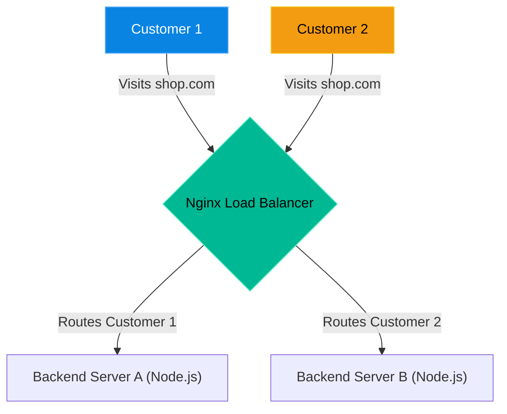

# Chapter 28 — Reverse Proxies & Load Balancing


## Learning Objectives

Have you ever wondered how Linux handles Reverse Proxies & Load Balancing? In this chapter, we dive deep into the mechanics, exploring the tools and strategies that separate a junior admin from a true Linux Support Engineer.

By the end of this chapter, you will be able to:
* Explain the difference between a Web Server and a Reverse Proxy.
* Understand why developers use `proxy_pass` to hide backend applications.
* Explain how a Load Balancer distributes traffic.
* Troubleshoot the "502 Bad Gateway" error.
* Troubleshoot "Sticky Session" logout loops.

## Visual Architecture: The Load Balancer

A single web server can only handle so much traffic. When a website gets popular, you must split the traffic across multiple servers. A Load Balancer sits at the front door and acts as a traffic cop.



## Theory & Concepts

### 1. What is a Reverse Proxy?
A web server (like we learned in Chapter 27) serves files directly from the hard drive (`/var/www/html`). 
A **Reverse Proxy** does *not* serve files. Instead, it takes the customer's request, turns around, hands the request to a completely different application running in the background, waits for the answer, and passes the answer back to the customer. 
Nginx is the undisputed king of Reverse Proxies.

### 2. Why hide the Backend? (The `proxy_pass`)
Most modern applications are built in Node.js, Python, or Ruby. These applications are terrible at handling raw internet traffic and SSL certificates.
Instead, developers run their Node.js app on a hidden internal port (e.g., `localhost:3000`). They use Nginx on Port 80 to act as the armored front door. Nginx uses the `proxy_pass http://localhost:3000;` directive to safely hand the traffic backward.

### 3. What is a Load Balancer?
If you add multiple backend servers to a Reverse Proxy configuration, it becomes a Load Balancer. Nginx will automatically send Request 1 to Server A, Request 2 to Server B, Request 3 to Server A, and so on (a "Round Robin" algorithm).

> [!TIP] Support Engineer Tip #27
> **Health Checks:** A good Load Balancer is smart. If Server B crashes, Nginx will detect the failure and instantly stop sending traffic to it, routing all new customers to Server A until Server B is fixed. This is called High Availability (HA).

## Scenario-Based Troubleshooting

> [!IMPORTANT] Incident Report: The "502 Bad Gateway" Error
>
> **Problem:** End User (Dave): "My web application is showing a giant, unstyled `502 Bad Gateway (Nginx)` error!"
>
> **Investigation:** Charlie knows a 502 error means the Nginx front door is working perfectly, but when Nginx turned around to hand the traffic to the backend application, the backend application wasn't there.
>
> **Wrong Assumption:** Bob (Junior Admin) says: "Nginx is throwing an error! Let's restart Nginx."
>
> **Root Cause:** Alice (Senior Admin) intervenes. Restarting the messenger doesn't fix the sender. The backend Node.js application crashed.
>
> **Lessons Learned:** Alice verifies the backend application is dead, then fixes it.
> 
> ```bash
> alice@prod-web1:~$ ss -tulpn | grep 3000
> # Output is empty, the app is not listening!
> alice@prod-web1:~$ systemctl status node-app
> ... Main process exited, code=killed, status=9/KILL
> alice@prod-web1:~$ systemctl start node-app
> ```
> 
> Once the Node.js application is running again, Nginx instantly detects it, and the 502 error vanishes without ever touching the Nginx service.
>
> [!IMPORTANT] Incident Report: The Sticky Session Logout Loop
>
> **Problem:** End User (Dave): "We just upgraded to a 2-server Load Balancer. Now, every time users log in, they click a link and are instantly logged out again!"
>
> **Investigation:** Charlie understands the flow. Click 1: User logs in, Load Balancer sends them to Server A, session is saved. Click 2: User clicks a link, Load Balancer sends them to Server B, Server B has no idea who this is, and logs them out.
>
> **Wrong Assumption:** Bob (Junior Admin) says: "The application code is broken, send it back to the developers."
>
> **Root Cause:** Alice (Senior Admin) steps in. The application is fine; the load balancer is blindly distributing traffic without considering session state.
>
> **Lessons Learned:** Alice adds the `ip_hash;` directive to the Nginx config to force "Sticky Sessions".
> 
> ```bash
> alice@prod-web1:~$ nano /etc/nginx/nginx.conf
> alice@prod-web1:~$ nginx -t
> alice@prod-web1:~$ systemctl restart nginx
> ```
> 
> Nginx now calculates the user's IP address and guarantees that Customer 1 will *always* be sent to Server A. The logout loop is fixed.

## Hands-on Lab

> [!CAUTION]
> **Practice Assignment Available**
> Before moving on, complete the exercises in the [Chapter 28 Practice Guide](../practice-files/V1-C28-practice.md). You will practice identifying whether a backend application is actually running before blaming the proxy.

## Interview Questions

### Question 1: A customer reports a "502 Bad Gateway" error. Is the Nginx web server down?
* **Target Answer**: "No, Nginx is not down. A 502 Bad Gateway error proves that Nginx is actually running and accepting connections. However, it indicates that Nginx is acting as a reverse proxy, and the backend application it is trying to communicate with (such as a Node.js or Python app) is either offline, crashed, or unreachable."

### Question 2: In Nginx, what does the `proxy_pass` directive do?
* **Target Answer**: "The `proxy_pass` directive tells Nginx to act as a reverse proxy. Instead of serving files from the local filesystem, Nginx intercepts the incoming HTTP request and forwards it to a specified backend URL or local port (like `http://127.0.0.1:3000`), waits for the response, and then passes that response back to the client."

### Question 3: A website behind a round-robin load balancer keeps randomly logging users out as they browse the site. What is the cause and the solution?
* **Target Answer**: "The cause is that session data is being stored locally on the backend servers. When the load balancer routes the user's next request to a different backend server, that server doesn't recognize the session. The immediate solution is to configure 'Sticky Sessions' (such as using `ip_hash` in Nginx) to ensure a user is consistently routed to the same backend server."

## Chapter Summary

As a Support Engineer, the most valuable lesson in this chapter is understanding the 502 error. Whenever you see a 502, do not restart Nginx. Nginx is doing its job by reporting the failure. Focus entirely on finding out why the hidden backend application crashed.

## Completion Checklist

- [ ] I understand the difference between a Web Server and a Reverse Proxy.
- [ ] I know that a 502 error means the backend is down, not Nginx.
- [ ] I understand why Sticky Sessions (`ip_hash`) prevent logout loops.

---

## Navigation

⬅ Previous:
[Chapter 27 – Introduction to Web Servers](V1-C27-introduction-to-web-servers.md)

🏠 Volume Contents:
[Table of Contents](../TOC.md)

➡ Next:
[Chapter 29 – Database Fundamentals](V1-C29-database-fundamentals.md)
