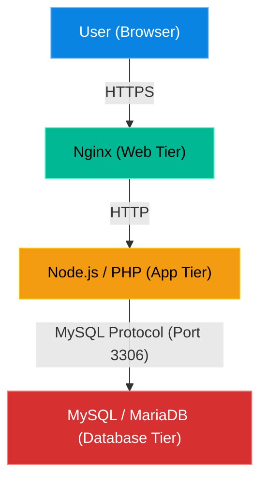

# Chapter 29 — Database Fundamentals


## Learning Objectives

Have you ever wondered how Linux handles Database Fundamentals? In this chapter, we dive deep into the mechanics, exploring the tools and strategies that separate a junior admin from a true Linux Support Engineer.

By the end of this chapter, you will be able to:
* Identify the standard database port (3306) and daemon (`mysqld`).
* Understand the difference between `127.0.0.1` and `0.0.0.0` bindings.
* Diagnose remote "Connection Refused" errors.
* Troubleshoot the Linux Out of Memory (OOM) Killer.

## Visual Architecture: The 3-Tier Stack

Databases are the final layer of the modern internet. A user never touches a database directly. The user touches the Web Server, the Web Server touches the Application, and the Application touches the Database.



## Theory & Concepts

### 1. The Daemon and the Port
Whether you are using MySQL or MariaDB, the background service is almost always called `mysqld` (MySQL Daemon). 
When running, it listens for incoming connections on **Port 3306**.

### 2. The `bind-address` (Localhost vs. Public)
For security reasons, when you install MySQL, it configures itself to only listen to `127.0.0.1` (Localhost). This means only applications hosted on the *exact same server* can connect to it. Hackers on the internet cannot reach it.
If you have a dedicated Database Server and a separate Web Server, you must edit the database configuration file and change the `bind-address` to `0.0.0.0` (All Interfaces) so it accepts connections from the outside world.

### 3. The Linux OOM Killer
Databases are memory hogs. If your server runs out of RAM, the Linux Kernel panics. To prevent the entire operating system from crashing, the Kernel deploys the **OOM (Out of Memory) Killer**. The OOM Killer scans the server for the process using the most RAM, targets it, and instantly assassinates it. 99% of the time, the victim is MySQL.

> [!TIP] Support Engineer Tip #28
> **Silent Assassinations:** The tricky part about the OOM Killer is that it operates at the Kernel level. It instantly terminates MySQL without warning. Therefore, MySQL does not have time to write an error to its own `/var/log/mysql/error.log`. The only place you will find evidence of the assassination is in the system-level logs (e.g. `/var/log/syslog` or `dmesg`).

## Scenario-Based Troubleshooting

> [!IMPORTANT] Incident Report: The "Connection Refused" Error
>
> **Problem:** End User (Dave): "We split our infrastructure. We put our application on Server A, and MySQL on Server B. Our application throws a fatal error: `Connection Refused to Server B`."
>
> **Investigation:** Charlie logs into Server B (the database) and checks what port MySQL is listening on.
> 
> ```bash
> charlie@prod-db1:~$ ss -tulpn | grep 3306
> tcp LISTEN 127.0.0.1:3306
> ```
>
> **Evidence:** The database is actively rejecting external traffic. It is only talking to itself (`127.0.0.1`).
>
> **Wrong Assumption:** Bob (Junior Admin) says: "The firewall must be blocking the traffic! Let's disable `ufw`."
>
> **Root Cause:** Alice (Senior Admin) intervenes. The firewall is irrelevant if the application isn't even listening on the public network interface. MySQL defaults to localhost for security.
>
> **Lessons Learned:** Alice opens the MySQL configuration file and changes the `bind-address` to `0.0.0.0`.
> 
> ```bash
> alice@prod-db1:~$ sudo nano /etc/mysql/mysql.conf.d/mysqld.cnf
> # Changed bind-address = 127.0.0.1 to bind-address = 0.0.0.0
> alice@prod-db1:~$ sudo systemctl restart mysql
> alice@prod-db1:~$ ss -tulpn | grep 3306
> tcp LISTEN 0.0.0.0:3306
> ```
> 
> The application instantly connects. *(Note: Alice also ensures the firewall only allows Server A to reach this port!)*
>
> [!IMPORTANT] Incident Report: The OOM Killer Assassin
>
> **Problem:** End User (Dave): "Our database crashes randomly every night around 2:00 AM. We just run `systemctl start mysql` every morning to fix it."
>
> **Investigation:** Charlie suspects memory exhaustion. He queries the system logs.
> 
> ```bash
> charlie@prod-db1:~$ grep -i "Out of memory" /var/log/syslog
> kernel: Out of memory: Killed process 4492 (mysqld).
> ```
>
> **Evidence:** The logs reveal the smoking gun. The Kernel assassinated MySQL to save the server.
>
> **Wrong Assumption:** Bob (Junior Admin) says: "MySQL has a memory leak! We need to upgrade to the latest version."
>
> **Root Cause:** Alice (Senior Admin) asks Dave what happens at 2:00 AM. Dave says, "We run our daily backup script."
>
> **Lessons Learned:** Alice informs Dave that their server only has 1GB of RAM, and the backup script requires more than that. The Kernel is executing the OOM Killer to save the system. She recommends upgrading the server to 2GB of RAM or adding a Swap file.

## Hands-on Lab

> [!CAUTION]
> **Practice Assignment Available**
> Before moving on, complete the exercises in the [Chapter 29 Practice Guide](../practice-files/V1-C29-practice.md). You will audit your server for evidence of OOM events.

## Interview Questions

### Question 1: An application on WebServer01 cannot connect to DatabaseServer01. You check DatabaseServer01 and see `tcp LISTEN 127.0.0.1:3306`. What is the problem?
* **Target Answer**: "The database is currently bound only to the localhost interface (`127.0.0.1`), meaning it will only accept connections originating from its own internal system. To allow external connections from WebServer01, the MySQL configuration file must be updated to set the `bind-address` to `0.0.0.0`, followed by a service restart."

### Question 2: A customer's MySQL service unexpectedly stopped overnight. You check the MySQL error logs, but there are no errors listed at the time of the crash. Where should you look next?
* **Target Answer**: "I would look at the system logs (`/var/log/syslog` or `dmesg`) and grep for 'Out of memory' or 'OOM'. Databases are frequently terminated by the Linux Kernel's OOM Killer when the system runs out of RAM. This termination happens at the OS level, which is why MySQL wouldn't have time to write an error to its own application logs."

### Question 3: What is the standard port for MySQL, and what is the name of the background daemon process?
* **Target Answer**: "The standard port is 3306, and the daemon process is named `mysqld`."

## Chapter Summary

When a database connection fails, always check the `bind-address` using `ss -tulpn`. When a database crashes silently without leaving a trace in its own application logs, always check the system logs for the OOM Killer. 

## Completion Checklist

- [ ] I understand the difference between `127.0.0.1` and `0.0.0.0` bindings.
- [ ] I can locate the `bind-address` configuration file on my distro.
- [ ] I know how to check the system logs for the OOM Killer.

---

## Navigation

⬅ Previous:
[Chapter 28 – Reverse Proxies & Load Balancing](V1-C28-reverse-proxies-and-load-balancing.md)

🏠 Volume Contents:
[Table of Contents](../TOC.md)

➡ Next:
[Chapter 30 – Conclusion & Career Path](V1-C30-conclusion-and-career-path.md)
