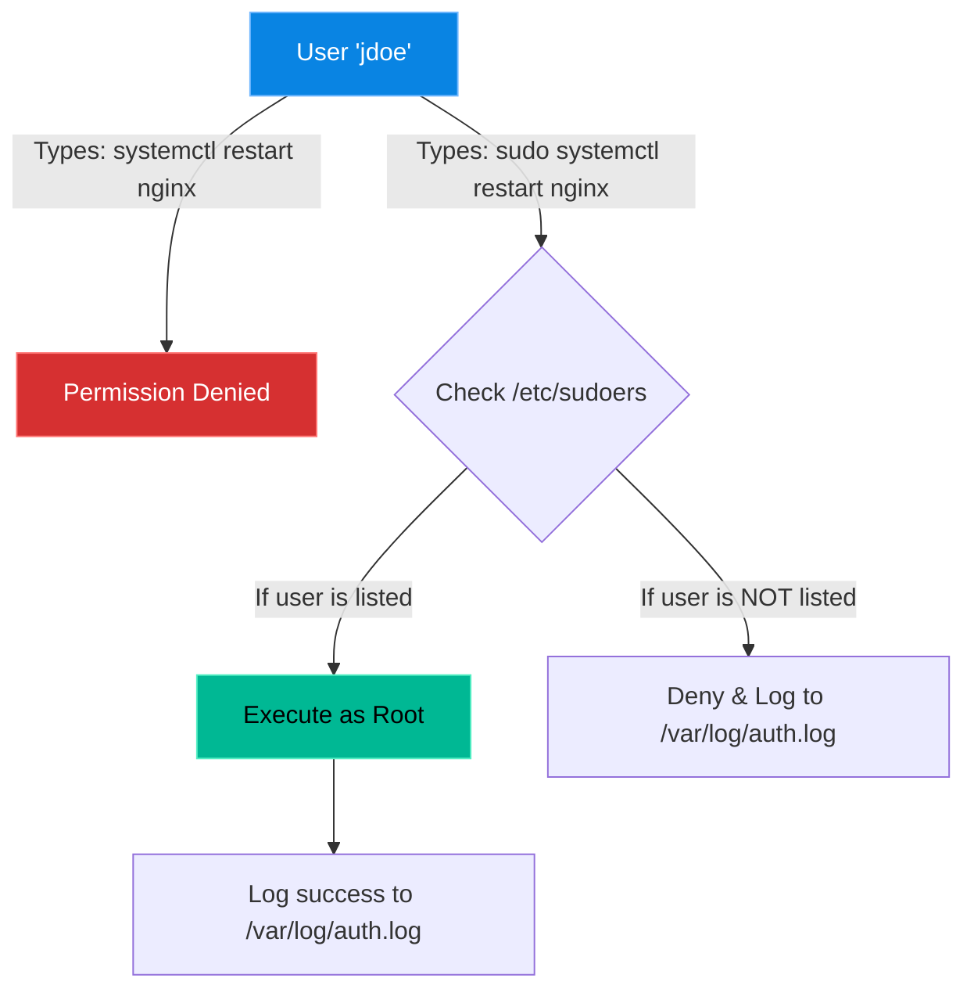

# Chapter 1 — The Root of All Power

## Learning Objectives

By the end of this chapter, you will be able to:
* Explain why logging directly into the `root` account is forbidden in the enterprise.
* Understand the mechanics of the `sudo` command.
* Safely edit the `/etc/sudoers` file to grant granular privileges.
* Use `visudo` to prevent locking yourself out of your own server.

> [!NOTE]
> **The Enterprise Mindset: The Sudo Command**
>
> In an enterprise, logging directly into the `root` account is forbidden because it destroys accountability. Instead, Support Engineers are granted specific privileges using `sudo`. This chapter will teach you how to manage those privileges without locking yourself out of the server.

## Visual Architecture: The Sudo Escalation

In enterprise environments, access is strictly audited. You do not hand out the keys to the castle; you temporarily grant an employee a keycard that works for exactly one door, for exactly five minutes, and you log the event.

## Theory & Concepts

### 1. The Death of Root
In Volume 1, you learned that `root` is the absolute master of the Linux system. So why don't we just give all system administrators the `root` password? 
1. **No Audit Trail:** If five engineers share the `root` password and someone deletes a production database, the logs only show that "root" deleted it. You have no idea *which* engineer actually did it.
2. **Accidental Damage:** When logged in as `root`, there are no safety nets. A simple typo (`rm -rf /`) executes immediately.

### 2. The `sudo` Command
`sudo` stands for "Superuser Do". It allows a standard user to execute a command with `root` privileges. 
* It requires the user to enter *their own* password, not the root password.
* It logs exactly who ran the command and what time they ran it.

### 3. The Sudoers File
The `/etc/sudoers` file dictates exactly who is allowed to use the `sudo` command. 
If you open the file, you will see a line like this:
`%admin ALL=(ALL) ALL`
* This means anyone in the `admin` group can run `ALL` commands as `ALL` users from `ALL` terminals.

## Real-World Support Ticket

> [!IMPORTANT] ServiceNow Ticket: INC-2026201
> **Title:** Syntax Error in /etc/sudoers
> **Assigned To:** Charlie (L2 Support Engineer)
> **Status:** IN PROGRESS
> 
> **1) Ticket intake & triage**
> Charlie confirms P1 impact: No administrators can execute privileged commands. SLA requires 15-minute response.
> 
> **2) Discovery & diagnosis**
> Charlie attempts `sudo -l` and immediately sees a parse error at line 25. He checks the audit log and sees Bob recently modified the file using nano instead of visudo.
> 
> **3) Immediate containment**
> Since sudo is completely broken, standard operations are halted. Charlie announces a temporary freeze on administrative tasks while he restores access.
> 
> **4) Resolution planning & execution**
> Charlie leverages an out-of-band management console to log in directly as root (which bypasses sudo). He uses `visudo` to correct the syntax error on line 25.
> 
> **5) Verification**
> Charlie logs back in as a standard user and runs `sudo -l`. The command succeeds.
> 
> **6) Closure & documentation**
> Charlie documents the fix: 'Corrected syntax in sudoers via root console'. Resolves the incident.
> 
> **7) Post-resolution follow-up**
> Charlie updates the SOP to strictly require `visudo` for all future sudoers edits to prevent syntax lockouts.
> 
> **8) Escalation rules**
> If the root password was lost and out-of-band management was unavailable, Charlie would have escalated to the Data Center team to boot into Single User Mode.

## Hands-on Lab

> [!TIP]
> **Practice Assignment Available**
> Proceed to the [Chapter 1 Practice Guide](../practice-files/V2-C01-practice.md) to practice writing granular `sudoers` rules using `visudo`.

## Interview Questions

### Question 1: Why is it considered a terrible security practice to log in directly as the `root` user?
* **Target Answer**: "Logging in directly as `root` destroys accountability. Because `root` is a shared identity, the system logs cannot distinguish which specific engineer ran a destructive command. Using `sudo` forces engineers to log in with their personal accounts, creating a perfect audit trail of who executed what command, and when."

### Question 2: You need to edit the `/etc/sudoers` file. Should you use `nano /etc/sudoers`? Why or why not?
* **Target Answer**: "No, you must never edit the file directly with a standard text editor. You should always use the `visudo` command. `visudo` locks the file to prevent simultaneous edits and, most importantly, performs a strict syntax check when you try to save. If you introduce a typo using `nano`, the `sudo` system breaks, completely locking all administrators out of the server."

### Question 3: How do you grant a user named 'appdev' the ability to restart the apache2 service without prompting them for a password?
* **Target Answer**: "I would run `sudo visudo` and add the following line: `appdev ALL=(ALL) NOPASSWD: /bin/systemctl restart apache2`. Using the absolute path to the binary is required for security."

## Common Mistakes & Pro-Tips

> [!WARNING] Common Mistake
> Editing `/etc/sudoers` with `nano` instead of `visudo`, breaking syntax and locking everyone out.

> [!CAUTION] Think Before You Type
> `chmod -R 777 /etc/` (What goes wrong? You destroy the strict permissions required by services like SSH and sudo, permanently breaking the system.)

## Chapter Summary

The `sudoers` file is the gateway to your server's security. Give people only the exact permissions they need to do their jobs (The Principle of Least Privilege), always use absolute paths for executables, and **never** forget the `visudo` command.

## Completion Checklist

- [ ] I can explain why shared `root` accounts break audit trails.
- [ ] I understand the catastrophic danger of editing `/etc/sudoers` with `nano`.
- [ ] I know how to find the absolute path of a command using `which`.

---

---

**Chapter Transition**
> You now have administrative access, but how do you verify who is logging in? It's time to explore Pluggable Authentication Modules.

---

## Navigation

← Previous: None

↑ Volume Contents: [Table of Contents](TOC.md)

→ Next: [Chapter 2 — Pluggable Authentication Modules (PAM)](V2-C02-pluggable-authentication-modules.md)
