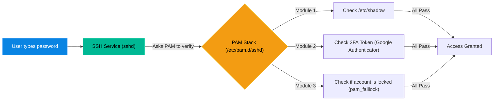

# Chapter 2 — Pluggable Authentication Modules (PAM)

## Learning Objectives

By the end of this chapter, you will be able to:
* Explain how the PAM architecture separates applications from authentication methods.
* Understand the 4 management groups of the PAM stack (`auth`, `account`, `password`, `session`).
* Navigate the `/etc/pam.d/` directory.
* Troubleshoot and reset user lockouts triggered by `pam_faillock` (or `pam_tally2`).

> [!NOTE]
> **The Enterprise Mindset: The Authentication Layer**
>
> Applications shouldn't have to know how to read fingerprints or send text messages. PAM creates an abstraction layer that handles authentication for every service on the system. When a user can't log in despite having the right password, a Support Engineer looks at PAM.

## Visual Architecture: The PAM Interceptor

Before PAM existed, every application (like SSH or FTP) had to be hard-coded to check the `/etc/shadow` file for passwords. If you wanted to add Fingerprint scanning or 2-Factor Authentication (2FA), you had to rewrite the SSH application. 
PAM solves this. It acts as an interceptor.

## Theory & Concepts

### 1. The `/etc/pam.d/` Directory
All PAM configurations live in `/etc/pam.d/`. If you look inside this folder, you will see a text file for almost every service on your server that requires a login (e.g., `sshd`, `sudo`, `login`, `su`).
When you use the `sudo` command, the OS opens `/etc/pam.d/sudo` and follows the instructions inside to figure out how to authenticate you.

### 2. The 4 Management Groups
Every line in a PAM configuration file falls into one of four categories:
1. **auth:** Verifies identity (e.g., "Does this password match the hash?").
2. **account:** Verifies account status (e.g., "Is this user's password expired? Is it past 5:00 PM?").
3. **password:** Handles password updates (e.g., "Does this new password contain at least 8 characters and a symbol?").
4. **session:** Handles setup and teardown (e.g., "Mount the user's home directory when they log in, and unmount it when they log out").

### 3. Control Flags (The `required` vs `sufficient` Rules)
PAM uses control flags to decide what happens if a module fails:
* **`required`**: The module *must* succeed. Even if it fails, PAM will quietly continue checking the rest of the modules before denying access (so hackers can't figure out exactly which module failed).
* **`requisite`**: The module *must* succeed. If it fails, PAM instantly rejects the user and drops the connection.
* **`sufficient`**: If this module succeeds, PAM instantly grants access and ignores the remaining modules.

## Hands-on Lab

> [!TIP]
> **Practice Assignment Available**
> Proceed to the [Chapter 2 Practice Guide](../practice-files/V2-C02-practice.md) to inspect your own PAM stack and learn to read the modular configuration files.

## Interview Questions

### Question 1: What problem does PAM (Pluggable Authentication Modules) solve in Linux?
* **Target Answer**: "Before PAM, every application had to have its authentication logic hard-coded into it. PAM decouples authentication from the application. It provides a centralized, modular framework so that administrators can easily add new authentication methods (like 2FA, biometric scans, or LDAP integration) to any service without rewriting the application's underlying code."

### Question 2: In a PAM configuration file, what is the difference between the `required` and `requisite` control flags?
* **Target Answer**: "Both flags mean the module must succeed for authentication to be granted. The difference is how they handle failure. If a `required` module fails, PAM will continue processing the rest of the stack before returning the failure, to prevent revealing which specific check failed. If a `requisite` module fails, PAM immediately terminates the authentication process and denies access."

### Question 3: A user is completely locked out of their account after typing the wrong password too many times. What PAM module is likely responsible, and how do you fix it?
* **Target Answer**: "The module responsible is likely `pam_faillock` (on modern systems) or `pam_tally2` (on older systems). As an administrator, I would run `faillock --user <username> --reset` (or `pam_tally2 --user <username> --reset`) to clear the failure counter and instantly restore their access."

## Common Mistakes & Pro-Tips

> [!WARNING] Common Mistake
> Locking out `root` without having a secondary administrative backdoor open.

> [!CAUTION] Think Before You Type
> `pam_tally2 --user admin` (Are you checking lockouts or resetting them? Know the flags!)

## Chapter Summary

PAM is the hidden bouncer of the Linux operating system. It doesn't just check passwords; it checks if your account is locked, if your password meets complexity requirements, and if your home directory exists. When a user cannot log in despite having the correct password, PAM is usually the culprit.

## Completion Checklist

- [ ] I understand the difference between `auth`, `account`, `password`, and `session` management groups.
- [ ] I can explain why PAM uses the `required` flag to hide failure reasons from hackers.
- [ ] I know the command to reset a locked user (`faillock --reset`).

---

---

**Chapter Transition**
> Local authentication is fine for one server, but what happens when you have a thousand? You need a central authority.

---

**Chapter Transition**
> Local authentication is fine for one server, but what happens when you have a thousand? You need a central authority.

---

## Navigation

← Previous: [Chapter 1 — The Root of All Power](V2-C01-the-root-of-all-power.md)

↑ Volume Contents: [Table of Contents](TOC.md)

→ Next: [Chapter 3 — Centralized Authentication](V2-C03-centralized-authentication.md)
