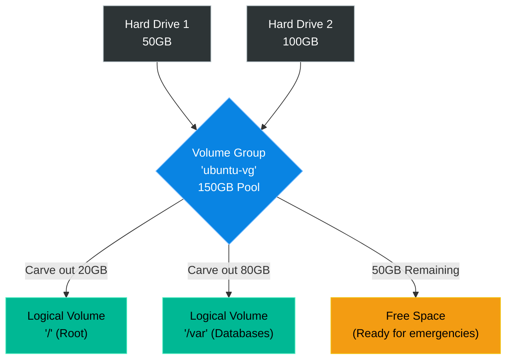

# Chapter 4 — Logical Volume Management (LVM)

## Learning Objectives

By the end of this chapter, you will be able to:
* Explain why standard disk partitions are rigid and dangerous for enterprise workloads.
* Define the 3 layers of LVM: Physical Volumes (PV), Volume Groups (VG), and Logical Volumes (LV).
* Add a new hard drive to an existing Volume Group.
* Extend a live filesystem using `lvextend` and `resize2fs` (or `xfs_growfs`).

> [!NOTE]
> **The Enterprise Mindset: Abstracting Storage**
>
> In traditional setups, if a partition fills up, you are trapped. In an enterprise, storage must be fluid. LVM solves this by creating an abstract "pool" of storage. You throw hard drives into the pool, and then you scoop out flexible chunks of storage called Logical Volumes that can be resized on the fly.

## Visual Architecture: The Storage Pool

In traditional Linux setups (like you learned in Volume 1), you format a hard drive and create a partition. If that partition fills up, you are trapped. 
LVM solves this by creating an abstract "pool" of storage. You throw hard drives into the pool, and then you scoop out flexible chunks of storage called Logical Volumes. 

## Theory & Concepts

### 1. The 3 Layers of LVM
LVM acts as an abstraction layer between the physical hard drive and the operating system.
1. **Physical Volumes (PV):** The actual, physical hard drives plugged into the server (e.g., `/dev/sdb`). You use the `pvcreate` command to mark them for LVM use.
2. **Volume Groups (VG):** The giant pool of storage. You use `vgcreate` to group multiple PVs together. If you group two 50GB drives together, you get a 100GB VG.
3. **Logical Volumes (LV):** The virtual partitions you carve out of the VG. You use `lvcreate` to make them, and then you format them with a filesystem (like `ext4`) and mount them to a folder.

### 2. The Commands
You can view the state of your LVM architecture at any time using three simple commands:
* `pvs` (Physical Volume Status)
* `vgs` (Volume Group Status)
* `lvs` (Logical Volume Status)

## Real-World Support Ticket

> [!IMPORTANT] ServiceNow Ticket: INC-2026204
> **Title:** Root Filesystem at 100% Capacity
> **Assigned To:** Charlie (L2 Support Engineer)
> **Status:** IN PROGRESS
> 
> **1) Ticket intake & triage**
> Charlie receives a P2 alert: `/` is at 100%. Web applications are failing to write temporary files. SLA requires 30-minute response.
> 
> **2) Discovery & diagnosis**
> Charlie runs `df -h` and confirms `/` is full. He runs `vgs` and sees 50GB of free space remaining in the Volume Group.
> 
> **3) Immediate containment**
> Charlie clears out old `/var/log` archives to free up 500MB immediately, allowing the web apps to resume functioning while he executes the permanent fix.
> 
> **4) Resolution planning & execution**
> Charlie uses `lvextend -L +10G /dev/vg0/root` to add 10GB from the VG to the LV, and then runs `resize2fs /dev/vg0/root` to expand the filesystem online.
> 
> **5) Verification**
> Charlie runs `df -h` and confirms `/` now shows 10GB of free space. Monitoring alerts clear.
> 
> **6) Closure & documentation**
> Charlie documents the LVM expansion and resolves the ticket.
> 
> **7) Post-resolution follow-up**
> Charlie adjusts the monitoring thresholds to alert at 85% instead of 95% to allow more reaction time in the future.
> 
> **8) Escalation rules**
> If the VG had 0 free space, Charlie would escalate to the Storage team to provision a new physical LUN.

## Hands-on Lab

> [!TIP]
> **Practice Assignment Available**
> Proceed to the [Chapter 4 Practice Guide](../practice-files/V2-C04-practice.md) to use `lsblk` and the LVM status commands to map out your own server's storage architecture.

## Interview Questions

### Question 1: What is the primary advantage of using LVM (Logical Volume Management) over standard partitions?
* **Target Answer**: "Standard partitions are rigid; if a standard partition fills up, resizing it usually requires unmounting the drive and experiencing downtime. LVM creates an abstraction layer that allows administrators to pool multiple physical hard drives together and dynamically resize Logical Volumes on the fly, without unmounting the filesystem or rebooting the server."

### Question 2: You just added 20GB of space to a Logical Volume using `lvextend`, but when you run `df -h`, the extra space does not show up. What step did you forget?
* **Target Answer**: "I forgot to resize the filesystem that sits on top of the Logical Volume. `lvextend` only increases the size of the block device. I must also run `resize2fs` (for ext4 filesystems) or `xfs_growfs` (for XFS filesystems) to instruct the filesystem to expand into the newly provided space."

### Question 3: Explain the relationship between a PV, a VG, and an LV.
* **Target Answer**: "A Physical Volume (PV) is the raw hard drive. Multiple PVs are pooled together to create a Volume Group (VG), which acts as a giant bucket of unified storage. From that Volume Group, administrators carve out smaller, flexible virtual partitions called Logical Volumes (LV), which are then formatted and mounted to the operating system."

## Common Mistakes & Pro-Tips

> [!WARNING] Common Mistake
> Expanding a filesystem without expanding the underlying Logical Volume first.

> [!CAUTION] Think Before You Type
> `lvremove /dev/vg0/data` (Are you sure the volume is unmounted and empty?)

## Chapter Summary

Storage emergencies are the most stressful events in IT. LVM reduces that stress by giving you flexibility. Always leave 20% of your Volume Group unallocated (free). That way, when a partition fills up in the middle of the night, you can instantly `lvextend` and `resize2fs` your way out of the crisis.

## Completion Checklist

- [ ] I can define PV, VG, and LV.
- [ ] I understand why `lvextend` must always be followed by `resize2fs` or `xfs_growfs`.
- [ ] I can list the commands to view LVM architecture (`pvs`, `vgs`, `lvs`).

---

---

**Chapter Transition**
> Logical volumes give us flexibility, but what happens when the underlying physical disk dies? We need hardware redundancy.

---

## Navigation

← Previous: [Chapter 3 — Centralized Authentication](V2-C03-centralized-authentication.md)

↑ Volume Contents: [Table of Contents](TOC.md)

→ Next: [Chapter 5 — RAID Arrays](V2-C05-raid-arrays.md)
