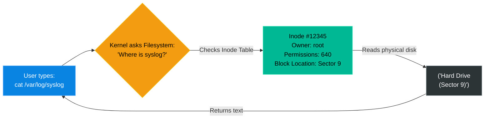

# Chapter 7 — Filesystem Tuning and Inodes

## Learning Objectives

By the end of this chapter, you will be able to:
* Define what an Inode is and how the Linux Kernel uses it.
* Differentiate between `df -h` (Disk Space) and `df -i` (Inode Space).
* Troubleshoot "No space left on device" errors caused by Inode exhaustion.
* Understand the `ext4` reserved block percentage.

> [!NOTE]
> **The Enterprise Mindset: Filesystem Tuning and Inodes**
>
> Mastering Filesystem Tuning and Inodes is critical for stability and accountability. We will explore how to handle Filesystem Tuning and Inodes to ensure continuous uptime.

## Visual Architecture: The Library Card Catalog

Think of a hard drive like a physical library. The physical books take up space (Disk Space). But to find the books, the librarian uses a card catalog. Every single book needs exactly one index card. The index card holds the metadata (the title, the author, where the book is located on the shelf). 
In Linux, the index card is called an **Inode**.

## Theory & Concepts

### 1. The Anatomy of an Inode
An Inode (Index Node) is a data structure on a filesystem that stores all the information *about* a file, except for its name and its actual data. 
It stores:
* The file's size
* The file's owner (UID) and group (GID)
* The read/write/execute permissions (`chmod`)
* The exact physical location on the hard drive where the data begins.

### 2. The Hard Limit
When you format a hard drive with the `ext4` filesystem, Linux calculates the size of the drive and creates a fixed, permanent number of Inodes. 
* 1 File = 1 Inode. 
* 1 Directory = 1 Inode.
If a partition is given 10,000,000 Inodes, you can only ever create 10 million files on that drive, regardless of how small they are.

### 3. Reserved Blocks
By default, `ext4` reserves 5% of all disk space exclusively for the `root` user. If a regular user fills the drive to 100%, `root` can still log in and use that hidden 5% to delete files and save the server.

## Real-World Support Ticket

> [!IMPORTANT] ServiceNow Ticket: INC-2026207
> **Title:** No Space Left on Device (Inodes)
> **Assigned To:** Charlie (L2 Support Engineer)
> **Status:** IN PROGRESS
> 
> **1) Ticket intake & triage**
> Charlie takes a P2 ticket: Users cannot upload profile pictures. Error: 'No space left on device'.
> 
> **2) Discovery & diagnosis**
> Charlie runs `df -h` and sees the disk is only 40% full. He remembers to check inodes and runs `df -i`. The inode usage is at 100%.
> 
> **3) Immediate containment**
> Charlie identifies a misconfigured PHP session directory containing 5 million tiny session files. He stops the web service briefly to prevent more files from being created.
> 
> **4) Resolution planning & execution**
> Charlie uses `find /var/lib/php/sessions -type f -delete` (after confirming it's safe) to purge the millions of files, freeing up the inodes.
> 
> **5) Verification**
> Charlie runs `df -i` and sees inode usage drop to 2%. He successfully uploads a test image.
> 
> **6) Closure & documentation**
> Charlie logs the root cause (inode exhaustion) and the cleanup command.
> 
> **7) Post-resolution follow-up**
> Charlie creates a Cron job to automatically prune PHP session files older than 24 hours.
> 
> **8) Escalation rules**
> If the inodes were exhausted by legitimate files that could not be deleted, he would escalate to the OS team to format a new partition with a higher inode ratio.

## Hands-on Lab

> [!TIP]
> **Practice Assignment Available**
> Proceed to the [Chapter 7 Practice Guide](../practice-files/V2-C07-practice.md) to inspect your own VM's Inode limits.

## Interview Questions

### Question 1: An application crashes with a "No space left on device" error. You check `df -h` and verify there is over 100GB of free space. What is the next command you should run?
* **Target Answer**: "I would run `df -i`. The error indicates that the filesystem cannot write new data. If physical block space is available, the filesystem has likely exhausted its supply of Inodes. Every file requires one Inode, so a runaway script generating millions of tiny files will exhaust the Inode pool before it exhausts the physical disk capacity."

### Question 2: What information is stored inside an Inode?
* **Target Answer**: "An Inode stores the metadata of a file. This includes the file's owner, group, access permissions, timestamps, file size, and the pointers to the physical blocks on the hard drive where the actual data resides. Notably, the Inode does *not* store the file's name (which is stored in the directory table) or the actual file content."

### Question 3: By default, the `ext4` filesystem reserves 5% of the disk space. What is the purpose of this reserved space?
* **Target Answer**: "The reserved space is held exclusively for the `root` user and critical system processes. If a runaway application or user fills the hard drive to 100%, the system will not crash. The `root` user can still log in, utilize the reserved 5% to execute commands, and delete files to resolve the emergency."

## Common Mistakes & Pro-Tips

> [!WARNING] Common Mistake
> Running out of inodes because of millions of tiny cache files, even when disk space shows 50% free.

> [!CAUTION] Think Before You Type
> `rm -rf /var/cache/*` (Will the application crash if the directory structure disappears?)

## Chapter Summary

The `df -h` command only tells you half the story. The physical size of the files matters, but the *quantity* of the files matters just as much. If you ever see "No space left on device," run `df -h`, and then immediately run `df -i`. 

## Completion Checklist

- [ ] I can define what an Inode is.
- [ ] I know the command to check Inode usage (`df -i`).
- [ ] I understand how millions of tiny files can crash a server.

---

---

**Chapter Transition**
> To connect to external storage and users, the server must exist on a network. We must master IP configuration.

---

## Navigation

← Previous: [Chapter 6 — Network Attached Storage (NFS & SMB)](V2-C06-network-attached-storage.md)

↑ Volume Contents: [Table of Contents](TOC.md)

→ Next: [Chapter 8 — Static IP Configuration](V2-C08-static-ip-configuration.md)
