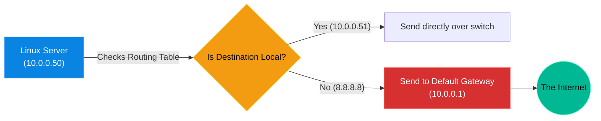

# Chapter 9 — Network Routing & Gateways


## Learning Objectives

By the end of this chapter, you will be able to:
* Explain the role of the Default Gateway in a Linux environment.
* Read and interpret the kernel routing table using `ip route`.
* Diagnose network pathing issues using `traceroute`.
* Troubleshoot "Asymmetric Routing" issues on servers with multiple network interfaces.


> [!NOTE]
> **The Enterprise Mindset: Network Routing & Gateways**
>
> Mastering Network Routing & Gateways is critical for stability and accountability. We will explore how to handle Network Routing & Gateways to ensure continuous uptime.

## Visual Architecture: The Great Escape

An IP address gives your server an identity, but it doesn't tell your server how to talk to anyone else. To talk to another computer, your server must consult its Routing Table. If the destination is outside the local subnet, the packet is handed to the Default Gateway (the Router), which forwards it out to the Internet.



## Theory & Concepts

### 1. The Local Subnet
Your server knows exactly what network it lives on. If its IP is `10.0.0.50/24`, it knows that any IP address from `10.0.0.1` to `10.0.0.254` is in the same building. If it wants to talk to `10.0.0.51`, it simply shouts across the local switch. It does not need a router.

### 2. The Default Gateway
If your server wants to talk to Google (`8.8.8.8`), it looks at the destination IP and realizes it is not in the local subnet. It must leave the building. The server packages the data and sends it to the **Default Gateway** (your physical router). The router is responsible for figuring out how to navigate the global internet.

### 3. Reading the Routing Table
You can view the kernel's GPS system using the `ip route` command. A standard output looks like this:
```text
default via 10.0.0.1 dev eth0
10.0.0.0/24 dev eth0 proto kernel scope link src 10.0.0.50
```
* **Line 2:** "If the destination is `10.0.0.X`, send it out of `eth0` directly."
* **Line 1:** "If the destination is literally anything else (`default`), send it to `10.0.0.1`."

## Hands-on Lab

> [!TIP]
> **Practice Assignment Available**
> Proceed to the [Chapter 9 Practice Guide](../practice-files/V2-C09-practice.md) to practice reading your own routing table and using `traceroute` to map the internet.

## Interview Questions

### Question 1: You ping an IP address on your local subnet, and it succeeds. You ping 8.8.8.8, and you receive 'Network is unreachable.' What is the most likely issue?
* **Target Answer**: "The server is missing a Default Gateway in its routing table. It knows how to talk to devices on its local subnet via the Layer 2 switch, but because there is no `default via` rule defined, the kernel has no idea where to send packets destined for the outside internet."

### Question 2: Explain the concept of 'Asymmetric Routing' on a server with multiple network interfaces.
* **Target Answer**: "Asymmetric routing occurs when a packet enters a server through one network interface, but the server's routing table dictates that the reply must leave through a different network interface. This often breaks TCP connections (like SSH), because the client is expecting a reply from the IP address it originally sent the request to."

### Question 3: What does the `traceroute` command do, and how is it useful for troubleshooting?
* **Target Answer**: "`traceroute` maps the exact path a packet takes to reach its destination. It lists every single router (or 'hop') the packet passes through. If a connection to a remote database is failing, `traceroute` allows an engineer to see exactly which router along the path is dropping the connection, isolating whether the issue is on our local network or the ISP's network."

## Common Mistakes & Pro-Tips

> [!WARNING] Common Mistake
> Adding a static route but forgetting to make it persistent across reboots.

> [!CAUTION] Think Before You Type
> `ip route del default` (How will your SSH packets get back to you?)

## Chapter Summary

Networking is simply following the map. If the server cannot reach a destination, run `ip route`. If the destination is outside the local subnet, ensure there is a `default` route pointing to the router. If you have multiple network cards, always be wary of asymmetric routes sending traffic out the wrong door!

## Completion Checklist

- [ ] I can read the output of `ip route`.
- [ ] I understand the purpose of the Default Gateway.
- [ ] I can explain why Asymmetric Routing breaks SSH connections.

---

---

**Chapter Transition**
> When routing fails and packets disappear, how do you prove it's the network and not the application? You must capture the packets.

---


## Navigation

← Previous: [Chapter 8 — Static IP Configuration](V2-C08-static-ip-configuration.md)

↑ Volume Contents: [Table of Contents](TOC.md)

→ Next: [Chapter 10 — Packet Capture & Analysis](V2-C10-packet-capture.md)
