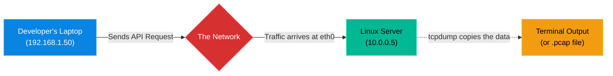

# Chapter 10 — Packet Capture & Analysis

## Learning Objectives

By the end of this chapter, you will be able to:
* Explain why packet capture is the ultimate source of truth in IT troubleshooting.
* Use `tcpdump` to capture live network traffic on a specific interface.
* Filter `tcpdump` output by IP address and port.
* Write packet captures to a `.pcap` file for advanced analysis in Wireshark.

> [!NOTE]
> **The Enterprise Mindset: Packet Capture & Analysis**
>
> Mastering Packet Capture & Analysis is critical for stability and accountability. We will explore how to handle Packet Capture & Analysis to ensure continuous uptime.

## Visual Architecture: The Invisible Observer

When an application breaks, developers often say, "The network is dropping my connection." As a Linux Support Engineer, you cannot just guess if they are right. You must prove it. `tcpdump` allows you to sit exactly at the server's network card and watch every single piece of data enter and leave in real-time.

## Theory & Concepts

### 1. The Ultimate Source of Truth
Logs can lie. Applications can have bugs. But network packets never lie. If a packet hits your network card, it happened. If it didn't, it didn't. `tcpdump` is the tool you use to see this truth. It puts the network card into "promiscuous mode," allowing it to read all traffic passing through it.

### 2. The Command Anatomy
If you run `tcpdump` by itself, your terminal will instantly flood with thousands of lines of unreadable text and crash. You must always use **filters**.
* **Specify the interface:** `tcpdump -i eth0` (Only listen on eth0).
* **Filter by Port:** `tcpdump -i eth0 port 443` (Only show HTTPS traffic).
* **Filter by Host:** `tcpdump -i eth0 host 10.0.0.50` (Only show traffic coming from or going to this specific IP).

### 3. PCAP Files and Wireshark
Reading raw packet data in a terminal is incredibly difficult. For complex issues, engineers write the capture to a file, download it to their laptop, and open it in a GUI tool called **Wireshark**.
To write to a file, use the `-w` flag:
`tcpdump -i eth0 port 443 -w capture.pcap`

## Industry Incident Spotlight: The Cloudflare Cloudbleed Leak

> [!CAUTION] **When Packets Reveal Too Much**
> In 2017, Cloudflare disclosed a severe vulnerability dubbed "Cloudbleed" that leaked sensitive customer data (including passwords, cookies, and tokens) into random HTTP responses.
>
> **The Timeline:**
> - A Google Project Zero researcher noticed corrupted data in HTTP responses from sites hosted behind Cloudflare.
> - By analyzing the raw packets, they discovered that the corrupted data wasn't just garbage—it contained sensitive memory from other Cloudflare customers.
>
> **The Root Cause:**
> A buffer overrun vulnerability in Cloudflare's HTML parser. The edge servers were reading past the end of a buffer and returning the contents of the server's memory in the HTTP response packets.
>
> **The Business Impact:**
> Sensitive data from millions of websites was potentially exposed and cached by search engines, requiring a massive coordinated effort to purge the leaked data from caches worldwide.
>
> **The Lessons Learned:**
> 1. **Packets don't lie.** Packet capture and analysis were crucial in proving that the server was transmitting data it shouldn't have been.
> 2. What happens in memory often leaks onto the wire if an application is compromised.

## Real-World Support Ticket

> [!IMPORTANT] ServiceNow Ticket: INC-2026210
> **Title:** Mysterious Network Latency
> **Assigned To:** Charlie (L2 Support Engineer)
> **Status:** IN PROGRESS
> 
> **1) Ticket intake & triage**
> Charlie receives a P3 ticket: The billing API is intermittently timing out when talking to the payment gateway.
> 
> **2) Discovery & diagnosis**
> Charlie runs a packet capture using `tcpdump -i eth0 host gateway.corp.local`. He analyzes the PCAP in Wireshark and notices a massive number of TCP Retransmissions.
> 
> **3) Immediate containment**
> Charlie notifies the Billing team that transactions may be delayed and to hold off on bulk processing.
> 
> **4) Resolution planning & execution**
> The packet capture proves the network switch is dropping packets. Charlie provides the PCAP to the Network Engineering team, who identify a faulty SFP module on the switch.
> 
> **5) Verification**
> After the Network team replaces the module, Charlie runs another `tcpdump` and confirms the TCP Retransmissions have stopped.
> 
> **6) Closure & documentation**
> Charlie attaches the PCAP analysis to the ticket and resolves it, crediting the Network team for the physical fix.
> 
> **7) Post-resolution follow-up**
> Charlie writes a KB article on how to identify TCP Retransmissions using tcpdump.
> 
> **8) Escalation rules**
> Charlie correctly escalated to the Network team once he had hard evidence (the PCAP) that the issue was Layer 2/3 packet loss.

## Hands-on Lab

> [!TIP]
> **Practice Assignment Available**
> Proceed to the [Chapter 10 Practice Guide](../practice-files/V2-C10-practice.md) to practice capturing live ICMP (ping) packets on your VM.

## Interview Questions

### Question 1: A developer claims that a firewall is blocking their traffic before it reaches your server. How can you use `tcpdump` to prove whether the traffic is actually arriving at your server?
* **Target Answer**: "I would run `tcpdump -i <interface> host <developer_ip>` on the server. If I see incoming packets from the developer's IP address, I have absolute proof that the network and external firewalls are allowing the traffic through, and the issue resides locally on the server (e.g., a local firewall or stopped service). If I see no packets, the developer is correct, and an upstream router or firewall is dropping the traffic."

### Question 2: If you run `tcpdump` without any flags on a busy production server, what will happen?
* **Target Answer**: "The terminal will be overwhelmed with thousands of lines of output per second, making it impossible to read and potentially causing the terminal session to freeze or crash. Furthermore, it will capture everything, including the SSH traffic you are using to connect to the server, creating an infinite feedback loop of packets. You must always use filters like `port` and `host`."

### Question 3: What is a `.pcap` file, and why would you use the `-w` flag with `tcpdump`?
* **Target Answer**: "A `.pcap` (Packet Capture) file is a standardized file format for storing network traffic. Reading raw packet payloads in a command-line terminal is extremely difficult. By using the `-w filename.pcap` flag, `tcpdump` saves the raw data to a file instead of printing it to the screen. I can then download that file to my workstation and open it in a graphical analysis tool like Wireshark for deep inspection."

## Common Mistakes & Pro-Tips

> [!WARNING] Common Mistake
> Capturing all traffic without filters, instantly filling up the local hard drive with a massive `.pcap` file.

> [!CAUTION] Think Before You Type
> `tcpdump -w trace.pcap` (Did you forget to specify a filter?)

## Chapter Summary

`tcpdump` is the ultimate arbiter of truth. Whenever there is a dispute between the application team and the network team, `tcpdump` provides the undeniable evidence needed to resolve the issue. Always remember to filter your captures, and when the data gets too complex, write it to a `.pcap` file for Wireshark.

## Completion Checklist

- [ ] I understand why packet capture is used to verify network delivery.
- [ ] I can write a `tcpdump` command using `port` and `host` filters.
- [ ] I know how to save a capture to a `.pcap` file.

---

---

**Chapter Transition**
> Now that we can see every packet, how do we block the malicious ones? We need to build a firewall.

---

## Navigation

← Previous: [Chapter 9 — Network Routing & Gateways](V2-C09-network-routing.md)

↑ Volume Contents: [Table of Contents](TOC.md)

→ Next: [Chapter 11 — Advanced Firewalls (UFW & firewalld)](V2-C11-advanced-firewalls.md)
