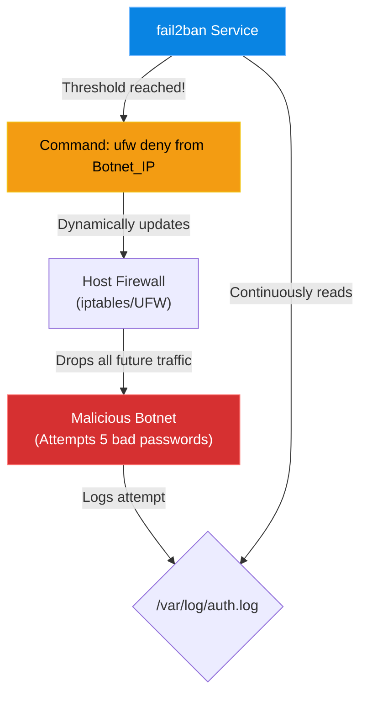

# Chapter 13 — Intrusion Prevention (fail2ban)

## Learning Objectives

By the end of this chapter, you will be able to:
* Explain the difference between a static firewall and an active Intrusion Prevention System (IPS).
* Understand how `fail2ban` parses log files to identify malicious behavior.
* Configure `fail2ban` jails for services like SSH.
* Use the `fail2ban-client` to unban an IP address after a false positive lockout.

> [!NOTE]
> **The Enterprise Mindset: Intrusion Prevention (fail2ban)**
>
> Mastering Intrusion Prevention (fail2ban) is critical for stability and accountability. We will explore how to handle Intrusion Prevention (fail2ban) to ensure continuous uptime.

## Visual Architecture: The Dynamic Defense

If you open Port 22 (SSH) in your firewall, anyone in the world can attempt to log in. A firewall is a dumb door; it doesn't care if the same IP address tries to guess your password 10,000 times a second. 
`fail2ban` acts as a security guard standing behind the door. If it sees someone acting suspiciously, it runs over to the firewall and dynamically writes a new rule to block them.

## Theory & Concepts

### 1. The Background Noise of the Internet
The moment you connect a Linux server to the internet, automated botnets will find it. Within 5 minutes, they will begin attempting to SSH into your server using common usernames (`root`, `admin`, `ubuntu`) and common passwords. Check your `/var/log/auth.log` file—it is likely filled with thousands of failed login attempts right now.

### 2. How fail2ban Works
`fail2ban` is a background daemon that reads log files. You configure "Jails" (rules) for specific services. 
For example, you can create an SSH Jail that says: "Watch `/var/log/auth.log`. If you see the same IP address generate 5 'authentication failure' messages within 10 minutes, ban that IP address for 1 hour."

### 3. The `fail2ban-client`
Because `fail2ban` works by dynamically modifying the underlying `iptables` firewall, you should not edit the firewall manually to fix a ban. You must ask `fail2ban` to do it using its client tool.
To see which IPs are currently banned from SSH:
`fail2ban-client status sshd`

## Real-World Support Ticket

> [!IMPORTANT] ServiceNow Ticket: INC-2026213
> **Title:** Massive Brute Force Attack
> **Assigned To:** Charlie (L2 Support Engineer)
> **Status:** IN PROGRESS
> 
> **1) Ticket intake & triage**
> Charlie gets a P1 Security Alert: Excessive failed SSH logins detected from multiple foreign IPs.
> 
> **2) Discovery & diagnosis**
> Charlie checks `/var/log/auth.log` and sees thousands of `Failed password for root` entries. The server is wasting CPU cycles processing the attempts.
> 
> **3) Immediate containment**
> Charlie immediately stops the SSH service on the public interface, restricting it to the internal management VPN.
> 
> **4) Resolution planning & execution**
> Charlie installs and configures `fail2ban`. He configures the `sshd` jail to ban IPs after 3 failed attempts.
> 
> **5) Verification**
> Charlie restarts SSH on the public interface and tails the fail2ban log. He watches fail2ban dynamically add iptables rules to drop the attacking IPs.
> 
> **6) Closure & documentation**
> Charlie documents the implementation of fail2ban and the drop in CPU usage.
> 
> **7) Post-resolution follow-up**
> Charlie schedules a project to disable password authentication entirely and switch to SSH Keys only.
> 
> **8) Escalation rules**
> If the attack was a massive DDoS saturating the network pipe, Charlie would have escalated to the ISP or Cloud Provider for upstream mitigation.

## Hands-on Lab

> [!TIP]
> **Practice Assignment Available**
> Proceed to the [Chapter 13 Practice Guide](../practice-files/V2-C13-practice.md) to inspect the `/var/log/auth.log` file and witness the background noise of the internet for yourself.

## Interview Questions

### Question 1: What is the difference between a standard firewall (like UFW) and an Intrusion Prevention System (like fail2ban)?
* **Target Answer**: "A standard firewall is static; it either allows traffic on a specific port or it denies it. If you allow SSH on port 22, the firewall allows anyone to attempt a login. An IPS like `fail2ban` is dynamic. It actively monitors log files for malicious behavior (like repeated failed logins), and if a threshold is crossed, it dynamically updates the firewall to drop traffic from the attacking IP address."

### Question 2: You configured `fail2ban` to protect SSH. An employee accidentally locked themselves out by typing the wrong password too many times. How do you restore their access?
* **Target Answer**: "Because `fail2ban` dynamically manages the underlying firewall rules, I should not manually edit the firewall to fix this. Instead, I would use the built-in management tool and run `fail2ban-client set sshd unbanip <EMPLOYEE_IP>` to gracefully remove the ban."

### Question 3: How does `fail2ban` know that an attack is occurring?
* **Target Answer**: "`fail2ban` relies on regular expressions (regex) to parse application log files in real-time. For example, it reads `/var/log/auth.log` (or `/var/log/secure` on RHEL) looking for specific text strings that indicate a failed password attempt. Once it counts enough matches from a single source IP, it triggers the ban."

## Common Mistakes & Pro-Tips

> [!WARNING] Common Mistake
> Whitelisting `0.0.0.0/0` by accident or failing to whitelist the corporate office IP, resulting in mass lockouts.

> [!CAUTION] Think Before You Type
> `fail2ban-client set sshd banip ...` (Did you just ban the CEO?)

## Chapter Summary

If a server is on the internet, it is being attacked. `fail2ban` gives your server the ability to fight back automatically, dropping malicious IPs before they can consume your server's resources. Just remember to be careful with your own passwords, or you might find yourself fighting your own security system!

## Completion Checklist

- [ ] I understand how `fail2ban` parses log files to trigger bans.
- [ ] I can list the command to unban an IP (`fail2ban-client set <jail> unbanip <IP>`).
- [ ] I know why I shouldn't manually edit the firewall to remove a `fail2ban` rule.

---

---

**Chapter Transition**
> Even with the perimeter secured, what happens if an attacker compromises a web application? We need Mandatory Access Control.

---

## Navigation

← Previous: [Chapter 12 — SSH Hardening](V2-C12-ssh-hardening.md)

↑ Volume Contents: [Table of Contents](TOC.md)

→ Next: [Chapter 14 — Mandatory Access Control (SELinux & AppArmor)](V2-C14-mandatory-access-control.md)
