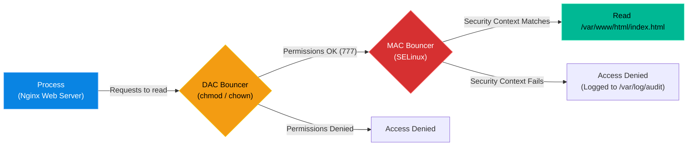

# Chapter 14 — Mandatory Access Control (SELinux & AppArmor)

## Learning Objectives

By the end of this chapter, you will be able to:
* Differentiate between Discretionary Access Control (DAC) and Mandatory Access Control (MAC).
* Understand the concept of SELinux Security Contexts.
* Toggle SELinux between Enforcing and Permissive modes.
* Troubleshoot "Hidden Denials" where SELinux blocks access despite `chmod 777` permissions.

> [!NOTE]
> **The Enterprise Mindset: Mandatory Access Control (SELinux & AppArmor)**
>
> Mastering Mandatory Access Control (SELinux & AppArmor) is critical for stability and accountability. We will explore how to handle Mandatory Access Control (SELinux & AppArmor) to ensure continuous uptime.

## Visual Architecture: The Two Bouncers

Every time a process tries to open a file in Linux, it must pass two bouncers. 
The first bouncer is DAC (`chmod`). He checks if the file owner matches the process owner. 
The second bouncer is MAC (SELinux or AppArmor). He doesn't care about the owner. He checks the *policy rules*. If the policy says "Web servers are never allowed to read passwords," MAC will block the web server, even if the web server legally owns the password file!

## Theory & Concepts

### 1. DAC vs. MAC
* **DAC (Discretionary Access Control):** You learned this in Volume 1. Users use `chmod` and `chown` to set permissions. The problem? If a hacker compromises the `root` user, `root` has the *discretion* to bypass all `chmod` rules.
* **MAC (Mandatory Access Control):** A higher authority. Administrators write strict, mandatory rules that dictate what a process is allowed to do. Even if a hacker compromises `root`, MAC will still block `root` from violating the policy. 

### 2. The Two Implementations
* **SELinux (Security-Enhanced Linux):** Developed by the NSA. Standard on RHEL, CentOS, and Fedora. It uses label-based "Security Contexts".
* **AppArmor:** Standard on Ubuntu and Debian. It uses path-based rules. It is generally considered easier to use than SELinux, but slightly less granular.

### 3. SELinux Modes
SELinux has three modes of operation, viewed by typing `sestatus`:
1. **Enforcing:** Active. It blocks violations and logs them.
2. **Permissive:** Passive. It *allows* violations but logs them (used for troubleshooting).
3. **Disabled:** Turned off entirely (not recommended).
You can temporarily switch to Permissive mode by typing `setenforce 0`.

## Hands-on Lab

> [!TIP]
> **Practice Assignment Available**
> Proceed to the [Chapter 14 Practice Guide](../practice-files/V2-C14-practice.md) to inspect the hidden Security Context labels attached to your files using the `-Z` flag.

## Interview Questions

### Question 1: You have verified that a file has `777` permissions, but a service still receives a "Permission Denied" error when trying to read it. What is the most likely cause?
* **Target Answer**: "The most likely cause is a Mandatory Access Control system like SELinux or AppArmor. Standard `777` permissions only satisfy Discretionary Access Control (DAC). If the SELinux security context of the file does not match the policy rules for the service attempting to read it, SELinux will block the read operation, creating a 'hidden deny'."

### Question 2: How can you quickly determine if SELinux is the cause of a broken application without permanently changing the server configuration?
* **Target Answer**: "I would run the `setenforce 0` command to temporarily place SELinux into 'Permissive' mode. In Permissive mode, SELinux allows all actions but continues to log policy violations. If the application suddenly starts working, I have proven SELinux is the culprit. I would then run `setenforce 1` to restore protection and begin fixing the file contexts."

### Question 3: What command do you use to view the SELinux security contexts (labels) attached to files in a directory?
* **Target Answer**: "You append the uppercase `-Z` flag to standard commands. For example, `ls -lZ` will display the standard file permissions alongside the SELinux user, role, and type context labels."

## Common Mistakes & Pro-Tips

> [!WARNING] Common Mistake
> Blindly running `setenforce 0` to 'fix' a permission issue instead of checking the audit logs.

> [!CAUTION] Think Before You Type
> `restorecon -R /var/www/` (Will this overwrite custom contexts you manually set?)

## Chapter Summary

SELinux and AppArmor are incredibly powerful security tools that stop hackers from doing damage even if they manage to steal the `root` password. Never disable them permanently to "fix" a broken application. Use `setenforce 0` to test, read the audit logs, and fix the file contexts using `chcon` or `restorecon`.

## Completion Checklist

- [ ] I understand the difference between DAC (`chmod`) and MAC (SELinux).
- [ ] I can explain Enforcing vs. Permissive modes.
- [ ] I know how to check if SELinux is running (`sestatus`).

---

---

**Chapter Transition**
> With SELinux enforcing policies, how do we track exactly what users and processes are doing? We must audit the system.

---

## Navigation

← Previous: [Chapter 13 — Intrusion Prevention (fail2ban)](V2-C13-intrusion-prevention.md)

↑ Volume Contents: [Table of Contents](TOC.md)

→ Next: [Chapter 15 — Security Auditing & Compliance](V2-C15-security-auditing.md)
