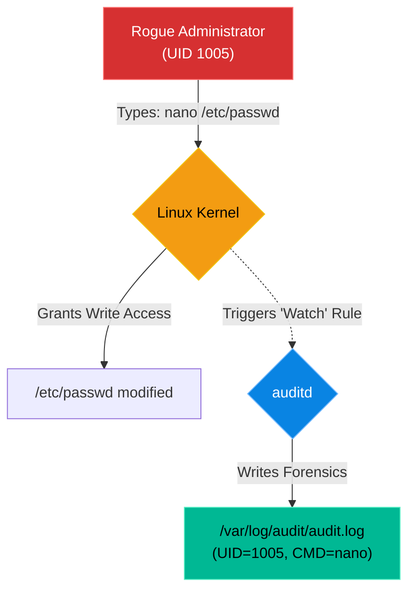

# Chapter 15 — Security Auditing & Compliance

## Learning Objectives

By the end of this chapter, you will be able to:
* Explain the purpose of CIS (Center for Internet Security) Benchmarks.
* Understand the role of `auditd` (The Linux Audit Daemon).
* Place a persistent watch on a critical file to monitor for unauthorized changes.
* Use `ausearch` to extract actionable forensics from the audit log.

> [!NOTE]
> **The Enterprise Mindset: Security Auditing & Compliance**
>
> Mastering Security Auditing & Compliance is critical for stability and accountability. We will explore how to handle Security Auditing & Compliance to ensure continuous uptime.

## Visual Architecture: The Security Camera

If `fail2ban` is the security guard at the door, `auditd` is the security camera inside the building. `auditd` plugs directly into the Linux Kernel. It watches every single system call (e.g., "Open File", "Execute Program"). If a system call matches a rule you defined, it records exactly who did it and when.

## Theory & Concepts

### 1. Compliance and CIS Benchmarks
When you work for a bank, a hospital, or the government, you cannot just say "My server is secure." You must prove it to an auditor. 
The industry standard for proving security is the **CIS Benchmarks** (Center for Internet Security). These are massive, 300-page checklists detailing exactly how every single setting on a Linux server should be configured to achieve compliance.

### 2. The Linux Audit Daemon (`auditd`)
One of the primary requirements of CIS compliance is having an active auditing system. `auditd` is the standard tool.
Unlike `syslog` (which relies on applications choosing to log messages), `auditd` operates at the Kernel level. Applications cannot hide from it. If a program touches the hard drive, `auditd` sees it.

### 3. Setting a Watch
You can tell `auditd` to place a tripwire on any file in the system using `auditctl`. 
For example, to place a watch (`-w`) on the password file, specifically monitoring for Writes or Attribute changes (`-p wa`), and label the log entry with a custom key (`-k passwd_changes`):
`auditctl -w /etc/passwd -p wa -k passwd_changes`

## Industry Incident Spotlight: The Equifax Data Breach

> [!CAUTION] **The Cost of Ignoring Audits and Updates**
> In 2017, Equifax suffered one of the largest data breaches in history, exposing the personal information of 147 million people.
>
> **The Timeline:**
> - Attackers exploited a known vulnerability in Apache Struts (CVE-2017-5638).
> - They maintained access to Equifax's network for 76 days, moving laterally and extracting data.
> - The breach was eventually discovered by suspicious network traffic, long after the initial intrusion.
>
> **The Root Cause:**
> The initial vector was an unpatched vulnerability. However, the *systemic* root cause was a failure in security auditing and monitoring. A certificate used to monitor encrypted traffic had expired months earlier, blinding their intrusion detection systems.
>
> **The Business Impact:**
> Billions of dollars in settlements, massive reputational damage, and the resignation of top executives.
>
> **The Lessons Learned:**
> 1. **Auditing is not optional.** You must know exactly what software is running in your environment and whether it is vulnerable.
> 2. If your monitoring tools silently fail (like an expired certificate), you are flying blind. Always audit the auditors.

## Hands-on Lab

> [!TIP]
> **Practice Assignment Available**
> Proceed to the [Chapter 15 Practice Guide](../practice-files/V2-C15-practice.md) to install `auditd` and set a tripwire on a test file!

## Interview Questions

### Question 1: What are the CIS Benchmarks, and why are they important to Linux System Administrators?
* **Target Answer**: "The Center for Internet Security (CIS) Benchmarks are globally recognized best practices for securing IT systems. For Linux administrators, they provide a strict, auditable checklist for server hardening. Adhering to CIS Benchmarks is often legally required for organizations dealing with financial data (PCI-DSS) or healthcare data (HIPAA)."

### Question 2: Why would you use `auditd` to monitor file changes instead of just checking a user's `.bash_history` file?
* **Target Answer**: "The `.bash_history` file is easily manipulated; a malicious user can simply clear the history or run commands with a leading space to avoid logging. `auditd` operates at the Kernel level. It records the exact system calls as they happen, making it impossible for a user-space application to hide its actions. `auditd` is a forensic tool, whereas `.bash_history` is just a user convenience."

### Question 3: Explain the command `auditctl -w /etc/shadow -p wa -k shadow_monitor`.
* **Target Answer**: "This command configures `auditd` to place a watch (`-w`) on the `/etc/shadow` file (which contains user password hashes). The `-p wa` flag tells the daemon to only trigger an alert if the file is Written to or its Attributes change (ignoring simple reads). The `-k shadow_monitor` flag attaches a custom search key to the log entry, making it easy to filter later using `ausearch -k shadow_monitor`."

## Common Mistakes & Pro-Tips

> [!WARNING] Common Mistake
> Logging everything blindly without configuring log rotation, eventually crashing the server when `/var/log` fills up.

> [!CAUTION] Think Before You Type
> `auditctl -D` (Did you just delete all active audit rules?)

## Chapter Summary

Compliance is not just paperwork; it is a mindset of total visibility. By utilizing `auditd`, you turn your Linux kernel into an unblinking security camera. When an outage occurs due to a rogue configuration change, you will never have to guess "Who did this?" again.

## Completion Checklist

- [ ] I understand the purpose of the CIS Benchmarks.
- [ ] I can write an `auditctl` command to place a watch on a file.
- [ ] I know how to use `ausearch` to retrieve records based on a custom key.

---

---

**Chapter Transition**
> Monitoring and auditing generate massive amounts of data and routine tasks. It's time to script our operations with Bash.

---

**Chapter Transition**
> Monitoring and auditing generate massive amounts of data and routine tasks. It's time to script our operations with Bash.

---

## Navigation

← Previous: [Chapter 14 — Mandatory Access Control (SELinux & AppArmor)](V2-C14-mandatory-access-control.md)

↑ Volume Contents: [Table of Contents](TOC.md)

→ Next: [Chapter 16 — Advanced Bash Scripting](V2-C16-advanced-bash-scripting.md)
