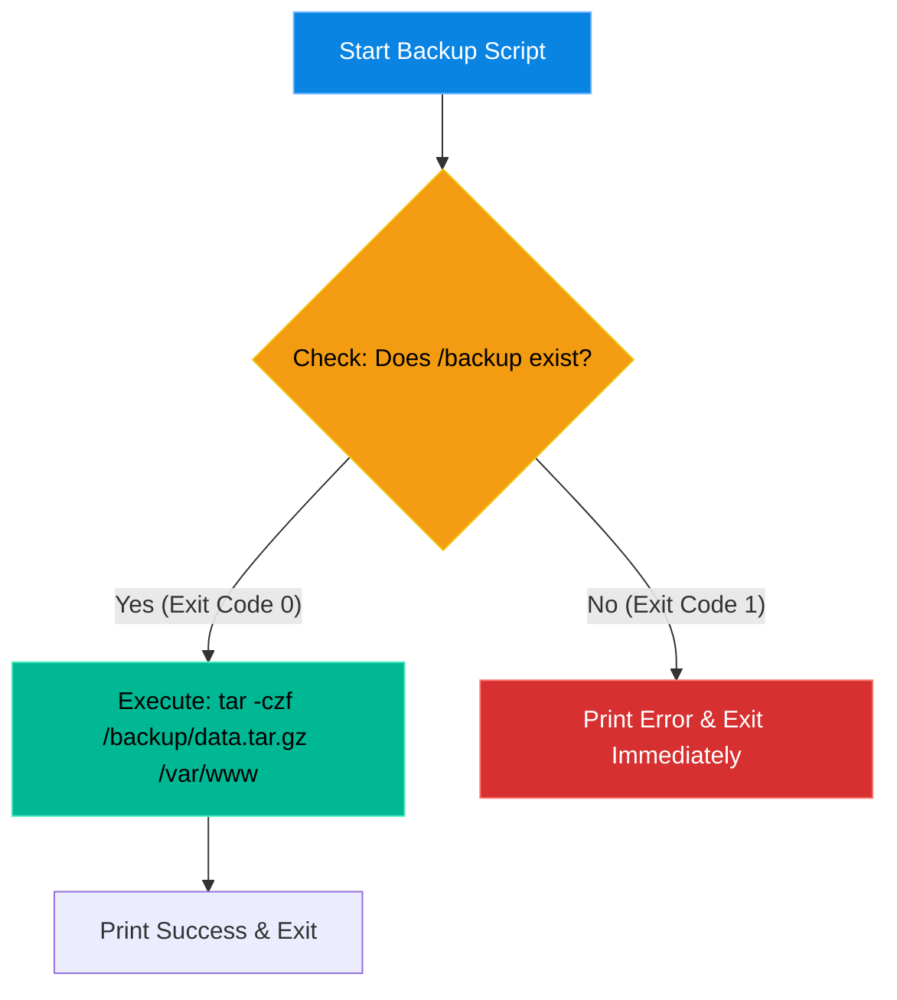

# Chapter 16 — Advanced Bash Scripting


## Learning Objectives

By the end of this chapter, you will be able to:
* Transition from writing one-line commands to writing multi-line Bash scripts.
* Use variables, `for` loops, and `if`/`else` conditionals.
* Understand the critical importance of Exit Codes (`$?`).
* Write robust scripts that "fail fast" using `set -e`.


> [!NOTE]
> **The Enterprise Mindset: Advanced Bash Scripting**
>
> Mastering Advanced Bash Scripting is critical for stability and accountability. We will explore how to handle Advanced Bash Scripting to ensure continuous uptime.

## Visual Architecture: The Script Logic

A script is just a text file containing a list of commands you would normally type by hand. However, unlike a human, a basic script will mindlessly continue executing line 2 even if line 1 fails. We must build logic into the script so it can make decisions.



## Theory & Concepts

### 1. The Shebang (`#!`)
Every Bash script must start with the following line: `#!/bin/bash`. This is called the "Shebang." It tells the Linux Kernel exactly which interpreter to use when reading the file. 
You must also give the file executable permissions before it will run: `chmod +x script.sh`.

### 2. Variables and Conditionals
Scripts become powerful when they can adapt to data.
* **Variables:** Store data for later use. `BACKUP_DIR="/var/backups"`
* **Conditionals:** Make decisions using `if` and `else`. 
  ```bash
  if [ -d "$BACKUP_DIR" ]; then
      echo "Directory exists."
  else
      echo "Directory missing!"
  fi
  ```

### 3. Exit Codes (`$?`)
Every time a command finishes, it leaves behind an invisible numeric grade called an Exit Code. 
* **0** means "Success."
* **1 to 255** means "Failure" (the exact number depends on the error).
You can view the grade of the very last command you ran by typing: `echo $?`

## Real-World Support Ticket

> [!IMPORTANT] ServiceNow Ticket: INC-2026216
> **Title:** Runaway Automation Script
> **Assigned To:** Charlie (L2 Support Engineer)
> **Status:** IN PROGRESS
> 
> **1) Ticket intake & triage**
> Charlie takes a P2 ticket: The nightly backup script has consumed all CPU and memory, crashing the server.
> 
> **2) Discovery & diagnosis**
> Charlie checks the script and finds a `while` loop that doesn't increment its counter. It's an infinite loop spawning child processes.
> 
> **3) Immediate containment**
> Charlie runs `killall -9 backup.sh` to forcefully terminate the runaway processes and stabilize the server.
> 
> **4) Resolution planning & execution**
> Charlie edits the Bash script, fixes the logic error in the loop, and adds `set -e` so the script exits immediately if any command fails.
> 
> **5) Verification**
> Charlie manually triggers the script with a small test dataset and verifies it completes successfully and exits.
> 
> **6) Closure & documentation**
> Charlie notes the logic error and the addition of `set -e` in the resolution summary.
> 
> **7) Post-resolution follow-up**
> Charlie institutes a peer-review policy for all Bash scripts deployed to production.
> 
> **8) Escalation rules**
> If the script had corrupted production data before crashing, Charlie would escalate to the Database team for a point-in-time restore.


## Hands-on Lab

> [!TIP]
> **Practice Assignment Available**
> Proceed to the [Chapter 16 Practice Guide](../practice-files/V2-C16-practice.md) to write your very first `for` loop script!

## Interview Questions

### Question 1: What is the purpose of the `#!/bin/bash` line at the top of a script?
* **Target Answer**: "This is called the Shebang. It explicitly tells the Linux Kernel which interpreter program to use to execute the subsequent lines in the file. Without it, the system might default to a different shell (like `sh` or `zsh`), which might not support advanced Bash features, leading to syntax errors."

### Question 2: What is an Exit Code, and how can you check it in a script?
* **Target Answer**: "An Exit Code is a numeric value returned by a command when it finishes executing. A value of `0` indicates success, while any non-zero value indicates a failure. Inside a script, you can capture the exit code of the most recently executed command using the special variable `$?` and use an `if` statement to decide what the script should do next."

### Question 3: What does the `set -e` command do at the top of a Bash script?
* **Target Answer**: "`set -e` instructs the Bash interpreter to exit immediately if any command returns a non-zero exit code. This prevents 'silent failures' where a script mindlessly continues executing subsequent commands even after a critical preceding command has failed."

## Common Mistakes & Pro-Tips

> [!WARNING] Common Mistake
> Using variables without quotes (e.g., `rm -rf $DIR/`), which deletes the root directory if `$DIR` is empty!

> [!CAUTION] Think Before You Type
> `for i in $(ls); do` (What happens if a filename contains a space?)

## Chapter Summary

Writing scripts is easy. Writing *robust* scripts is hard. Always assume your commands will fail. Check your directories before writing to them, check your exit codes, and when in doubt, use `set -e` to ensure your scripts fail loudly rather than silently.

## Completion Checklist

- [ ] I understand the purpose of the Shebang (`#!/bin/bash`).
- [ ] I can explain what a `0` Exit Code means.
- [ ] I know how `set -e` prevents silent failures.

---

---

**Chapter Transition**
> Scripts are powerful, but they shouldn't require manual execution. We need the server to run them on a schedule.

---


## Navigation

← Previous: [Chapter 15 — Security Auditing & Compliance](V2-C15-security-auditing.md)

↑ Volume Contents: [Table of Contents](TOC.md)

→ Next: [Chapter 17 — Cron & Task Scheduling](V2-C17-cron-and-task-scheduling.md)
