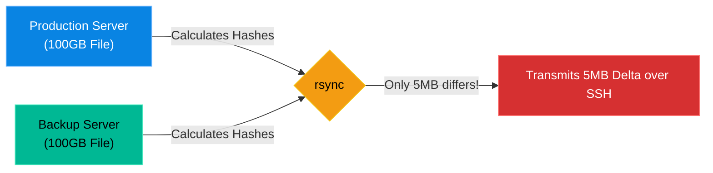

# Chapter 18 — System Backup & Restoration (rsync)

## Learning Objectives

By the end of this chapter, you will be able to:
* Explain the 3-2-1 Backup Rule.
* Understand why `rsync` is vastly superior to `cp` or `tar` for network backups.
* Execute an `rsync` command over SSH to push or pull data.
* Recover deleted files from a remote backup server.

> [!NOTE]
> **The Enterprise Mindset: System Backup & Restoration (rsync)**
>
> Mastering System Backup & Restoration (rsync) is critical for stability and accountability. We will explore how to handle System Backup & Restoration (rsync) to ensure continuous uptime.

## Visual Architecture: The Delta Transfer

If you have a 100GB database file and you change a single 5MB table, the `cp` command will copy the entire 100GB file again. This is impossible to scale. 
`rsync` is brilliant. It compares the cryptographic hashes of the files on both servers, calculates exactly which blocks changed (the "delta"), and only transmits those modified blocks over the network.

## Theory & Concepts

### 1. The 3-2-1 Rule
Every Support Engineer must memorize the golden rule of backups:
* **3** Copies of your data.
* **2** Different physical media (e.g., SSD and Tape, or AWS and Azure).
* **1** Copy stored completely offsite.
If you do not follow this rule, you do not actually have a backup; you just have an illusion of safety.

### 2. The `rsync` Command
`rsync` is the industry standard for synchronizing files between servers. 
The standard flags are `-avz`:
* `-a` (Archive): Preserves all permissions, owners, and symlinks.
* `-v` (Verbose): Prints what it is doing to the screen.
* `-z` (Compress): Compresses the data during network transit.

**To push data to a backup server:**
`rsync -avz /var/www/html/ backupuser@10.0.0.50:/backups/website/`

**To pull data from a backup server:**
`rsync -avz backupuser@10.0.0.50:/backups/website/ /var/www/html/`

## Hands-on Lab

> [!TIP]
> **Practice Assignment Available**
> Proceed to the [Chapter 18 Practice Guide](../practice-files/V2-C18-practice.md) to practice synchronizing a local directory and witnessing the magic of Delta transfers!

## Interview Questions

### Question 1: What makes `rsync` fundamentally better than `scp` or `cp` for daily automated backups?
* **Target Answer**: "`scp` and `cp` are dumb copying tools; they will copy the entire file every single time they are run. `rsync` uses a delta-transfer algorithm. It compares the source and destination, and only transmits the specific blocks of data that have changed. This reduces network bandwidth and backup time from hours to seconds."

### Question 2: Explain the 3-2-1 Backup Rule.
* **Target Answer**: "The 3-2-1 rule states that you must maintain 3 copies of your data, stored on 2 different types of storage media, with at least 1 copy located physically offsite (like a separate cloud provider or geographical region) to protect against site-wide disasters."

### Question 3: In the command `rsync -avz`, what does the `-a` flag do, and why is it critical for Linux system backups?
* **Target Answer**: "The `-a` flag stands for 'Archive' mode. It is actually a combination of several flags that tell `rsync` to recursively copy directories while strictly preserving all symlinks, file permissions, ownership (UID/GID), and modification times. This is critical for system backups because restoring an application with incorrect file permissions will usually cause the application to crash."

## Common Mistakes & Pro-Tips

> [!WARNING] Common Mistake
> Running `rsync` without the trailing slash on the source directory, accidentally nesting directories.

> [!CAUTION] Think Before You Type
> `rsync --delete` (Are you absolutely sure you have the source and destination in the correct order?)

## Chapter Summary

Accidents happen. Hard drives fail. Hackers deploy ransomware. The only thing standing between a company and total bankruptcy is a tested, reliable backup strategy. Master `rsync`, schedule it in `cron`, and sleep soundly knowing your data is safe.

## Completion Checklist

- [ ] I can recite the 3-2-1 Backup Rule.
- [ ] I understand how the `rsync` Delta algorithm saves bandwidth.
- [ ] I can write an `rsync` command to push data to a remote server.

---

---

**Chapter Transition**
> You have backups, but what do you do when a real disaster strikes? You need a forensic incident response methodology.

---

## Navigation

← Previous: [Chapter 17 — Cron & Task Scheduling](V2-C17-cron-and-task-scheduling.md)

↑ Volume Contents: [Table of Contents](TOC.md)

→ Next: [Chapter 19 — Incident Response Methodology](V2-C19-incident-response.md)
