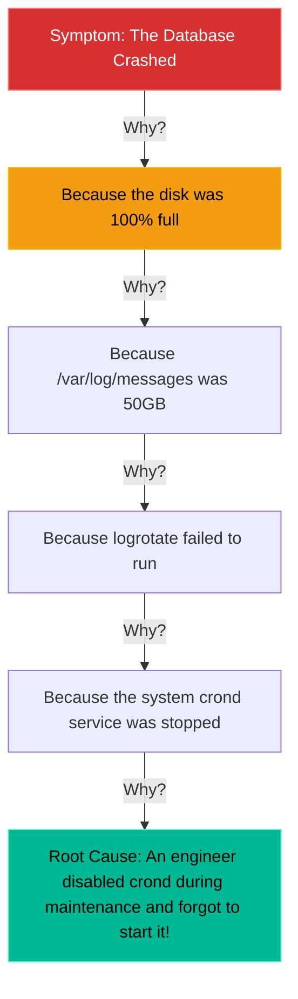

# Chapter 19 — Incident Response Methodology

## Learning Objectives

By the end of this chapter, you will be able to:
* Apply the OODA Loop (Observe, Orient, Decide, Act) to high-pressure outages.
* Understand the concept of a Cascading Failure.
* Use the "5 Whys" framework to discover the true Root Cause of an incident.
* Write a basic Root Cause Analysis (RCA) document.

> [!NOTE]
> **The Enterprise Mindset: Incident Response Methodology**
>
> Mastering Incident Response Methodology is critical for stability and accountability. We will explore how to handle Incident Response Methodology to ensure continuous uptime.

## Visual Architecture: The 5 Whys

Junior engineers fix the symptom. Senior engineers fix the disease. If you stop troubleshooting at the first "Why?", the server will just crash again next week.

## Theory & Concepts

### 1. The OODA Loop
Created by military fighter pilots, the OODA loop is the premier framework for handling high-pressure server outages.
* **Observe:** What are the symptoms? (e.g., "The website is throwing a 502 Bad Gateway").
* **Orient:** Gather data. Look at the logs (`/var/log/nginx/error.log`). Check the disk space (`df -h`). Check memory (`free -m`).
* **Decide:** Formulate a hypothesis. ("I believe Nginx is failing because the backend application service is stopped.")
* **Act:** Test the hypothesis. (`systemctl start backend-app`). If it fails, start the loop over again.

### 2. Cascading Failures
In complex systems, the thing that broke is rarely the thing that caused the outage. A **Cascading Failure** is a chain reaction. For example: A single hard drive slows down -> The database queries take longer -> The application server runs out of worker threads waiting for the database -> The load balancer assumes the app server is dead -> The entire website goes offline.

### 3. The Root Cause Analysis (RCA)
Once the fire is put out, a Senior Engineer must write an RCA. The goal of an RCA is *never* to punish an employee. The goal is to identify the systemic failure and permanently fix it. 
To find the Root Cause, you ask "Why?" until you reach a human process or configuration error that can be changed.

## Real-World Support Ticket

> [!IMPORTANT] ServiceNow Ticket: INC-2026219
> **Title:** Ransomware Detected
> **Assigned To:** Charlie (L2 Support Engineer)
> **Status:** IN PROGRESS
> 
> **1) Ticket intake & triage**
> Charlie receives a P1 Critical alert: Antivirus has flagged a known ransomware binary executing in `/tmp/`.
> 
> **2) Discovery & diagnosis**
> Charlie logs in and immediately checks active network connections using `ss -antp`. He sees the binary attempting to connect to an external Command & Control server.
> 
> **3) Immediate containment**
> Charlie does NOT reboot the server. Instead, he isolates it by disabling its network interfaces (`ip link set eth0 down`), preventing the ransomware from spreading or encrypting network shares.
> 
> **4) Resolution planning & execution**
> Charlie captures a memory dump for the Security team. Since the system is compromised, he powers it down and deploys a fresh VM from a known-good template.
> 
> **5) Verification**
> Charlie mounts the backups to the new VM and verifies data integrity before allowing it back onto the network.
> 
> **6) Closure & documentation**
> Charlie attaches the incident timeline and forensic evidence to the Security Incident ticket.
> 
> **7) Post-resolution follow-up**
> Charlie updates the Incident Response playbook to explicitly forbid rebooting compromised servers.
> 
> **8) Escalation rules**
> Charlie immediately escalated to the Information Security Officer as soon as malware was confirmed.

## Hands-on Lab

> [!TIP]
> **Practice Assignment Available**
> Proceed to the [Chapter 19 Practice Guide](../practice-files/V2-C19-practice.md) to practice writing your own Root Cause Analysis!

## Interview Questions

### Question 1: During a massive production outage, you try restarting a service, but it fails again. You don't know what to do next. How does the OODA loop apply here?
* **Target Answer**: "The OODA loop dictates that I must immediately return to the 'Observe' and 'Orient' phases. I should not blindly guess and type random commands. I need to look at the error logs generated by the failed restart, check system resources (`top`, `df -h`), and formulate a new, data-driven hypothesis before deciding on my next action."

### Question 2: What is the primary purpose of writing a Root Cause Analysis (RCA) document after an incident is resolved?
* **Target Answer**: "The primary purpose of an RCA is to identify the underlying systemic or configuration failure that led to the outage, and to implement a permanent preventative fix so the exact same outage can never happen again. It is explicitly a 'blameless' document; the focus is on improving the system architecture, not punishing individuals."

### Question 3: Explain the concept of the '5 Whys'.
* **Target Answer**: "The '5 Whys' is an investigative technique used during an RCA. When an incident occurs, you ask 'Why did this happen?' Once you find the answer, you ask 'Why?' to that answer, peeling back the layers of a cascading failure. You repeat this until you arrive at the fundamental root cause—which is usually a missing process, a lack of automation, or a misconfiguration."

## Common Mistakes & Pro-Tips

> [!WARNING] Common Mistake
> Rebooting a compromised server immediately, which destroys all volatile memory (RAM) evidence needed for forensics.

> [!CAUTION] Think Before You Type
> `reboot` (Have you captured memory dumps and network connections first?)

## Chapter Summary

The difference between a Junior and a Senior Administrator is how they handle the aftermath of an outage. Juniors fix the symptoms and move on. Seniors write RCAs, implement automated fixes, and ensure they never have to wake up at 3:00 AM for that specific issue ever again.

## Completion Checklist

- [ ] I understand the four steps of the OODA Loop.
- [ ] I can explain what a Cascading Failure is.
- [ ] I understand the purpose of a blameless Root Cause Analysis.

---

---

**Chapter Transition**
> Incidents are resolved, but how do we handle massive traffic spikes without going down again? We need an advanced web server.

---

**Chapter Transition**
> Incidents are resolved, but how do we handle massive traffic spikes without going down again? We need an advanced web server.

---

## Navigation

← Previous: [Chapter 18 — System Backup & Restoration (rsync)](V2-C18-system-backup.md)

↑ Volume Contents: [Table of Contents](TOC.md)

→ Next: [Chapter 20 — Advanced Web Servers (NGINX)](V2-C20-advanced-nginx.md)
