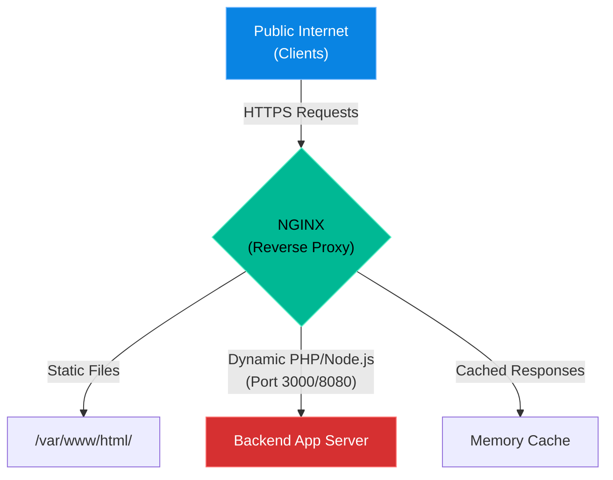

# Chapter 20 — Advanced Web Servers (NGINX)

## Learning Objectives

By the end of this chapter, you will be able to:
* Configure NGINX as a Reverse Proxy.
* Implement Micro-caching to survive traffic spikes.
* Configure SSL/TLS certificates for secure HTTPS termination.
* Troubleshoot `502 Bad Gateway` and `504 Gateway Timeout` errors.

> [!NOTE]
> **The Enterprise Mindset: Beyond the Basics**
>
> In Volume 1, you learned how to install a web server and serve static HTML. In the enterprise, NGINX is rarely used just to serve static files. It acts as a Reverse Proxy, a Load Balancer, and a high-performance Cache layer protecting fragile backend applications.

## Visual Architecture: The Reverse Proxy

## Theory & Concepts

### 1. The Reverse Proxy
A Reverse Proxy sits in front of your application servers. When a user requests a dynamic page, NGINX accepts the request, forwards it to an internal backend server (like a Python or Node.js app running on port 8080), waits for the response, and then sends it back to the user. This shields the backend from direct internet exposure.

### 2. FastCGI and Micro-Caching
Backend applications are slow because they query databases. If a news website gets a traffic spike, the database will crash. NGINX can "micro-cache" the backend's response for just 5 seconds. If 10,000 users request the page in those 5 seconds, NGINX only queries the backend once, and serves the cached copy to the other 9,999 users.

## Industry Incident Spotlight: The Fastly Outage

> [!CAUTION] **When a Configuration Change Takes Down the Internet**
> In June 2021, the Fastly CDN experienced a global outage that brought down major websites including Reddit, Amazon, Twitch, and the New York Times.
>
> **The Timeline:**
> - A single customer updated their CDN configuration with a valid, but edge-case setting.
> - This specific setting triggered a hidden bug in Fastly's VCL (Varnish Configuration Language) compiler.
> - 85% of Fastly's network immediately returned 503 errors.
>
> **The Root Cause:**
> A latent software bug was triggered by a valid customer configuration change, causing the edge proxy servers to crash globally. 
>
> **The Business Impact:**
> A massive chunk of the global internet was inaccessible for approximately 49 minutes, resulting in millions of dollars in lost e-commerce revenue and significant disruption.
>
> **The Lessons Learned:**
> 1. **Reverse proxies are single points of failure.** A bug in the caching layer can bring down the entire infrastructure behind it.
> 2. Configuration rollouts must be staggered. Deploying a change globally in seconds means breaking things globally in seconds.

## Hands-on Lab

> [!TIP]
> **Practice Assignment Available**
> Proceed to the [Chapter 20 Practice Guide](../practice-files/V2-C20-practice.md) to set up a local proxy pass.

## Interview Questions

### Question 1: What does a 502 Bad Gateway error mean in an NGINX environment?
* **Target Answer**: "A 502 Bad Gateway means NGINX is acting as a proxy, but the upstream backend server it is trying to forward the request to is offline, rejecting connections, or misconfigured. The issue is almost never NGINX itself, but the application behind it."

## Common Mistakes & Pro-Tips

> [!WARNING] Common Mistake
> Forgetting a trailing semicolon in the config, breaking the entire web cluster on reload.

> [!CAUTION] Think Before You Type
> `nginx -s reload` (Did you run `nginx -t` to test the syntax first?)

## Chapter Summary

NGINX is the shield of the enterprise. By utilizing proxying and caching, you can keep fragile backend applications online during massive traffic spikes.

## Completion Checklist
- [ ] I understand how a Reverse Proxy works.
- [ ] I can distinguish between a 502 and 504 HTTP status code.

---

---

**Chapter Transition**
> The web tier is scaled, but the application is only as fast as its database. We must master database replication.

---

## Navigation
← Previous: [Chapter 19 — Incident Response](V2-C19-incident-response.md)  
↑ Volume Contents: [Table of Contents](TOC.md)  
→ Next: [Chapter 21 — Database Administration Basics](V2-C21-database-replication.md)
