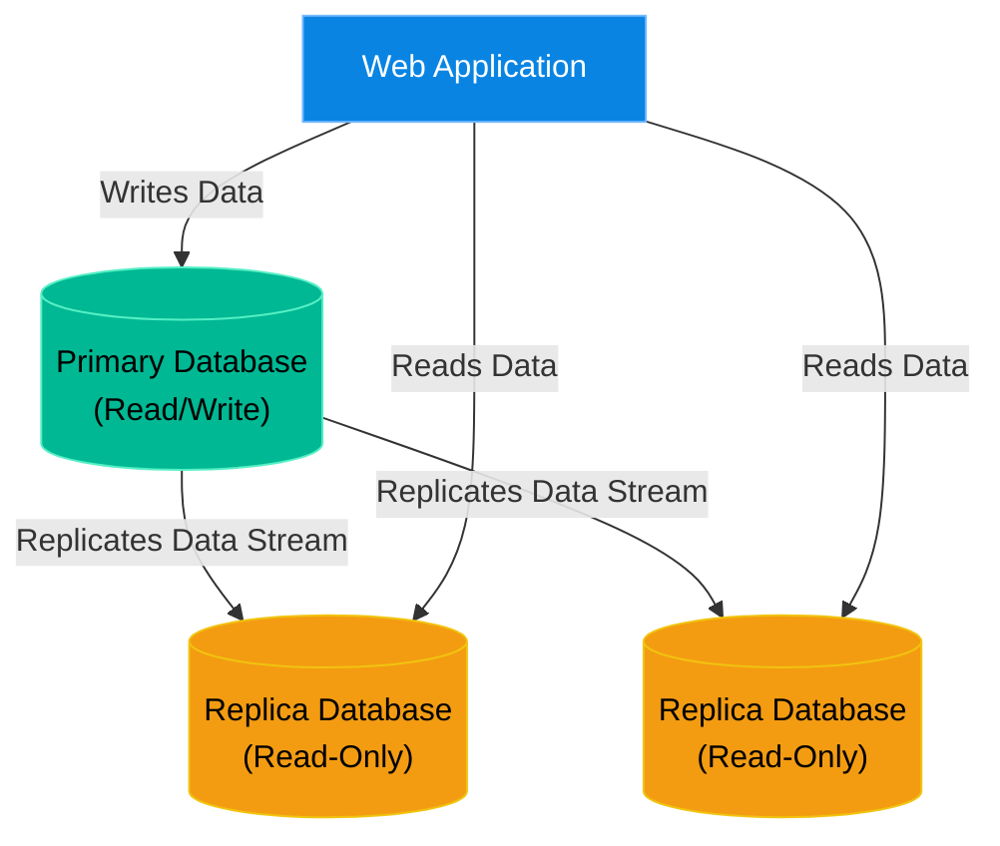

# Chapter 21 — Database Administration Basics (MySQL)

## Learning Objectives

By the end of this chapter, you will be able to:
* Understand the concept of Database Replication (Master/Slave).
* Safely dump and restore a database using `mysqldump`.
* Troubleshoot slow queries and replication lag.

> [!NOTE]
> **The Enterprise Mindset: The Source of Truth**
>
> In an enterprise environment, the database is the most critical asset. A web server can be destroyed and rebuilt in 5 minutes using automation. If a database is destroyed without a backup, the company goes bankrupt. Support Engineers must treat databases with extreme caution.

## Visual Architecture: Primary/Replica

## Hands-on Lab

> [!TIP]
> **Practice Assignment Available**
> Proceed to the [Chapter 21 Practice Guide](../practice-files/V2-C21-practice.md) to practice `mysqldump`.

## Interview Questions

### Question 1: Explain why Database Replication is not a substitute for Backups.
* **Target Answer**: "Database Replication provides High Availability and Read scaling. It does not provide point-in-time recovery. If an administrator accidentally drops a table on the Primary, that `DROP TABLE` command is instantly replicated to all Replicas, destroying the data everywhere. Backups are required for point-in-time recovery against human error."

## Common Mistakes & Pro-Tips

> [!WARNING] Common Mistake
> Backing up the database without locking tables or using transactions, resulting in corrupted backups.

> [!CAUTION] Think Before You Type
> `DROP DATABASE prod;` (Are you on the staging server or the production server?)

## Chapter Summary

Respect the database. It is the heart of the business. Understand replication to ensure uptime, but rely on offline backups (like `mysqldump`) for actual data security.

## Completion Checklist
- [ ] I understand Primary/Replica architecture.
- [ ] I know how to restore a database from a `.sql` file.

---

---

**Chapter Transition**
> Managing complex dependencies across servers is a nightmare. What if we could package the application and its environment together?

---

## Navigation
← Previous: [Chapter 20 — Advanced Web Servers (NGINX)](V2-C20-advanced-nginx.md)  
↑ Volume Contents: [Table of Contents](TOC.md)  
→ Next: [Chapter 22 — Introduction to Docker](V2-C22-introduction-to-docker.md)
