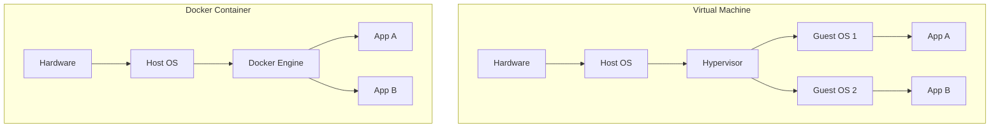

# Chapter 22 — Introduction to Docker

## Learning Objectives

By the end of this chapter, you will be able to:
* Explain the difference between a Virtual Machine and a Docker Container.
* Understand the concept of Container Images and Registries.
* Run a basic NGINX container.

> [!NOTE]
> **The Enterprise Mindset: The "Works on My Machine" Problem**
>
> For decades, Developers and Support Engineers fought over the phrase: "Well, the code works on my machine!" Docker solved this by packaging the code, the dependencies, and the operating system into a single, immutable container. If it works on the developer's laptop, it will work exactly the same way on the production server.

## Visual Architecture: VM vs. Container

## Theory & Concepts

### 1. Containers vs. Virtual Machines
A Virtual Machine (VM) runs a full, independent Operating System. It is heavy, slow to start, and consumes a massive amount of RAM. 
A Container shares the Host's kernel. It only packages the application and its dependencies. It starts in milliseconds and consumes minimal resources.

### 2. Images and Containers
* **Image:** A read-only template. Think of it as a recipe.
* **Container:** A running instance of an Image. Think of it as the cake baked from the recipe.
You pull Images from a Registry (like Docker Hub) and run them as Containers on your server.

## Real-World Support Ticket

> [!IMPORTANT] ServiceNow Ticket: INC-2026222
> **Title:** Application Dependency Hell
> **Assigned To:** Charlie (L2 Support Engineer)
> **Status:** IN PROGRESS
> 
> **1) Ticket intake & triage**
> Charlie takes a P3 ticket: Developers complain that the Node.js application runs on their laptops but crashes on the staging server.
> 
> **2) Discovery & diagnosis**
> Charlie checks the server and realizes it has Node.js v14 installed, but the developers are using features from v18.
> 
> **3) Immediate containment**
> Charlie holds off on upgrading the host server's Node.js, as other legacy applications depend on v14.
> 
> **4) Resolution planning & execution**
> Charlie writes a `Dockerfile` to package the application with its own isolated Node.js v18 environment.
> 
> **5) Verification**
> Charlie runs the container (`docker run ...`). The application launches successfully without affecting the host OS.
> 
> **6) Closure & documentation**
> Charlie provides the `Dockerfile` to the developers and closes the ticket.
> 
> **7) Post-resolution follow-up**
> Charlie begins migrating all legacy applications to Docker containers to eliminate future dependency conflicts.
> 
> **8) Escalation rules**
> If Docker was not approved for use in this environment, Charlie would have to escalate to Architecture to request a dedicated VM for the new app.

## Hands-on Lab

> [!TIP]
> **Practice Assignment Available**
> Proceed to the [Chapter 22 Practice Guide](../practice-files/V2-C22-practice.md) to pull and run your first Docker container.

## Interview Questions

### Question 1: What is the primary architectural difference between a Docker Container and a Virtual Machine?
* **Target Answer**: "A Virtual Machine requires a Hypervisor and runs a complete, independent Guest Operating System, making it resource-heavy. A Docker container does not have its own Guest OS; it shares the kernel of the Host Operating System, making it incredibly lightweight and fast to start."

## Common Mistakes & Pro-Tips

> [!WARNING] Common Mistake
> Treating a container like a VM and running SSH inside it, defeating the purpose of microservices.

> [!CAUTION] Think Before You Type
> `docker kill $(docker ps -q)` (Did you mean to kill *all* running containers?)

## Chapter Summary

Docker revolutionized the industry by creating a standardized unit of software. Understanding how to pull, run, and map ports to a container is a fundamental requirement for modern Support Engineers.

## Completion Checklist
- [ ] I can explain why containers are lighter than VMs.
- [ ] I understand the difference between an Image and a Container.

---

---

**Chapter Transition**
> Docker containers solve dependency issues, but how do you manage them in a production environment?

---

**Chapter Transition**
> Docker containers solve dependency issues, but how do you manage them in a production environment?

---

## Navigation
← Previous: [Chapter 21 — Database Administration Basics](V2-C21-database-replication.md)  
↑ Volume Contents: [Table of Contents](TOC.md)  
→ Next: [Chapter 23 — Docker Administration](V2-C23-docker-administration.md)
