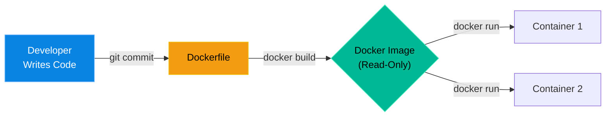

# Chapter 23 — Docker Administration

## Learning Objectives

By the end of this chapter, you will be able to:
* Write a basic `Dockerfile` to build custom images.
* Understand the concept of Docker Layers and Caching.
* Troubleshoot crashing containers by reading their internal logs.

> [!NOTE]
> **The Enterprise Mindset: Immutability**
>
> In traditional IT, administrators SSH into a server, install a package, edit a config file, and restart the service. In a Dockerized enterprise, you **never** SSH into a container to fix it. Containers are immutable. If something is broken, you update the `Dockerfile`, build a new image, destroy the old container, and deploy the new one.

## Visual Architecture: The Build Pipeline



## Theory & Concepts

### 1. The Dockerfile
A `Dockerfile` is a text file that contains all the commands a user could call on the command line to assemble an image.
Example:
```dockerfile
FROM ubuntu:latest
RUN apt-get update && apt-get install -y nginx
COPY ./website/ /var/www/html/
EXPOSE 80
CMD ["nginx", "-g", "daemon off;"]
```
When you run `docker build .`, Docker executes these instructions step-by-step and creates an immutable Image.

### 2. Layers and Caching
Every instruction in a `Dockerfile` (`RUN`, `COPY`, etc.) creates a "Layer". Docker caches these layers. If you change the code in the `COPY` step, Docker doesn't have to re-download Ubuntu or re-install NGINX; it just re-uses the cached layers from the previous steps. This makes builds incredibly fast.

## Hands-on Lab

> [!TIP]
> **Practice Assignment Available**
> Proceed to the [Chapter 23 Practice Guide](../practice-files/V2-C23-practice.md) to write a Dockerfile and troubleshoot an `Exited (1)` container.

## Interview Questions

### Question 1: A Docker container starts, but immediately exits with status `Exited (0)`. You check the logs and there are no errors. What is the most likely cause?
* **Target Answer**: "The container's primary process (defined by the `CMD` or `ENTRYPOINT`) likely spawned a background daemon and then immediately returned success (exit 0). Because the foreground process ended, Docker assumed the container's task was complete and shut it down. To fix this, the application must be configured to run in the foreground."

## Common Mistakes & Pro-Tips

> [!WARNING] Common Mistake
> Storing persistent data inside the container filesystem. When the container stops, the data is gone forever!

> [!CAUTION] Think Before You Type
> `docker system prune -a` (Are you ready to redownload all those images?)

## Chapter Summary

Containers are cattle, not pets. If a container acts up, you don't log in and perform surgery on it. You read its logs, fix its `Dockerfile`, and spawn a brand new container. This immutable architecture is the foundation of modern cloud engineering.

## Completion Checklist
- [ ] I understand how a `Dockerfile` defines an Image.
- [ ] I know how to check the logs of a dead container using `docker logs`.

---

---

**Chapter Transition**
> With containers, databases, and networks running together, failures become complex. We need a universal troubleshooting model.

---


## Navigation
← Previous: [Chapter 22 — Introduction to Docker](V2-C22-introduction-to-docker.md)  
↑ Volume Contents: [Table of Contents](TOC.md)  
→ Next: [Chapter 24 — Intermediate Troubleshooting Methodology](V2-C24-intermediate-troubleshooting.md)
