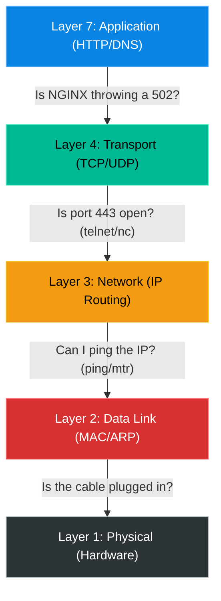

# Chapter 24 — Intermediate Troubleshooting (The OSI Model)

## Learning Objectives

By the end of this chapter, you will be able to:
* Use the OSI Model to systematically diagnose complex enterprise outages.
* Understand the difference between a Layer 3, Layer 4, and Layer 7 issue.
* Stop guessing and start proving failure points.

> [!NOTE]
> **The Enterprise Mindset: Systematic Deduction**
>
> When a major outage occurs, the worst thing an engineer can do is guess. "Maybe it's the firewall? Let's turn it off. Maybe it's DNS? Let's flush it." This is chaotic and dangerous. Senior Support Engineers use a framework—usually the OSI Model—to systematically prove exactly where the failure is occurring, starting from the bottom and working their way up.

## Visual Architecture: The Troubleshooting Ladder

## Theory & Concepts

### The Bottom-Up Approach
When a user says "The website is down", you should ask yourself a series of questions based on the OSI model.

**Layer 1 & 2 (Physical & Data Link)**
* *In the Cloud*: Is the VM actually powered on? Does the virtual Network Interface have an IP attached?
* *On-Prem*: Is the cable plugged in? Are the link lights on? 

**Layer 3 (Network)**
* *Tool*: `ping` or `mtr`. 
* *Question*: Can my computer reach the server's IP address? Is there a routing black hole?

**Layer 4 (Transport)**
* *Tool*: `nc` (netcat) or `telnet`.
* *Question*: The server is online, but is the specific port open? If I can ping the server, but `nc -zv server_ip 443` fails, then a Firewall is blocking Layer 4, or the web service has crashed and nothing is listening on port 443.

**Layer 7 (Application)**
* *Tool*: `curl` or browser.
* *Question*: The port is open, but what is the application saying? Is it returning a `200 OK` or a `502 Bad Gateway`? If it returns a 502, the network is perfect, but the application code is broken.

## Hands-on Lab

> [!TIP]
> **Practice Assignment Available**
> Proceed to the [Chapter 24 Practice Guide](../practice-files/V2-C24-practice.md) to practice the Bottom-Up troubleshooting methodology on a broken lab server.

## Interview Questions

### Question 1: A user reports they cannot access an internal web server. You run `ping 10.0.0.5` and receive a response. You run `curl http://10.0.0.5` and it hangs until it times out. Where in the OSI model is the issue occurring?
* **Target Answer**: "The `ping` response proves that Layer 3 (Network Routing) is functioning perfectly. The `curl` timeout indicates an issue at Layer 4 (Transport). Either a firewall is dropping packets destined for port 80, or the web service on the server has completely crashed and is not listening on that port."

## Common Mistakes & Pro-Tips

> [!WARNING] Common Mistake
> Assuming the application is broken when the DNS server is actually down. Always start at Layer 1!

> [!CAUTION] Think Before You Type
> `ping 8.8.8.8` (If this works but `ping google.com` fails, what is the real issue?)

## Chapter Summary

The OSI Model is not just academic theory; it is a practical checklist for solving emergencies. Start at the bottom. Prove the server is online (ping). Prove the port is open (netcat). Prove the application is responding (curl). Eliminate variables one by one until only the root cause remains.

## Completion Checklist
- [ ] I can map standard Linux tools (`ping`, `nc`, `curl`) to their respective OSI layers.
- [ ] I understand why a `500 Internal Server Error` proves the network is not the problem.

---

---

**Chapter Transition**
> You have the theory. You have the tools. Now, it's time for the ultimate test of your skills.

---

## Navigation
← Previous: [Chapter 23 — Docker Administration](V2-C23-docker-administration.md)  
↑ Volume Contents: [Table of Contents](TOC.md)  
→ Next: [Chapter 25 — Capstone Project](V2-C25-capstone-project.md)
