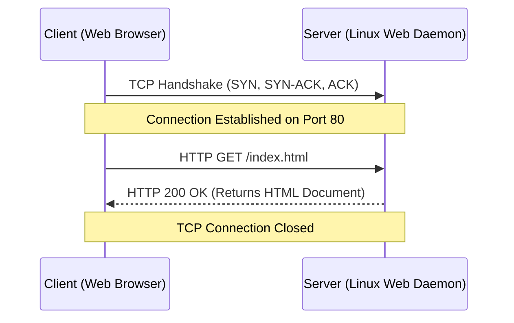

# Chapter 1 — Web Server Fundamentals

## Learning Objectives

By the end of this chapter, you will be able to:
* Explain the difference between a Client and a Server in the context of HTTP.
* Differentiate between TCP and UDP protocols.
* Identify the standard network ports used by web traffic (80 and 443).
* Troubleshoot "Port already in use" errors using the `ss` command.

## Visual Architecture: The Request Lifecycle

When you type `google.com` into your browser, it doesn't just magically appear. Your browser (the Client) constructs a text-based HTTP Request and sends it over the internet to a Linux Server running a Web Daemon. The Daemon reads the request, finds the correct HTML file on its hard drive, and sends it back as an HTTP Response.

## Theory & Concepts

### 1. TCP vs. UDP
Data travels across the internet using two primary transport protocols:
* **TCP (Transmission Control Protocol):** Guaranteed delivery. The server and client perform a "handshake" before sending data. If a packet is lost, it is re-transmitted. Web traffic (HTTP/HTTPS) strictly uses TCP because you cannot load half a webpage.
* **UDP (User Datagram Protocol):** Fire and forget. It is much faster than TCP but offers no guarantees. It is used for live video streaming or gaming, where a dropped packet just means a brief stutter, not a broken page.

### 2. Network Ports
An IP address gets your traffic to the correct server. But once it arrives at the server, how does the Linux Kernel know which application should receive the traffic? 
It uses **Ports**. A port is simply a numbered mailbox (from 1 to 65535).
* **Port 80:** Standard HTTP (Unencrypted Web Traffic).
* **Port 443:** Standard HTTPS (Encrypted Web Traffic).
* **Port 22:** SSH (Remote Administration).

A web server daemon (like Nginx or Apache) "binds" to Port 80 and listens for incoming messages.

### 3. The `ss` Command (Socket Statistics)
If a daemon binds to a port, *no other daemon can use that port*. 
To see which ports are currently in use on your server, you use the `ss` command (which replaced the older `netstat` command).
* `ss -tulpn`
  * `-t`: TCP ports
  * `-u`: UDP ports
  * `-l`: Listening ports (waiting for connections)
  * `-p`: Show the process (daemon) using the port
  * `-n`: Show numerical addresses instead of trying to resolve hostnames

## Scenario-Based Troubleshooting

### Scenario A: The Port Conflict
**The Incident:** An engineer is tasked with deploying a new, lightweight web server. They install the software and run `systemctl start myserver`. The command fails. They check `systemctl status myserver` and see a fatal error: `Address already in use: bind(0.0.0.0:80)`. 

**The Investigation & Fix:**

1. The Support Engineer knows exactly what this error means. Two programs are trying to share the same mailbox!
2. The engineer runs the command to find out who is squatting on Port 80:
   `sudo ss -tulpn | grep :80`
3. The output returns:
   `tcp  LISTEN  0  511  0.0.0.0:80  0.0.0.0:*  users:(("apache2",pid=415,fd=4))`
4. Ah-ha! The server already had `apache2` installed and running in the background. The new web server cannot start because Apache is already listening on Port 80.
5. The engineer runs `systemctl stop apache2` and `systemctl disable apache2`.
6. They start the new web server again, and it binds to Port 80 successfully.

> [!TIP]
> **Senior Engineer Note**
> When troubleshooting Web Server Fundamentals in production, never restart the service immediately. Restarts clear memory buffers, wipe temporary state, and destroy the exact evidence you need to find the root cause. Always capture logs (e.g., `journalctl` or container logs) *before* attempting a fix.

## Hands-on Lab

> [!TIP]
> **Practice Assignment Available**
> Proceed to the [Chapter 1 Practice Guide](../practice-files/V3-C01-practice.md) to inspect your own listening ports and use `curl` to fetch HTTP headers!

## Interview Questions

### Question 1: What is the difference between TCP and UDP? Why does HTTP use TCP?
* **Target Answer**: "TCP is a connection-oriented protocol that guarantees packet delivery through a three-way handshake and retransmissions. UDP is a connectionless protocol that sends data quickly without verifying delivery. HTTP uses TCP because web pages require all text, HTML, and script data to arrive intact and in order; a missing UDP packet could corrupt the entire webpage."

### Question 2: You try to start Nginx, but you receive an error stating `bind() to 0.0.0.0:80 failed (98: Address already in use)`. What does this mean, and how do you fix it?
* **Target Answer**: "This means another process is already listening on Port 80, which is the default port for HTTP traffic. Only one application can bind to a specific port at a time. To fix it, I would run `sudo ss -tulpn | grep :80` to identify the Process ID (PID) and name of the conflicting service. Once identified, I would either stop that service or reconfigure Nginx to listen on a different port."

### Question 3: What does the `curl -I` command do?
* **Target Answer**: "The `curl` command fetches data from a URL. The `-I` flag (or `--head`) tells `curl` to only fetch the HTTP Headers from the server, ignoring the actual HTML body content. This is incredibly useful for troubleshooting to see what server software the destination is running, or to check the HTTP status code (like 200 OK or 404 Not Found) without downloading massive amounts of page data."

## Common Mistakes & Pro-Tips

> [!WARNING] Common Mistake
> Ignoring HTTP status codes. A 200 OK doesn't mean the app works if the page is completely blank.

> [!CAUTION] Think Before You Type
> `curl -I example.com` (Are you checking the headers or just the body?)

## Chapter Summary

Web servers are not magic. They are simply Linux daemons (background processes) that bind to Port 80 or 443, accept TCP connections, read text-based HTTP requests, and send text-based HTTP responses back to the client. If you understand the network layer, troubleshooting web servers becomes remarkably simple.

## Completion Checklist

- [ ] I can explain the difference between TCP (guaranteed) and UDP (fast).
- [ ] I know that standard HTTP traffic uses Port 80.
- [ ] I can use `ss -tulpn` to find out which application is listening on a specific port.

---

**Chapter Transition**
> We understand how the web works in theory. Now, let's deploy the server that powers half the internet.

---

## Navigation

← Previous: None

↑ Volume Contents: [Table of Contents](TOC.md)

→ Next: [Chapter 2 — Deploying Apache HTTP Server](V3-C02-deploying-apache.md)
