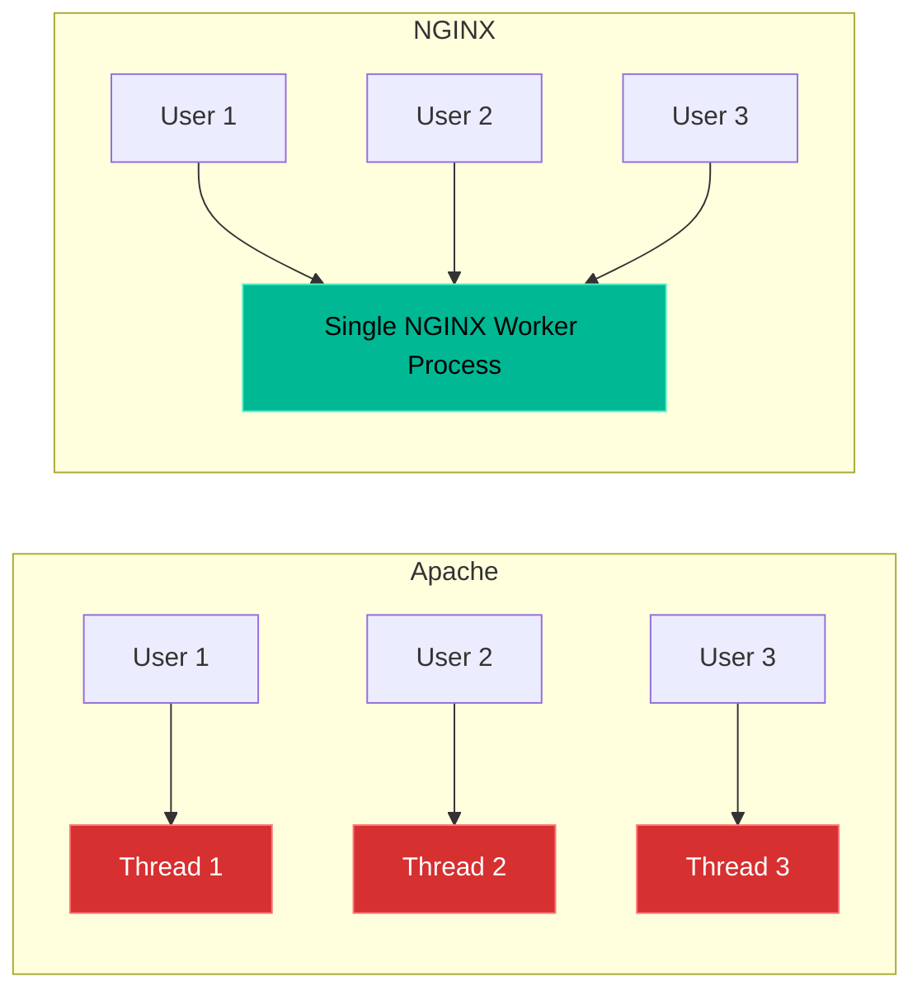

# Chapter 3 — Deploying NGINX


## Learning Objectives

By the end of this chapter, you will be able to:
* Explain the architectural difference between Apache (process-driven) and NGINX (event-driven).
* Install and configure the NGINX web server.
* Write an NGINX `server` block (the equivalent of an Apache Virtual Host).
* Understand and troubleshoot the infamous `502 Bad Gateway` error.

## Visual Architecture: Event-Driven vs Process-Driven

In the early 2000s, Apache had a problem known as the C10K problem (handling 10,000 concurrent connections). Apache spawns a new process (or thread) for every single user. If 10,000 people visit your site, Apache tries to create 10,000 threads, consuming massive amounts of RAM until the server crashes.
NGINX was built to solve this. It uses an **Event-Driven** architecture. A single NGINX worker process can asynchronously handle thousands of connections at the exact same time without consuming extra memory.



## Theory & Concepts

### 1. NGINX Configuration Structure
Unlike Apache's XML-style tags (`<VirtualHost>`), NGINX uses a cleaner, JSON-like bracket syntax. 
The main configuration file is `/etc/nginx/nginx.conf`. Inside this file is the `http {}` block, which contains all web server settings.

### 2. Server Blocks
What Apache calls a "Virtual Host," NGINX calls a **Server Block**. 
Just like Apache on Ubuntu, NGINX uses the `/etc/nginx/sites-available/` and `sites-enabled/` directories. You must symlink your configurations to enable them.
A basic Server Block looks like this:
```nginx
server {
    listen 80;
    server_name www.company.com;
    root /var/www/company;
    index index.html;
}
```

### 3. Syntax Checking
Before restarting NGINX, you should *always* test your configuration for typos. If you restart NGINX with a typo in the config file, the entire web server will crash and go offline.
The command to test the configuration is:
`nginx -t`

## Scenario-Based Troubleshooting

### Scenario A: The Bad Gateway (502)
**The Incident:** The marketing team reports that their new NGINX-powered blog is down. When they visit the URL, the browser displays a stark, white page that simply says: `502 Bad Gateway (nginx)`.

**The Investigation & Fix:**

1. The Support Engineer understands what a 502 error means. It means NGINX is online and working perfectly, but it is trying to talk to a backend service (like a PHP processor or a database) that is offline. NGINX is acting as a "Gateway" and the backend is "Bad."
2. The engineer checks the NGINX configuration for the blog. They see a line like this:
   `fastcgi_pass unix:/run/php/php8.1-fpm.sock;`
3. This tells NGINX to pass the PHP code to the `php-fpm` service for processing.
4. The engineer checks the status of that backend service:
   `systemctl status php8.1-fpm`
5. The service is `failed`! It crashed overnight due to an out-of-memory error.
6. The engineer restarts the PHP service (`systemctl start php8.1-fpm`). 
7. The engineer refreshes the blog. The `502 Bad Gateway` error disappears, and the website loads perfectly. NGINX is happy because its backend service is alive again.

> [!TIP]
> **Senior Engineer Note**
> When troubleshooting Deploying NGINX in production, never restart the service immediately. Restarts clear memory buffers, wipe temporary state, and destroy the exact evidence you need to find the root cause. Always capture logs (e.g., `journalctl` or container logs) *before* attempting a fix.


## Real-World Support Ticket

> [!IMPORTANT] ServiceNow Ticket: INC-3026303
> **Title:** 502 Bad Gateway on All Web Traffic
> **Assigned To:** Charlie (L2 Support Engineer)
> **Status:** IN PROGRESS
> 
> **1) Ticket intake & triage**
> Charlie receives a P1 Critical alert: The primary e-commerce site is returning 502 errors.
> 
> **2) Discovery & diagnosis**
> Charlie checks the NGINX error logs (`/var/log/nginx/error.log`) and sees `connect() failed (111: Connection refused) while connecting to upstream`. The proxy cannot reach the backend application.
> 
> **3) Immediate containment**
> Charlie places a static 'Maintenance' page on the NGINX proxy to provide a better user experience while he investigates.
> 
> **4) Resolution planning & execution**
> Charlie SSHes into the backend application server and discovers the Node.js process crashed. He restarts the service (`systemctl restart node-app`).
> 
> **5) Verification**
> Charlie runs `curl -I localhost:3000` on the backend, then removes the Maintenance page on NGINX. The site loads successfully.
> 
> **6) Closure & documentation**
> Charlie documents the upstream connection refusal and resolves the ticket.
> 
> **7) Post-resolution follow-up**
> Charlie adds a systemd `Restart=always` directive to the Node.js service to automatically recover from future crashes.
> 
> **8) Escalation rules**
> If the backend application continuously crashed on startup, Charlie would escalate to the Development team.


## Real-World Support Ticket

> [!IMPORTANT] ServiceNow Ticket: INC-3026303
> **Title:** 502 Bad Gateway on All Web Traffic
> **Assigned To:** Charlie (L2 Support Engineer)
> **Status:** IN PROGRESS
> 
> **1) Ticket intake & triage**
> Charlie receives a P1 Critical alert: The primary e-commerce site is returning 502 errors.
> 
> **2) Discovery & diagnosis**
> Charlie checks the NGINX error logs (`/var/log/nginx/error.log`) and sees `connect() failed (111: Connection refused) while connecting to upstream`. The proxy cannot reach the backend application.
> 
> **3) Immediate containment**
> Charlie places a static 'Maintenance' page on the NGINX proxy to provide a better user experience while he investigates.
> 
> **4) Resolution planning & execution**
> Charlie SSHes into the backend application server and discovers the Node.js process crashed. He restarts the service (`systemctl restart node-app`).
> 
> **5) Verification**
> Charlie runs `curl -I localhost:3000` on the backend, then removes the Maintenance page on NGINX. The site loads successfully.
> 
> **6) Closure & documentation**
> Charlie documents the upstream connection refusal and resolves the ticket.
> 
> **7) Post-resolution follow-up**
> Charlie adds a systemd `Restart=always` directive to the Node.js service to automatically recover from future crashes.
> 
> **8) Escalation rules**
> If the backend application continuously crashed on startup, Charlie would escalate to the Development team.


## Hands-on Lab

> [!TIP]
> **Practice Assignment Available**
> Proceed to the [Chapter 3 Practice Guide](../practice-files/V3-C03-practice.md) to install NGINX, write your first Server Block, and use `nginx -t` to validate it!

## Interview Questions

### Question 1: What is the primary architectural difference between Apache and NGINX that allows NGINX to handle high traffic loads with less RAM?
* **Target Answer**: "Apache uses a process-driven (or thread-driven) architecture, where it spawns a new thread for every single incoming connection, which consumes a significant amount of RAM under heavy load. NGINX uses an event-driven, asynchronous architecture. A single NGINX worker process can handle thousands of concurrent connections simultaneously within an event loop, making it incredibly lightweight and fast."

### Question 2: You just edited the NGINX configuration file. What command must you run before you restart the service?
* **Target Answer**: "You must run `nginx -t`. This command parses the configuration files and checks them for syntax errors. If you skip this step and restart the service with a typo, the NGINX daemon will fail to start, resulting in total downtime for all websites hosted on the server."

### Question 3: A user complains they are seeing a `502 Bad Gateway` error served by NGINX. Is NGINX broken? How do you troubleshoot this?
* **Target Answer**: "No, NGINX is not broken; in fact, the 502 error proves NGINX is running successfully. A `502 Bad Gateway` means NGINX is acting as a proxy or gateway and attempted to forward the request to a backend application server (like Node.js, Tomcat, or PHP-FPM), but that backend server failed to respond. To troubleshoot, I would check the status and logs of the backend application service, not NGINX."

## Common Mistakes & Pro-Tips

> [!WARNING] Common Mistake
> Forgetting to pass the `X-Forwarded-For` header. Your backend app will think all traffic is coming from the NGINX server itself!

> [!CAUTION] Think Before You Type
> `nginx -s reload` (Did you test the config?)

## Chapter Summary

NGINX has taken the world by storm because of its incredible speed, low memory footprint, and clean configuration syntax. By mastering Server Blocks and understanding how NGINX interacts with backend services, you are well on your way to building modern web infrastructure.

## Completion Checklist

- [ ] I can explain why NGINX's event-driven architecture is superior under heavy load.
- [ ] I understand the structure of a `server {}` block.
- [ ] I know to always run `nginx -t` before restarting the service.

---

**Chapter Transition**
> Having a web server is great, but exposing it directly to the internet is dangerous. We need a proxy.

---

**Chapter Transition**
> Having a web server is great, but exposing it directly to the internet is dangerous. We need a proxy.

---


## Navigation

← Previous: [Chapter 2 — Deploying Apache HTTP Server](V3-C02-deploying-apache.md)

↑ Volume Contents: [Table of Contents](TOC.md)

→ Next: [Chapter 4 — Reverse Proxies & Load Balancing](V3-C04-reverse-proxies.md)
