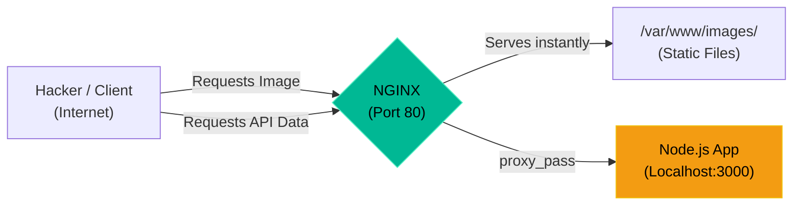

# Chapter 4 — Reverse Proxies & Load Balancing


## Learning Objectives

By the end of this chapter, you will be able to:
* Explain why exposing backend application servers directly to the internet is a terrible idea.
* Configure NGINX as a Reverse Proxy using `proxy_pass`.
* Configure NGINX as a Load Balancer using the `upstream` block.
* Understand the concept of Horizontal Scaling.

## Visual Architecture: The Invisible Shield

Developers write applications using Python, Node.js, or Java (Tomcat). These applications are not designed to handle raw internet traffic. They are slow at serving static images, terrible at SSL encryption, and easily crashed by basic DDoS attacks. 
To fix this, we place NGINX at the edge of the network. NGINX acts as an invisible shield called a **Reverse Proxy**. The client thinks they are talking to the Python app, but they are actually talking to NGINX, which secretly fetches the data from the Python app running on a hidden internal port (like 8000).



## Theory & Concepts

### 1. The `proxy_pass` Directive
To turn an NGINX Server Block into a Reverse Proxy, you use the `proxy_pass` directive inside a `location` block.
```nginx
server {
    listen 80;
    server_name api.company.com;
    
    location / {
        proxy_pass http://127.0.0.1:3000;
        proxy_set_header Host $host;
        proxy_set_header X-Real-IP $remote_addr;
    }
}
```
In this example, NGINX answers the phone on Port 80, grabs the request, turns around, and throws it to Port 3000 where the Node.js application is waiting.

### 2. The `upstream` Block (Load Balancing)
What happens if 100,000 people visit the website? One Node.js application cannot handle that much traffic. We must use **Horizontal Scaling** (adding more servers).
You can run three copies of the Node.js app on ports 3001, 3002, and 3003. You then tell NGINX to load balance between them using an `upstream` block.

```nginx
upstream my_backend {
    server 127.0.0.1:3001;
    server 127.0.0.1:3002;
    server 127.0.0.1:3003;
}

server {
    listen 80;
    location / {
        proxy_pass http://my_backend;
    }
}
```
By default, NGINX uses the "Round Robin" algorithm. It gives the first request to 3001, the second to 3002, the third to 3003, and then starts over.

## Scenario-Based Troubleshooting

### Scenario A: The Crashing App
**The Incident:** The company launches a massive marketing campaign. The single Java Tomcat application server is overwhelmed. CPU hits 100%, and the application crashes. The developers are panicking because they cannot optimize the code fast enough.

**The Investigation & Fix:**

1. The Support Engineer knows that fixing the code takes weeks, but fixing the infrastructure takes minutes. 
2. The engineer tells the developers to spin up two more identical virtual machines running the exact same Java code.
3. The engineer logs into the NGINX Reverse Proxy server that sits in front of the Java application.
4. They define an `upstream` block:
   ```nginx
   upstream java_cluster {
       server 10.0.0.51:8080; # Original Server
       server 10.0.0.52:8080; # New Server 1
       server 10.0.0.53:8080; # New Server 2
   }
   ```
5. They change the `proxy_pass` directive to point to `http://java_cluster`.
6. They run `nginx -t` and `systemctl reload nginx`.
7. Instantly, the CPU usage on the original server drops from 100% to 33%. The traffic is perfectly load-balanced across all three machines. The website stays online.

> [!TIP]
> **Senior Engineer Note**
> When troubleshooting Reverse Proxies & Load Balancing in production, never restart the service immediately. Restarts clear memory buffers, wipe temporary state, and destroy the exact evidence you need to find the root cause. Always capture logs (e.g., `journalctl` or container logs) *before* attempting a fix.


## Hands-on Lab

> [!TIP]
> **Practice Assignment Available**
> Proceed to the [Chapter 4 Practice Guide](../practice-files/V3-C04-practice.md) to set up a python web server and shield it behind an NGINX proxy!

## Interview Questions

### Question 1: What is a Reverse Proxy, and why is it considered a best practice to use one in front of an application server?
* **Target Answer**: "A reverse proxy is a server that sits in front of backend application servers (like Tomcat, Node.js, or Django) and forwards client requests to them. It is a best practice because backend application servers are not built for edge security. A reverse proxy like NGINX handles SSL termination, serves static assets efficiently, mitigates DDoS attacks, and allows you to load balance traffic across multiple backend servers."

### Question 2: In NGINX, what is the purpose of the `proxy_set_header X-Real-IP $remote_addr;` directive?
* **Target Answer**: "When NGINX proxies a request to a backend server, the backend server sees the request as coming from NGINX's IP address (usually 127.0.0.1 or the proxy's internal IP). This breaks application logging and IP banning. The `X-Real-IP` header takes the original client's IP address and explicitly passes it through to the backend application so the app knows who the actual user is."

### Question 3: What is 'Round Robin' load balancing?
* **Target Answer**: "Round Robin is the default load balancing algorithm used by NGINX. It distributes incoming client requests sequentially across a list of backend servers defined in an `upstream` block. Server 1 gets the first request, Server 2 gets the second, and so on, looping back to Server 1 when it reaches the end of the list."

## Common Mistakes & Pro-Tips

> [!WARNING] Common Mistake
> Creating an open proxy by accident, allowing attackers to route their malicious traffic through your server.

> [!CAUTION] Think Before You Type
> `proxy_pass http://localhost:8080/` (Does the trailing slash matter? Yes, it changes the entire URI path!)

## Chapter Summary

The ability to write an NGINX `proxy_pass` configuration is the defining skill of a modern Infrastructure Engineer. It allows you to build highly available, secure, and horizontally scalable systems without the developers ever needing to change their application code.

## Completion Checklist

- [ ] I understand why we do not expose application servers directly to the internet.
- [ ] I can write an NGINX `proxy_pass` directive.
- [ ] I understand how an `upstream` block enables Round Robin load balancing.

---

**Chapter Transition**
> The proxy is in place, but traffic is still transmitted in plaintext. It's time to secure the transport layer.

---

**Chapter Transition**
> The proxy is in place, but traffic is still transmitted in plaintext. It's time to secure the transport layer.

---


## Navigation

← Previous: [Chapter 3 — Deploying NGINX](V3-C03-deploying-nginx.md)

↑ Volume Contents: [Table of Contents](TOC.md)

→ Next: [Chapter 5 — TLS/SSL Cryptography & Certbot](V3-C05-tls-ssl-cryptography.md)
