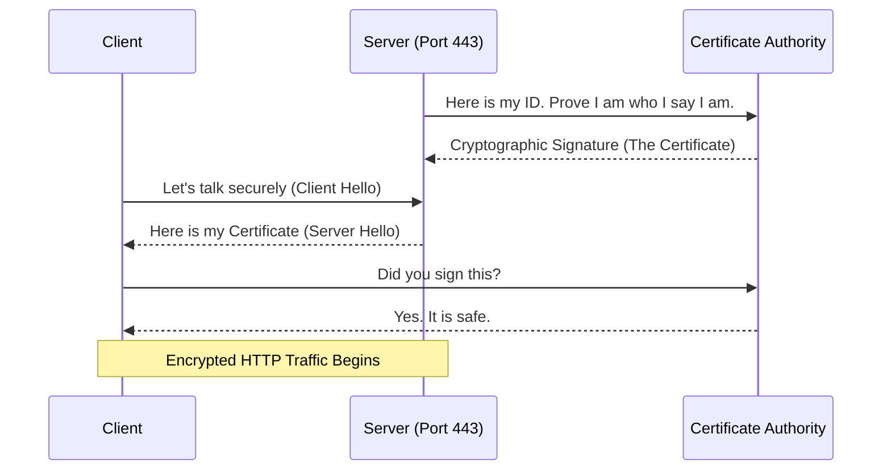

# Chapter 5 — TLS/SSL Cryptography & Certbot

## Learning Objectives

By the end of this chapter, you will be able to:
* Differentiate between Symmetric and Asymmetric encryption.
* Understand the role of a Certificate Authority (CA) like Let's Encrypt.
* Use `certbot` to automatically provision a free SSL certificate.
* Configure NGINX to force all traffic from HTTP (80) to HTTPS (443).

## Visual Architecture: The Handshake

When you visit a website over Port 80 (HTTP), everything you type (passwords, credit cards) is sent in raw plaintext. Anyone sitting in a coffee shop with Wireshark can read it. 
To fix this, we use TLS (Transport Layer Security, formerly known as SSL). NGINX listens on Port 443. The client and server perform a mathematical "handshake" to exchange a symmetric encryption key. Once exchanged, the connection is totally secure.

## Theory & Concepts

### 1. The Key Exchange
TLS uses **Asymmetric Encryption** (a Public Key and a Private Key) just to establish the connection. The server gives everyone the Public Key, which can only encrypt data. The server keeps the Private Key hidden, which is the only thing that can decrypt the data.
Once the connection is established, the client and server switch to **Symmetric Encryption** (using the same shared key) because it is much faster for transferring large amounts of data.

### 2. The Certificate Authority (CA)
How does your browser know that `google.com` is actually Google, and not a hacker intercepting your traffic? It trusts a Certificate Authority (CA). 
A CA is an organization that verifies the identity of a server and mathematically "signs" their Public Key. If the signature is valid, your browser displays a padlock icon. If it is invalid, your browser displays a massive red "Not Secure" warning.

### 3. Certbot and Let's Encrypt
Historically, SSL certificates cost hundreds of dollars per year. A non-profit organization called Let's Encrypt changed the world by offering free, automated certificates to everyone. 
They provide a tool called `certbot`. You run `certbot --nginx`, and it will automatically talk to Let's Encrypt, prove you own the domain, download the certificate, and rewrite your NGINX configuration file for you!

## Scenario-Based Troubleshooting

### Scenario A: The "Not Secure" Warning
**The Incident:** The marketing team buys a new domain, `newproduct.com`. They point it to the NGINX server. When the CEO visits the site in Google Chrome, they get a massive red warning that says "Your connection is not private." The CEO is furious.

**The Investigation & Fix:**

1. The Support Engineer investigates. They realize the NGINX configuration is only listening on Port 80 (HTTP). 
2. The engineer runs `certbot --nginx -d newproduct.com`.
3. Certbot automatically requests a certificate from Let's Encrypt. Let's Encrypt sends a "challenge" to the server to prove the engineer actually owns the domain. Certbot answers the challenge automatically.
4. Let's Encrypt issues the certificate. Certbot automatically edits the NGINX configuration to:
   * Listen on Port 443 (HTTPS) with the new certificate.
   * Listen on Port 80 (HTTP) and immediately return a `301 Redirect` to the HTTPS version.
5. The CEO refreshes the page. The traffic is redirected to Port 443, the padlock icon appears, and the connection is secure.

> [!TIP]
> **Senior Engineer Note**
> When troubleshooting TLS/SSL Cryptography & Certbot in production, never restart the service immediately. Restarts clear memory buffers, wipe temporary state, and destroy the exact evidence you need to find the root cause. Always capture logs (e.g., `journalctl` or container logs) *before* attempting a fix.

## Real-World Support Ticket

> [!IMPORTANT] ServiceNow Ticket: INC-3026305
> **Title:** Expired SSL Certificate
> **Assigned To:** Charlie (L2 Support Engineer)
> **Status:** IN PROGRESS
> 
> **1) Ticket intake & triage**
> Charlie takes a P1 ticket: Users report their browsers are showing a terrifying 'Your connection is not private' red screen.
> 
> **2) Discovery & diagnosis**
> Charlie runs `curl -vI https://example.com` and sees `SSL certificate problem: certificate has expired`. He checks the Let's Encrypt logs and sees the automated renewal cron job failed due to a firewall change.
> 
> **3) Immediate containment**
> Charlie immediately opens port 80 on the firewall, which Let's Encrypt requires for the HTTP-01 challenge.
> 
> **4) Resolution planning & execution**
> Charlie manually forces the renewal using `certbot renew --force-renewal`. He then reloads NGINX to apply the new certificate.
> 
> **5) Verification**
> Charlie accesses the site in a fresh browser session and verifies the padlock is green and valid for another 90 days.
> 
> **6) Closure & documentation**
> Charlie documents the firewall blockage and resolves the ticket.
> 
> **7) Post-resolution follow-up**
> Charlie sets up an external monitoring alert to notify the team 14 days before a certificate expires.
> 
> **8) Escalation rules**
> If the certificate authority was completely unreachable, Charlie would escalate to Network Engineering to check outbound routing.

## Hands-on Lab

> [!TIP]
> **Practice Assignment Available**
> Proceed to the [Chapter 5 Practice Guide](../practice-files/V3-C05-practice.md) to manually generate a "Self-Signed" certificate using `openssl`!

## Interview Questions

### Question 1: What is the difference between Symmetric and Asymmetric encryption, and how does TLS use both?
* **Target Answer**: "Symmetric encryption uses a single shared key to both encrypt and decrypt data, making it very fast but hard to share securely over the internet. Asymmetric encryption uses a key pair (Public and Private); data encrypted with the Public key can only be decrypted by the Private key. TLS uses Asymmetric encryption during the initial handshake to securely exchange a Symmetric key, which is then used for the remainder of the session to ensure fast, secure communication."

### Question 2: What is the role of a Certificate Authority (CA)?
* **Target Answer**: "A Certificate Authority is a trusted third-party organization that cryptographically signs a server's public key certificate. This signature proves to the client's web browser that the server truly owns the domain name it claims to be, preventing Man-in-the-Middle (MitM) attacks. Without a CA's signature, a browser will display a severe security warning."

### Question 3: How do you force all incoming Port 80 web traffic to use Port 443 instead?
* **Target Answer**: "You configure the web server (like NGINX) with a `server` block listening on Port 80 that performs an HTTP 301 Permanent Redirect to the `https://` version of the exact same URL. Tools like `certbot` will usually configure this automatic redirection block for you when provisioning a certificate."

## Common Mistakes & Pro-Tips

> [!WARNING] Common Mistake
> Letting an SSL certificate expire silently, causing every browser in the world to block your website.

> [!CAUTION] Think Before You Type
> `certbot renew --force-renewal` (Are you sure? You might hit the Let's Encrypt rate limit and be blocked for a week.)

## Chapter Summary

The internet is hostile. Every website, from a massive bank to a tiny personal blog, must use HTTPS. With NGINX acting as your Reverse Proxy and Certbot automating your SSL certificates, securing your applications takes less than thirty seconds.

## Completion Checklist

- [ ] I understand the difference between Symmetric and Asymmetric encryption.
- [ ] I know what a Certificate Authority (CA) does.
- [ ] I understand how `certbot` automates HTTPS configuration.

---

**Chapter Transition**
> With the web tier secured, we must now focus on where the actual data lives: the database.

---

## Navigation

← Previous: [Chapter 4 — Reverse Proxies & Load Balancing](V3-C04-reverse-proxies.md)

↑ Volume Contents: [Table of Contents](TOC.md)

→ Next: [Chapter 6 — Relational Database Concepts](V3-C06-database-concepts.md)
